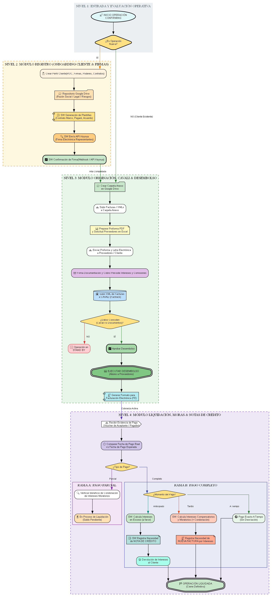

# 🏛️ Módulo Confirming — Arquitectura General y Planos del Sistema

> **DOCUMENTO DE REFERENCIA Y ARQUITECTURA OFICIAL**  
> **Proyecto:** InAndes ERP · Módulo Confirming  
> **Fecha de Creación:** 01 de Setiembre de 2026  
> **Flujograma Oficial:** `FLUJOGRAMA_Confirming_V1.png` / `FLUJOGRAMA_Confirming_V1.pdf`

---

## 🎯 1. ¿Qué es el Módulo de Confirming?

El módulo de **Confirming** gestiona el financiamiento y pago anticipado a proveedores a solicitud de una empresa cliente (pagador/aceptante), permitiendo optimizar el flujo de caja de la cadena de suministro con comisiones e intereses transparentes.

Su lógica matemática y operativa es análoga a la de **Factoring**, compartiendo los motores financieros de cálculo de tasas, comisiones, integración con Cavali (Factrack), gestión documental en Google Drive y facturación electrónica SUNAT.

---

## 🗺️ 2. Flujograma de Arquitectura Oficial (V1)

*Para descargar en formato vectorial de alta resolución:* [FLUJOGRAMA_Confirming_V1.pdf](FLUJOGRAMA_Confirming_V1.pdf)  
*Script generador en Graphviz:* `FLOW_CHARTS/Charts_Confirming/FLUJOGRAMA_Confirming_V1.py`

---

## 🏗️ 3. Estructura de los 4 Módulos Operativos

### 1️⃣ Módulo Registro (Onboarding de Clientes Nuevos)
1. **Creación de Perfil:** Registro de RUC, razón social, poderes, representantes y datos bancarios.
2. **Repositorio Google Drive:** Creación automatizada de la carpeta del cliente con subcarpetas `/Legal` y `/Riesgos`.
3. **Generación Documental (SW):** Creación de Contrato Marco, Pagaré y Acuerdo a partir de plantillas dinámicas.
4. **Firma Digital (Keynua API):** Despacho automático para firma electrónica de representantes y recepción de confirmación vía Webhook.

### 2️⃣ Módulo Originación & Desembolso
1. **Carpeta de Anexo:** Creación de carpeta de lote en Drive y carga de facturas comerciales / XMLs.
2. **Proforma y Proveedores:** Generación de Proforma PDF y plantilla Excel de solicitud a proveedores.
3. **Emisión de Letra:** Envío de letra electrónica, cobro previo de comisiones/intereses y carga de XMLs en **Cavali (Factrack)**.
4. **Validación de Calidad:** Cruce automático Cavali vs Documentos. Si no coinciden → *Stand By*; si coinciden → Aprobación y Ejecución del Desembolso a proveedores.
5. **Facturación Electrónica:** Generación del formato oficial para emisión de comprobantes de pago.

### 3️⃣ Módulo Liquidación & Cobranzas
1. **Recepción de Voucher:** Carga de evidencia de pago y cálculo de días transcurridos frente a la fecha esperada.
2. **Casuística de Liquidación:**
   * **Pago Parcial:** Aplica lógica de condonación de mora (si aplica) y mantiene la operación activa como *En Proceso de Liquidación*.
   * **Pago Anticipado:** El sistema calcula intereses a favor del cliente, emite la solicitud de **Nota de Crédito** y procesa la devolución de intereses.
   * **Pago A Tiempo:** Cierre y liquidación directa.
   * **Pago Tardío (Mora):** El sistema calcula intereses compensatorios y moratorios adicionales y genera la solicitud de **Nueva Factura por Intereses**.

---

## 📁 4. Índice de Documentación de Planos

| Documento | Descripción | Estado |
|---|---|:---:|
| **`00. Bienvenido y Arquitectura Confirming.md`** | Visión general y flujograma maestro | ✅ Oficial |
| **`01. Modulo de Registro y Onboarding.md`** | Especificación de perfil, Drive y Keynua | 📝 Planos |
| **`02. Modulo de Originacion y Desembolso.md`** | Proformas, proveedores, Cavali y desembolsos | 📝 Planos |
| **`03. Modulo de Liquidacion y Cobranzas.md`** | Pagos parciales, mora, anticipos y NC | 📝 Planos |
