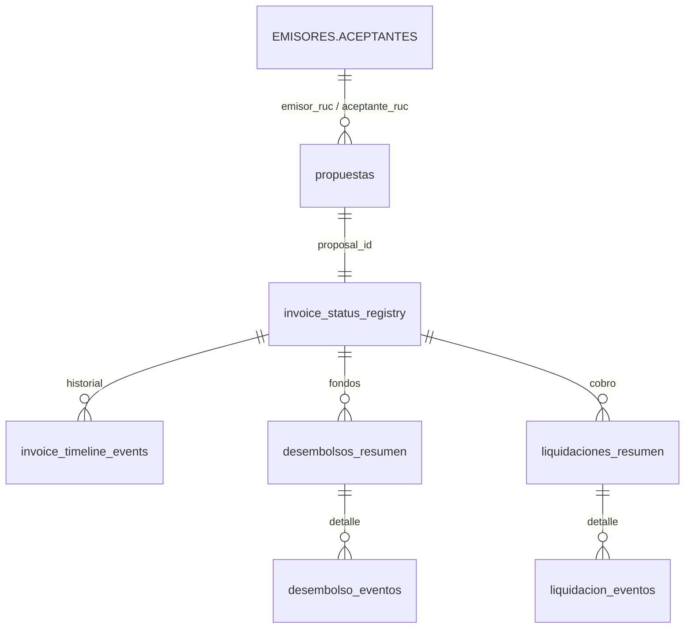

# 1. Entendimiento de la Base de Datos (Factoring)

El modulo de Factoring utiliza un modelo de datos transaccional en Supabase. Maneja un ciclo de vida rapido basado en **estados de facturas (Originacion -> Aprobacion -> Desembolso -> Liquidacion)**.

> [!IMPORTANT]
> El proyecto tiene **DOS Supabase distintas**:
> - **Streamlit** → Proyecto `vinjzmqwaqsqzoigqpxk` (Railway + VPS)
> - **React** → Proyecto `egvcinsbyropumybatdf` (pooler: `aws-0-us-east-1.pooler.supabase.com`)

---

## La Tabla Maestra: EMISORES.ACEPTANTES

Esta es la tabla de contrapartes. Tanto Emisores (quienes venden la factura a InAndes) como Aceptantes (quienes deben pagar) viven en la misma tabla diferenciados por la columna `TIPO`.

### Las tres variantes de la tabla (hallazgo de sesion 16/07/2026)

En **ambas** Supabase existen tres tablas con nombres similares:

| Tabla | Proposito | Columnas |
|---|---|---|
| `EMISORES.ACEPTANTES` | **PRODUCCION** — la que usa el codigo | 73 (enriquecida) |
| `EMISORES.ACEPTANTES.BETA` | Schema completo original | ~75 |
| `EMISORES.ACEPTANTES.ORIGINAL` | Backup snapshot antes de migracion | ~29 |

> [!NOTE]
> El nombre con **punto literal** (no schema.tabla) es intencional. El cliente Supabase lo llama como `supabase.table("EMISORES.ACEPTANTES")` directamente sobre el schema `public`.

### Schema completo de EMISORES.ACEPTANTES (post-enriquecimiento)

La tabla de produccion fue enriquecida el 16/07/2026 con un `ALTER TABLE` ejecutado via psql en el VPS Hostinger conectado al pooler de Supabase React.

**Columnas originales (29):** `id`, `created_at`, `TIPO`, `RUC`, `Razon Social`, `Depositario 1`, `DNI Depositario 1`, `Garante/Fiador solidario 1 & 2`, `DNI Garante/Fiador solidario 1 & 2`, `Correo Electronico 1 & 2`, `Institucion Financiera`, `Numero de Cuenta PEN/USD`, `Numero de CCI PEN/USD`, tasas financieras y comisiones en snake_case, `dias_minimos_interes`.

**Columnas agregadas (44 nuevas):**

| Grupo | Columnas |
|---|---|
| Identidad | `SECTOR`, `GRUPO` |
| Contacto Comercial | `CONTACTO_COMERCIAL`, `CELULAR_CONTACTO`, `CORREO_CONTACTO` |
| Contacto Cobranza | `CONTACTO_COBRANZA`, `CELULAR_COBRANZA`, `CORREO_COBRANZA` |
| Correos adicionales | `Correo Electronico 3 & 4`, `CORREO_DEPOSITARIO` |
| Domicilio Fiscal | `DOMICILIO_FISCAL`, `DEPARTAMENTO`, `PROVINCIA`, `DISTRITO` |
| Domicilios Fiadores (x4) | `DOMICILIO_FIADORn`, `DEPARTAMENTO_FIADORn`, `PROVINCIA_FIADORn`, `DISTRITO_FIADORn` |
| Garantes adicionales | `Garante/Fiador solidario 3 & 4`, `DNI Garante/Fiador solidario 3 & 4` |
| Lineas de Credito | `LINEA_CREDITO_PEN/USD`, `LINEA_DISPONIBLE_PEN/USD` |
| Riesgo | `CALIFICACION_RIESGO`, `FECHA_CALIFICACION`, `FUENTE_CALIFICACION` |
| Otros | `PLAZO_PAGO`, `OBSERVACIONES` |

**Comando ejecutado:**

```bash
# Ejecutado desde VPS Hostinger (91.108.125.253) via script Python + paramiko
PGPASSWORD="VivaLaVida2026" psql \
  -h aws-0-us-east-1.pooler.supabase.com \
  -U postgres.egvcinsbyropumybatdf \
  -d postgres -p 5432 \
  -f /tmp/alter_emisores.sql
# Resultado: ALTER TABLE exitoso, 73 columnas confirmadas
```

---

## Otras Tablas del Flujo (pendientes de analisis detallado)



- **`propuestas`**: Motor matematico. Guarda `capital_calculado`, `interes_calculado`, `abono_real_calculado`.
- **`invoice_status_registry`**: Maquina de estados (`REGISTRADO` → `APROBADO` → `DESEMBOLSADO` → `LIQUIDADO`).
- **`invoice_timeline_events`**: Log inmutable de auditoria.
- **`desembolsos_resumen` / `liquidaciones_resumen`**: Flujo de caja real.

> [!WARNING]
> Estas tablas aun no han sido verificadas en la Supabase de React (`egvcinsbyropumybatdf`). Antes de implementar los tabs de Aprobacion, Desembolso y Liquidacion, verificar que existan y tengan el schema esperado.
