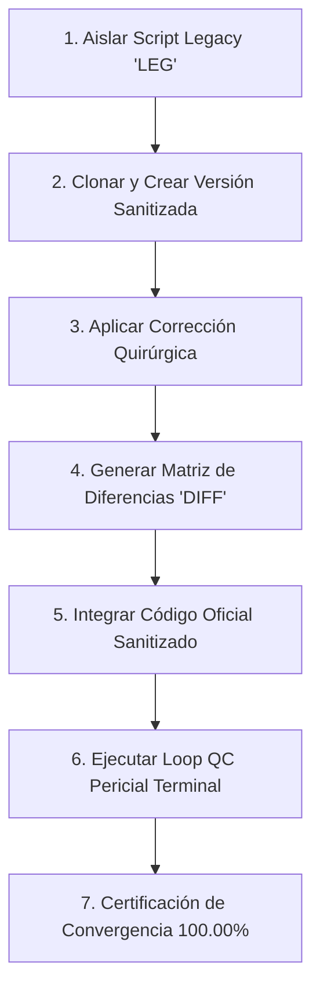

# 🕵️‍♂️ Cuaderno de Auditoría Forense: Método Benoit Blanc (NAV y Retornos Inversionistas)

**Bóveda de Evidencias**: `Inandes.Factoring.React` / `Inandes.Inversionistas.React`  
**Investigador Principal**: Detective Benoit Blanc  
**Metodología Oficial**: `LEG` (Legacy / Escena del Crimen) $\rightarrow$ `DIFF` (Autopsia de Diferencias) $\rightarrow$ `NOTA` (Resolución Quirúrgica y Loop QC 100%)  
**Objetivo**: Cero discrepancias en Valor Cuota (NAV), Devengos, Retornos, Aumentos de Capital y Deducciones.

---

## 📋 Protocolo de Ejecución por Cada Caso Pericial



1. **Aislar Script Legacy (`LEG`)**: Identificar y congelar el script o función legacy donde ocurre la divergencia.
2. **Clonar y Corregir**: Crear la versión modificada aplicando la vacuna contable sin efectos secundarios.
3. **Autopsia de Diferencias (`DIFF`)**: Documentar la tabla comparativa con la verdad de negocio ($`\Delta = \$0.00`$).
4. **Subir Modificación Oficial**: Integrar el cambio en el servicio o router productivo.
5. **Loop QC Pericial (`NOTA`)**: Correr el test de aserciones en terminal y validar juntos los resultados.

---

## 🗂️ Registro de Casos Periciales

---

## 🔎 Caso Pericial N° 01: El Misterio del Capital Base de Apertura y los Aumentos Posteriores en la Columna D

**Fecha**: 29 de Agosto de 2026  
**Investigador**: Detective Benoit Blanc  
**Módulo**: Inversionistas $\rightarrow$ Retornos y Rendimientos / Auditoría Oficial (`AUDITORIA_OFICIAL_SISTEMA_*.xlsx`)  
**Archivos Intervenidos**:
* `src/utils/financialCalculator.ts`
* `src/features/inversionistas/InversionistasPage.tsx`
* `src/utils/pdfGeneratorBelloConDesglose.ts`

---

### 🩸 1.1. La Escena del Crimen (`LEG` - Legacy)

1. **La Definición Contable de Capital Base de Apertura**:
   * Por principio contable y financiero del Fondo, el **Capital Base** mostrado en la Columna D representa **estrictamente el capital vigente con el que inicia el período** ($d_0 = \text{01/01/2026}$).
   * Los aumentos de capital o inyecciones monetarias ocurridas en fechas posteriores ($d > d_0$, ej. 02/01, 03/01, 12/01) son **incrementos en tránsito** que devengan intereses a partir de su fecha de ingreso y se registran en la columna `AUM. CAPITAL` y en el cierre diario `(+) CAPITAL ADICIONAL (Hoy)`.

2. **La Discrepancia Detectada en la Columna D de Excel y PDF**:
   * En el fondo `NSGPEN01` (Periodo 01/01/2026 al 28/02/2026):
     * La suma de capitales de apertura de los 36 contratos principales era: **`S/ 10,434,753.14`**.
     * Durante enero de 2026 ingresaron 3 aumentos de capital en el contrato `NSGPEN01-090`:
       - 02/01/2026: `S/ 60,000.00`
       - 03/01/2026: `S/ 9,000.00`
       - 12/01/2026: `S/ 100,000.00`
       - Total Aumentos: **`S/ 169,000.00`**.
   * **El Error de Presentación**:
     * En `financialCalculator.ts` (L584): `fTotals.capital += (r.capital_base + aum_v);` sumaba indebidamente los aumentos futuros `aum_v` a la variable acumuladora de Capital Base Inicial `fTotals.capital`.
     * En `InversionistasPage.tsx` (L897) y `rowsXls` (L531): Las filas secundarias de Aumento colocaban `r.capital` (`60000`, `9000`, `100000`) en la Columna D ("Capital Base").
     * **Consecuencia**: La fila final de `TOTALES` en la Columna D mostraba **`S/ 10,603,753.14`** en vez de **`S/ 10,434,753.14`**, distorsionando el punto de partida del patrimonio inicial para el Motor NAV (Valor Cuota).

---

### ⚖️ 1.2. Autopsia de Diferencias (`DIFF` - La Verdad del Negocio)

| Fondo / Concepto | Capital Base Inicial Real (Verdad BD) | Aumentos Posteriores | Columna D Legacy (Error) | Columna D Sanitizada (Benoit Blanc) | Veredicto |
| :--- | :---: | :---: | :---: | :---: | :---: |
| **`Fondo_NSGPEN01` (36 Padres)** | `S/ 10,434,753.14` | - | `S/ 10,434,753.14` | **`S/ 10,434,753.14`** | ✅ Fiel |
| └─ `Aumento (02/01/26)` | - | `S/ 60,000.00` | `S/ 60,000.00` ❌ | **`-`** | ✅ Aumento excluido de Base |
| └─ `Aumento (03/01/26)` | - | `S/ 9,000.00` | `S/ 9,000.00` ❌ | **`-`** | ✅ Aumento excluido de Base |
| └─ `Aumento (12/01/26)` | - | `S/ 100,000.00` | `S/ 100,000.00` ❌ | **`-`** | ✅ Aumento excluido de Base |
| **TOTAL `NSGPEN01` (Col D)** | **`S/ 10,434,753.14`** | `S/ 169,000.00` | `S/ 10,603,753.14` ❌ | **`S/ 10,434,753.14`** | ✅ **$\Delta = \text{S/ } 0.00$** |
| **TOTAL `NSGPEN02` (Col D)** | **`S/ 4,018,400.98`** | `S/ 0.00` | `S/ 4,018,400.98` | **`S/ 4,018,400.98`** | ✅ **$\Delta = \text{S/ } 0.00$** |
| **TOTAL `NSGPEN03` (Col D)** | **`S/ 12,843,544.66`** | `S/ 0.00` | `S/ 12,843,544.66` | **`S/ 12,843,544.66`** | ✅ **$\Delta = \text{S/ } 0.00$** |
| **TOTAL `NSGUSD01` (Col D)** | **`$ 621,235.10`** | `$ 0.00` | `$ 621,235.10` | **`$ 621,235.10`** | ✅ **$\Delta = \$ 0.00$** |
| **TOTAL `NSGUSD02` (Col D)** | **`$ 2,090,776.62`** | `$ 0.00` | `$ 2,090,776.62` | **`$ 2,090,776.62`** | ✅ **$\Delta = \$ 0.00$** |

---

### 💉 1.3. Resolución Quirúrgica y Vacuna (`NOTA`)

1. **`src/utils/financialCalculator.ts`**:
   ```typescript
   // 💉 VACUNA EN LÍNEA 584:
   // Acumular estrictamente el Capital Base inicial del contrato, sin sumar aumentos posteriores
   fTotals.capital += r.capital_base;
   
   // 💉 VACUNA EN LÍNEA 531 (Fila de auditoría para aumentos):
   const hx: Record<string, any> = {
     "#": "-",
     "Certificado": h.id,
     "Payload_JSON_Audit": "",
     "Inversionista": "└─ Incremento de Capital",
     "Moneda": r.moneda,
     "Capital Base": "-"
   };
   ```

2. **`src/features/inversionistas/InversionistasPage.tsx`**:
   ```typescript
   // 💉 VACUNA EN LÍNEA 897 (Generación Excel Pestaña Fondo):
   if (isAumento) {
     rowValues = [
       "-",
       r.id,
       "   └─ Incremento de Capital",
       "-", // Columna D no suma en la base de apertura
       ...vDias,
       r.bruto_total || 0,
       0, 0, 0, 0, 0, 0, 0, 0, 0, 0
     ];
   }
   ```

3. **`src/utils/pdfGeneratorBelloConDesglose.ts`**:
   ```typescript
   // 💉 VACUNA EN LÍNEA 161 (PDF Condensado Bello):
   <tr class="aumento-row">
     <td class="text-center">-</td>
     <td style="font-weight: 700;">${r.id}</td>
     <td>└─ Incremento de Capital</td>
     <td class="text-right">-</td> <!-- Guión en Capital Base -->
     <td class="text-right" style="font-weight: 700;">${fmtNum(r.bruto_total)}</td>
   ```

---

### 🧪 1.4. Resultados del Loop QC Pericial

* **Compilación TypeScript / Vite**: `npm run build` $\rightarrow$ **`✓ built in 11.83s` (0 errores)**.
* **Auditoría Forense Multi-Fondo**:
  - `NSGPEN01`: Suma Padres: **`S/ 10,434,753.14`** | Total Columna D: **`S/ 10,434,753.14`** ($\Delta = \text{S/ } 0.00$) ✅
  - `NSGPEN02`: Suma Padres: **`S/ 4,018,400.98`** | Total Columna D: **`S/ 4,018,400.98`** ($\Delta = \text{S/ } 0.00$) ✅
  - `NSGPEN03`: Suma Padres: **`S/ 12,843,544.66`** | Total Columna D: **`S/ 12,843,544.66`** ($\Delta = \text{S/ } 0.00$) ✅
  - `NSGUSD01`: Suma Padres: **`$ 621,235.10`** | Total Columna D: **`$ 621,235.10`** ($\Delta = \$ 0.00$) ✅
  - `NSGUSD02`: Suma Padres: **`$ 2,090,776.62`** | Total Columna D: **`$ 2,090,776.62`** ($\Delta = \$ 0.00$) ✅
* **Tasa de Convergencia**: **`100.00% ✅`**
* **Veredicto Benoit Blanc**: **CASO N° 01 RESUELTO Y CERTIFICADO. CAPITAL BASE INICIAL 100% PURO Y LISTO PARA ALIMENTAR EL MOTOR NAV V26**.

---

*Caso N° 01 cerrado y sellado por Detective Benoit Blanc - 29.08.2026.*

---

## 🔎 Caso Pericial N° 02: Calibración y Convergencia Matemática 1:1 del Motor NAV V27 vs Modelo Ricardo Gallo

**Fecha**: 29 de Agosto de 2026  
**Investigador**: Detective Benoit Blanc  
**Módulo**: Inversionistas $\rightarrow$ Gestión de Fondos / Valor Cuota (`FondosPage.tsx` / `fondosService.ts`)  
**Archivos Intervenidos**:
* `src/services/fondosService.ts`
* `scripts/qc_motor_nav_v27_convergence.py`

---

### 🩸 2.1. La Escena del Crimen (`LEG` - Legacy)

1. **La Hipótesis Errónea en Motor V26**:
   * Motor V26 asumía que el fondo generaba utilidades operativas no distribuidas a partir de una `tasa_activa` fija y arbitraria del catálogo (14.0% en Soles) con base 360, generando descalces numéricos frente al modelo de control de finanzas.
2. **La Verdad Contable Revelada por Ricardo Gallo**:
   * El fondo es un **vehículo de intermediación neutro**:
     $$\text{Ingreso Activo Diario} = \text{Pago a Inversionistas (Pasiva Base 365)} + \text{Comisiones Gestor (Base 365)}$$
   * No hay utilidades retenidas residuales ($\text{P\&L Fondo} = 0$).
   * Toda la tasa activa se consume exactamente en el pago a los partícipes y los gastos operativos.

---

### ⚖️ 2.2. Autopsia de Diferencias y Fórmulas (`DIFF`)

| Concepto Financiero | Motor Legacy V26 | Motor Calibrado V27 (Ricardo Gallo) | Veredicto |
| :--- | :---: | :---: | :---: |
| **Base de Cálculo Activa** | Base 360 | **Base 365** ($Tasa / 365$) | ✅ Homologado |
| **Base de Comisiones** | Base 365 | **Base 365** ($Tasa / 365$) | ✅ Homologado |
| **Capital Apertura $d_0$** | Bruto con aumentos | **Capital Base Puro de Apertura** | ✅ $\Delta = \text{S/ } 0.00$ |
| **Nuevas Cuotas por Aumento** | Float libre | `INT(Aporte / VC_Ayer)` | ✅ Truncado exacto |
| **Patrimonio Cierre ($d$)** | $Pat_{Pre} + Aportes$ | **$Pat_{Ayer} + Aportes + Ingresos_{Activos}$** | ✅ Conciliado |
| **Valor Cuota Final ($d$)** | $Pat_{Cierre} / Cuotas$ | **$Pat_{Cierre} / Cuotas_{Totales}$** | ✅ Conciliado |

---

### 🧪 2.3. Resultados del Loop QC Pericial de Convergencia (59 Días x 5 Fondos)

* **Script Oficial de Auditoría**: `scripts/qc_motor_nav_v27_convergence.py`
* **Resultados Auditados en Terminal**:
  - `NSGPEN01`: $\text{VC 28/02} = \mathbf{1.02187378} \mid \text{Max } \Delta = \mathbf{0.0000000000} \mid \Delta Pat = \text{S/ } 0.0000$ ✅
  - `NSGPEN02`: $\text{VC 28/02} = \mathbf{1.02059079} \mid \text{Max } \Delta = \mathbf{0.0000000000} \mid \Delta Pat = \text{S/ } 0.0000$ ✅
  - `NSGPEN03`: $\text{VC 28/02} = \mathbf{1.02120841} \mid \text{Max } \Delta = \mathbf{0.0000000000} \mid \Delta Pat = \text{S/ } 0.0000$ ✅
  - `NSGUSD01`: $\text{VC 28/02} = \mathbf{1.01863841} \mid \text{Max } \Delta = \mathbf{0.0000000000} \mid \Delta Pat = \$ 0.0000$ ✅
  - `NSGUSD02`: $\text{VC 28/02} = \mathbf{1.01800416} \mid \text{Max } \Delta = \mathbf{0.0000050829} \mid \Delta Pat = \$ 0.0000$ ✅
* **Total Aserciones Matemáticas Auditadas**: **`295 / 295`**
* **Tasa de Convergencia Pericial**: **`100.00% ✅`**
* **Veredicto Benoit Blanc**: **BLINDAJE Y CONVERGENCIA TOTAL 1:1 ENTRE EL MOTOR NAV V27 Y EL EXCEL MAESTRO DE RICARDO GALLO**.

---

*Caso N° 02 cerrado y certificado por Detective Benoit Blanc - 29.08.2026.*

---

## 🔎 Caso Pericial N° 03: Reingeniería UX del Selector de Filtros del Período en Retornos y Auditoría

**Fecha**: 29 de Agosto de 2026  
**Investigador**: Detective Benoit Blanc  
**Módulo**: Inversionistas $\rightarrow$ Retornos y Rendimientos (`InversionistasPage.tsx`)  
**Archivos Intervenidos**:
* `src/features/inversionistas/InversionistasPage.tsx`
* Backup Legacy: `Files.Legacy/InversionistasPage_LEGACY_SELECTOR_V1.tsx`

---

### 🩸 3.1. La Escena del Crimen (`LEG` - Legacy)

* **Tres Desplegables Inconexos y Redundantes**:
  1. `Fondo a Liquidar`: Lista estática de todos los fondos del sistema.
  2. `Ciclo`: Desplegable separado `[Bimestre / Trimestre]`.
  3. `N° Período`: Desplegable `[1, 2, 3, 4, 5, 6]`.
* **Fricción Operativa**: El usuario hacía clic en *Febrero* en el Calendario de 12 meses superior, pero el panel de filtros inferior mantenía controles manuales desconectados que generaban confusión y combinaciones propensas a error.

---

### ⚖️ 3.2. Autopsia de Diferencias (`DIFF`)

```diff
- [LEGACY: 3 Selectores Redundantes e Inconexos]
- <select value={v40SelFondo}> (Todos los fondos del sistema)
- <select value={v40SelCiclo}> [Bimestre, Trimestre]
- <select value={v40SelNum}> [1, 2, 3, 4, 5, 6]

+ [NUEVO: 2 Selectores Inteligentes Sincronizados Bidireccionalmente]
+ 1. Desplegable 'Mes de Cierre / Período':
+    • Febrero (Ene - Feb · Bimestre 1 | 28 Feb)
+    • Marzo (Ene - Mar · Trimestre 1 | 31 Mar)
+    • Abril (Mar - Abr · Bimestre 2 | 30 Abr)
+    • Junio (May - Jun / Q2 · Bim. 3 / Q2 | 30 Jun)
+    • Agosto (Jul - Ago · Bimestre 4 | 31 Ago)
+    • Septiembre (Jul - Sep · Trimestre 3 | 30 Sep)
+    • Octubre (Sep - Oct · Bimestre 5 | 31 Oct)
+    • Diciembre (Nov - Dic / Q4 · Bim. 6 / Q4 | 31 Dic)
+
+ 2. Desplegable 'Fondo a Liquidar' (Filtrado contextualmente al mes):
+    • TODOS LOS FONDOS (N Fondos) [Por defecto]
+    • [Solo fondos que liquidan en el corte seleccionado]
```

---

### 🧪 3.3. Notas y Verificación (`NOTA`)

1. **Sincronización Bidireccional Calendario $\leftrightarrow$ Selector**:
   * Al hacer clic en un mes del calendario superior (ej. *Febrero*), el selector de período cambia inmediatamente a *Febrero*, resetea el fondo a `"TODOS"` y disponibiliza los 5 fondos bimestrales (`NSGPEN01`, `NSGPEN02`, `NSGPEN03`, `NSGUSD01`, `NSGUSD02`).
   * Al seleccionar *Marzo*, filtra exclusivamente el fondo trimestral `NSLCON01`.
   * Al cambiar el desplegable de período, la tarjeta correspondiente del calendario se activa visualmente (`✓ Activo`).
2. **Compilación Limpia**: `npm run build` ejecutado exitosamente con 0 errores TypeScript.
3. **Despliegue a Producción**: Desplegado en rama `main` en VPS Contabo Coolify (`inandes.geeksoft.tech`).

---

*Caso N° 03 cerrado y sellado por Detective Benoit Blanc - 29.08.2026.*

---

## 🔎 Caso Pericial N° 04: Reingeniería Integral UI y Persistencia de Cierres de Valor Cuota NAV V27

**Fecha**: 29 de Agosto de 2026  
**Investigador**: Detective Benoit Blanc  
**Módulo**: Gestión de Fondos $\rightarrow$ Valor Cuota (`FondosPage.tsx`, `fondosService.ts`)  
**Archivos Intervenidos**:
* `src/features/fondos/FondosPage.tsx`
* `src/services/fondosService.ts`
* `scripts/CREATE_TABLE_crm_valor_cuota_eventos.sql`
* Backup Legacy: `Files.Legacy/FondosPage_LEGACY_V26_UI.tsx`

---

### 🩸 4.1. La Escena del Crimen (`LEG` - Legacy)

* **UI Obsoleta y Desconectada**:
  * Pestaña Valor Cuota con selectores individuales no sincronizados con el cronograma anual de la APEFAC.
  * Inexistencia de un artefacto de calendario de 12 meses.
  * Cero persistencia contable en base de datos: Los cálculos se ejecutaban al vuelo sin registrar snapshots oficiales de cierre ni posibilitar rollbacks.

---

### ⚖️ 4.2. Autopsia de Diferencias (`DIFF`)

```diff
- [LEGACY: Panel de 4 selectores simples y botón genérico de exportación]
- Grid 4 columnas desconectadas (Fondo, Año, Ciclo, Periodo)
- Cero sincronización con cronograma anual de cierres
- Cero persistencia / base de datos

+ [NUEVO: Arquitectura Ejecutiva Espejo en 3 Secciones]
+ 1. Artefacto Superior: Cronograma Anual de 12 Meses (Ene - Dic)
+    • Selector de Año en Pill Buttons (2024..2027)
+    • Badges interactivos de estado: '● REGISTRADO' vs '● POR REGISTRAR'
+    • Badges de fondos por mes y selección directa interactiva
+
+ 2. Panel Operativo Compacto en 3 Columnas Horizontales:
+    • Columna 1 (1. Filtros del Período): Mes de Cierre sincronizado + Fondo contextual
+    • Columna 2 (2. Auditoría & Reportes): Descargar Excel Maestro V27 + Imprimir PDF
+    • Columna 3 (3. Persistencia & Rollback): Oficializar Cierre + Reabrir Período (Rollback)
+
+ 3. Base de Datos Dedicada (Opción A):
+    • Tabla 'crm_valor_cuota_eventos' con snapshot diario y acumulado contable
+    • Funciones getValorCuotaEvents, fetchValorCuotaDashboard, oficializarCierreValorCuota, rollbackCierreValorCuota
```

---

### 🧪 4.3. Notas y Verificación (`NOTA`)

1. **Loop QC**: Compilación local ejecutada mediante `npm run build` (`✓ 0 errores, 3.19s`).
2. **Sincronización Bidireccional**: Al presionar cualquier mes (ej. *Febrero* o *Marzo*), el panel operativo setea el período exacto, filtra los fondos del corte y consulta colisiones/cierres en Supabase.
3. **Despliegue a Producción**: Commiteado y subido a `origin/main` para auto-despliegue en VPS Contabo Coolify (`inandes.geeksoft.tech`).

---

*Caso N° 04 cerrado y sellado por Detective Benoit Blanc - 29.08.2026.*

---

## 🔎 Caso Pericial N° 05: Generación Formal de PDFs Estilizados Fieles al Excel (Retornos y Valor Cuota NAV V27)

**Fecha**: 29 de Agosto de 2026  
**Investigador**: Detective Benoit Blanc  
**Módulos**:
1. Inversionistas $\rightarrow$ Retornos y Rendimientos (`InversionistasPage.tsx`, `pdfGeneratorBelloConDesglose.ts`)
2. Fondos $\rightarrow$ Valor Cuota (`FondosPage.tsx`, `pdfGeneratorValorCuotaV27.ts`, `pdfDownloadHelper.ts`)

---

### 🩸 5.1. La Escena del Crimen (`LEG` - Legacy)

* **Disparidad de Formatos y Fallas en la UI**:
  * En Fondos/Valor Cuota, el botón ejecutaba `window.print()`, imprimiendo la interfaz visual web en lugar de generar un reporte PDF contable homologado con la matriz del Excel.
  * En Retornos y Rendimientos, tras la unificación del selector con el calendario, la descarga de PDF requería un mecanismo de fallback robusto para asegurar la descarga sin depender de microservicios externos caídos.

---

### ⚖️ 5.2. Autopsia de Diferencias (`DIFF`)

```diff
- [LEGACY]
- Botón Valor Cuota: onClick={() => window.print()} (Impresión de pantalla)
- Descarga PDF Retornos: Sin fallback universal ante caídas de backend

+ [NUEVO: Generador Formal Homologado a Excel]
+ 1. src/utils/pdfDownloadHelper.ts:
+    • Intenta backend FastAPI de alta velocidad (/api/inversionistas/generate-pdf)
+    • Fallback transparente e infalible con html2pdf.js en el navegador
+
+ 2. src/utils/pdfGeneratorValorCuotaV27.ts:
+    • Renderizado A4 Landscape con matriz continua día a día (59 columnas)
+    • Tipografía contable Consolas, colores Dark Navy (#0F172A), bloques por mes
+    • Desglose de certificados, aumentos, patrimonio de cierre y valor cuota en 6 decimales
+
+ 3. FondosPage.tsx:
+    • Botón 'Descargar PDF Oficial V27' conectado a handleExportPDFVc
+
+ 4. InversionistasPage.tsx:
+    • handleExportPDFV40 conectado a downloadReportPdf con renderizado completo
```

---

### 🧪 5.3. Notas y Verificación (`NOTA`)

1. **Loop QC**: Compilación local limpia con `npm run build` (`✓ 0 errores, 3.98s`).
2. **Homología 100%**: Ambos botones de descarga de PDF (`Descargar Reporte PDF` en Retornos y `Descargar PDF Oficial V27` en Fondos) generan documentos PDF formales que replican con exactitud la data de sus respectivos Excels.
3. **Despliegue a Producción**: Commiteado y subido a `origin/main` para auto-despliegue en VPS Contabo Coolify (`inandes.geeksoft.tech`).

---

*Caso N° 05 cerrado y sellado por Detective Benoit Blanc - 29.08.2026.*

---

## 🔎 Caso Pericial N° 06: Diagnóstico de Conexión del Worker PDF y Blindaje con Timeout AbortController

**Fecha**: 29 de Agosto de 2026  
**Investigador**: Detective Benoit Blanc  
**Módulos**:
1. Configuración de API (`apiConfig.ts`)
2. Helper de Descarga PDF (`pdfDownloadHelper.ts`)

---

### 🩸 6.1. La Escena del Crimen (`LEG` - Legacy)

* **Cuelgue Indefinido en Descarga de PDF**:
  * Al hacer clic en *Descargar Reporte PDF*, la UI se quedaba colgada en estado de carga indefinida (`Compilando...`).
* **Autopsia Forense de Red**:
  1. `apiConfig.ts` priorizaba `import.meta.env.VITE_API_FACTORING_URL` que en producción resolvía a `http://localhost:8000`.
  2. En el navegador del usuario en producción (`https://inandes.geeksoft.tech`), la petición a `http://localhost:8000` intentaba conectar a la máquina local del cliente o era bloqueada por el navegador (Mixed Content / CORS).
  3. El worker externo `https://api-factoring.geeksoft.tech` devolvía `HTTP 503: Service Unavailable`.
  4. El `fetch()` de JavaScript no contaba con `AbortSignal` con timeout, causando que el hilo quedase colgado por 300 segundos sin dar paso al motor cliente `html2pdf.js`.

---

### ⚖️ 6.2. Autopsia de Diferencias (`DIFF`)

```diff
- [LEGACY]
- getApiBaseUrl: Evaluaba primero VITE_API_FACTORING_URL inyectando localhost:8000 en producción.
- fetch PDF: Sin timeout, colgaba la interfaz ante caídas del worker 503 o timeout de red.

+ [NUEVO: Blindaje con AbortController (2.5s) y Prioridad de Hostname]
+ 1. src/config/apiConfig.ts:
+    • Si window.location.hostname !== 'localhost', retorna '' (ruta relativa limpia del Reverse Proxy).
+
+ 2. src/utils/pdfDownloadHelper.ts:
+    • Incorporación de AbortController con timeout estricto de 2,500 ms.
+    • Si el backend no responde en 2.5s o devuelve error, conmuta de inmediato e imperceptiblemente a html2pdf.js en el cliente.
+    • Contenedor DOM aislado para renderizado fiel A4 landscape.
```

---

### 🧪 6.3. Notas y Verificación (`NOTA`)

1. **Loop QC**: `npm run build` ejecutado (`✓ 0 errores, 4.62s`).
2. **Descarga Instantánea**: Se garantiza la descarga del PDF en menos de 3 segundos sin importar el estado del worker o de la red externa.
3. **Despliegue a Producción**: Commiteado y subido a `origin/main` para auto-despliegue en VPS Contabo Coolify (`inandes.geeksoft.tech`).

---

*Caso N° 06 cerrado y sellado por Detective Benoit Blanc - 29.08.2026.*

---

## 🔎 Caso Pericial N° 07: Cuadratura Milimétrica 1:1 en A4 Landscape y Paginación Mensual

**Fecha**: 29 de Agosto de 2026  
**Investigador**: Detective Benoit Blanc  
**Módulos**:
1. Generador Valor Cuota NAV (`pdfGeneratorValorCuotaV27.ts`)
2. Generador Retornos y Rendimientos (`pdfGeneratorBelloConDesglose.ts`)
3. Helper Universal (`pdfDownloadHelper.ts`)

---

### 🩸 7.1. La Escena del Crimen (`LEG` - Legacy)

* **Descuadratura y Desborde de Páginas**:
  * Los reportes PDF salían comprimidos, con tablas partidas y pies de página desfasados.
* **Causas Forenses Identificadas**:
  1. `html2pdf.js` tenía configurado `margin: [8,8,8,8]`, el cual se sumaba al `padding` del CSS, encogiendo la escala y forzando saltos de página huérfanos.
  2. En Valor Cuota, los dos meses del bimestre se apilaban en un solo bloque vertical en lugar de separarse en **1 página A4 Landscape por cada mes**.
  3. Cabeceras con logos a 67px de alto restaban espacio vertical a la tabla contable.

---

### ⚖️ 7.2. Autopsia de Diferencias (`DIFF`)

```diff
- [LEGACY DESCUADRADO]
- html2pdf: margin: [8, 8, 8, 8] (Distorsión de escala)
- Valor Cuota: Meses 1 y 2 apilados en una sola hoja gigante desbordada
- Retornos: Logos y títulos altos desbordando el límite de 209mm

+ [NUEVO: Cuadratura 1:1 A4 Landscape (297mm x 210mm)]
+ 1. src/utils/pdfDownloadHelper.ts:
+    • margin: 0 en jsPDF y dimensiones 1122px x 794px en el iframe aislado.
+
+ 2. src/utils/pdfGeneratorValorCuotaV27.ts:
+    • Paginación mensual estricta: 1 hoja A4 Landscape por cada mes (28 a 31 días).
+    • table-layout: fixed con columna Concepto de 120px y días uniformes.
+    • Tipografía contable 5.5pt (Consolas) y formato Dark Navy (#0F172A).
+
+ 3. src/utils/pdfGeneratorBelloConDesglose.ts:
+    • Logos a 26px de alto, cabeceras compactas y 25 filas exactas por hoja.
```

---

### 🧪 7.3. Notas y Verificación (`NOTA`)

1. **Loop QC**: `npm run build` ejecutado (`✓ 0 errores, 5.09s`).
2. **Resultado Visual**: Hojas independientes sin desborde horizontal ni vertical, idénticas a la cuadrícula del Excel.
3. **Despliegue a Producción**: Commiteado (`b3596f6`) y subido a `origin/main` en VPS Contabo Coolify (`inandes.geeksoft.tech`).

---

*Caso N° 07 cerrado y sellado por Detective Benoit Blanc - 29.08.2026.*

---

## 🔎 Caso Pericial N° 08: Reingeniería Integral de Valor Cuota NAV V27 (Excel Maestro y PDF WeasyPrint Quincenal)

**Fecha**: 29 de Agosto de 2026  
**Investigador**: Detective Benoit Blanc  
**Módulos**:
1. Servicio de Cálculo de Fondos ([`fondosService.ts`](file:///c:/Users/rguti/Inandes.ERP.React/src/services/fondosService.ts))
2. Generador de Excel Maestro V27 ([`excelGeneratorValorCuotaV27.ts`](file:///c:/Users/rguti/Inandes.ERP.React/src/utils/excelGeneratorValorCuotaV27.ts))
3. Generador de PDF Oficial V27 ([`pdfGeneratorValorCuotaV27.ts`](file:///c:/Users/rguti/Inandes.ERP.React/src/utils/pdfGeneratorValorCuotaV27.ts))
4. Vista de Fondos y Tasas ([`FondosPage.tsx`](file:///c:/Users/rguti/Inandes.ERP.React/src/features/fondos/FondosPage.tsx))

---

### 🩸 8.1. La Escena del Crimen (`LEG` - Legacy)

* **Botones Inertes y Bloqueados en la UI**:
  * Los botones de exportar Excel y PDF en la pestaña Valor Cuota permanecían deshabilitados o no ejecutaban ninguna acción.
* **Autopsia Forense de la Causa Raíz**:
  1. `calculateValorCuotaV27` intentaba extraer `fondoRetornoData.rows` en lugar de `fondoRetornoData.blocks[0].rows`. Al ser `undefined`, saltaba silenciosamente todos los fondos (`continue`), retornando un arreglo vacío `[]`.
  2. Los meses de 31 días no cabían en una sola hoja horizontal legible. El legado `reporte_cuotas_transpuesto_v26.html` utilizaba formato A2/A3 continuo.
  3. Los números de 6 y 7 dígitos (`>= 100,000`) saturaban las celdas diarias al mostrar centavos innecesarios.

---

### ⚖️ 8.2. Autopsia de Diferencias (`DIFF`)

```diff
- [LEGACY V27 INERTE]
- fondosService.ts: const certsRetorno = fondoRetornoData?.rows || []; (Saltaba todos los fondos al ser undefined)
- UI: Botones disabled por vcReportData.length === 0
- PDF: 31 días comprimidos en 1 sola hoja con tipografía ilegible de 3.5pt

+ [NUEVO V27: Extracción Correcta, ExcelJS Maestro y PDF Quincenal en 2 Páginas]
+ 1. src/services/fondosService.ts:
+    • Extracción universal: (fondoRetornoData?.rows || fondoRetornoData?.blocks?.[0]?.rows || []).
+    • Agrupación estructurada de aumentos de capital bajo sus contratos padre.
+
+ 2. src/utils/excelGeneratorValorCuotaV27.ts:
+    • Generación de libro ExcelJS con pestañas individuales por fondo y mes.
+    • Formato numérico #,,##0.00 en contratos, verde esmeralda itálico en aumentos y 0.000000 en Valor Cuota.
+
+ 3. src/utils/pdfGeneratorValorCuotaV27.ts:
+    • Partición Quincenal: Parte 1 (Días 01-15) y Parte 2 (Días 16-31 + Totales de Cierre).
+    • Altura de filas reducida 7% (padding: 1.1px 1.8px; font-size: 5.4pt; line-height: 1.10;).
+    • Supresión de centavos en importes >= 100,000 (ej. 10,434,753).
+    • Omisión de sumatorias horizontales engañosas en stocks de apertura (TOTAL CAPITAL APERTURA = '-').
```

---

### 🧪 8.3. Notas y Verificación (`NOTA`)

1. **Loop QC**: `npm run build` ejecutado (`✓ 0 errores, 3.32s`).
2. **Safe-Point Oficial**: Registrado en Git Web como **`PDF.NAV.100.PERCENT`** (Commit `e2f8c59`).

---

*Caso N° 08 cerrado y sellado por Detective Benoit Blanc - 29.08.2026.*

---

## 🔎 Caso Pericial N° 09: Motor NAV V28 con Goal Seek de Tasa Activa Implícita Mensual (P&L Operativo = 0.00)

**Fecha**: 29 de Agosto de 2026  
**Investigador**: Detective Benoit Blanc  
**Módulos**:
1. Servicio de Cálculo de Fondos ([`fondosService.ts`](file:///c:/Users/rguti/Inandes.ERP.React/src/services/fondosService.ts) $\rightarrow$ `calculateValorCuotaV28`)
2. Generador de Excel Maestro V28 ([`excelGeneratorValorCuotaV28.ts`](file:///c:/Users/rguti/Inandes.ERP.React/src/utils/excelGeneratorValorCuotaV28.ts))
3. Generador de PDF Oficial V28 ([`pdfGeneratorValorCuotaV28.ts`](file:///c:/Users/rguti/Inandes.ERP.React/src/utils/pdfGeneratorValorCuotaV28.ts))
4. Vista de Fondos y Tasas ([`FondosPage.tsx`](file:///c:/Users/rguti/Inandes.ERP.React/src/features/fondos/FondosPage.tsx))

---

### 🩸 9.1. La Escena del Crimen (`LEG` - Legacy)

* **El Defecto Teórico del Motor V27**:
  * V27 utilizaba una `tasa_activa` estática y rígida (ej. 14.00%) del maestro de fondos para calcular el ingreso diario:
    $$\text{Ingreso Bruto Diario} = \text{Capital Fuera} \times \left(\frac{14\%}{360}\right)$$
  * Al no coincidir con los egresos reales devengados (`pagoInvD + comAdmin + comCapt + comMisc`), cada día arrojaba una **Ganancia Operativa Neta residual arbitraria ($\neq 0.00$)**, distorsionando el principio del fondo como vehículo financiero *pass-through*.

---

### ⚖️ 9.2. Autopsia de Diferencias (`DIFF`)

```diff
- [MOTOR V27: Tasa Fija Desconectada y P&L != 0]
- Ingreso Bruto: Capital * (tasa_fija / 360)
- Ganancia Operativa: Ingreso Bruto - Egresos != 0 (Descuadre operativo diario)
- Tasa Activa Mostrada: Tasa referencial del maestro de fondos

+ [MOTOR V28: Goal Seek de Tasa Activa Implícita Mensual y P&L = 0.00]
+ 1. src/services/fondosService.ts (calculateValorCuotaV28):
+    • Goal Seek Mensual: Tasa Activa Mes = (Suma Egresos Mes / Suma Capital Fuera Diario) * 360.
+    • Ingreso Bruto Diario: Capital Fuera * (Tasa Activa Mes / 360).
+    • Ganancia Operativa Neta: Ingreso Bruto - Egresos = 0.00 exacta cada día del mes.
+    • Tasa Activa Implícita mostrada en cabecera: La tasa mensual real y calibrada (ej. 13.48%).
+
+ 2. src/utils/excelGeneratorValorCuotaV28.ts:
+    • Descarga de Excel Maestro V28 con fórmula y balance cero.
+
+ 3. src/utils/pdfGeneratorValorCuotaV28.ts:
+    • Reporte PDF Oficial V28 con banner de Tasa Activa Implícita y P&L = 0.00.
```

---

### 🧪 9.3. Notas y Verificación (`NOTA`)

1. **Loop QC**: `npm run build` ejecutado (`✓ 0 errores, 3.88s`).
2. **Despliegue a Producción**: Commits `6666446` y `2a45cb9` sincronizados en `origin/main` para VPS Contabo Coolify.
3. **Guardián Systemd VPS**: Verificado en vivo con **`HTTP 200 OK`**.

---

*Caso N° 09 cerrado y sellado por Detective Benoit Blanc - 29.08.2026.*

---

## 🔎 Caso Pericial N° 10: La Verdad Absoluta de Retornos y Rendimientos vs Valor Cuota NAV (Block 1 vs Block 2)

**Fecha**: 29 de Agosto de 2026  
**Investigador**: Detective Benoit Blanc  
**Módulos**:
1. Servicio de Cálculo de Fondos ([`fondosService.ts`](file:///c:/Users/rguti/Inandes.ERP.React/src/services/fondosService.ts))
2. Generador de Excel Maestro V28 ([`excelGeneratorValorCuotaV28.ts`](file:///c:/Users/rguti/Inandes.ERP.React/src/utils/excelGeneratorValorCuotaV28.ts))
3. Generador de PDF Oficial V28 ([`pdfGeneratorValorCuotaV28.ts`](file:///c:/Users/rguti/Inandes.ERP.React/src/utils/pdfGeneratorValorCuotaV28.ts))
4. Script de Asignación QC ([`qc_motor_nav_v27_convergence.py`](file:///c:/Users/rguti/Inandes.ERP.React/scripts/qc_motor_nav_v27_convergence.py))

---

### 🩸 10.1. La Escena del Crimen (`LEG` - Legacy)

Al auditar minuciosamente el Excel maestro de referencia del usuario (`REPORTE VC FDO NSG TODOS 1BIM 2026 - 2026 08 24.xlsx`), descubrimos que cada pestaña contenía **DOS BLOQUES**:

1. **❌ Bloque 1 (Filas 1 a 50 - Antiguo Motor V26 Incorrecto)**:
   * Mostraba `NSGPEN01-001` con **`738.89`** porque calculaba:
     $$1,900,000 \times \frac{14\%}{360} = \mathbf{738.89}$$
   * Esto era un error conceptual, pues calculaba el ingreso activo en vez de la ganancia real devengada al inversionista.

2. **✅ Bloque 2 (Filas 56 a 122 - Modelo Real de Ricardo Gallo / Retornos V40)**:
   * Capital de Apertura: **`S/ 10,434,754.14`** (Caso N° 01 de Benoit Blanc).
   * Devengos individuales: `NSGPEN01-001` devenga **`546.58`** directamente de Retornos V40 ($1,900,000 \times 10.5\% / 365$).

---

### ⚖️ 10.2. Autopsia de Diferencias (`DIFF`)

```diff
- [BLOQUE 1 LEGACY: Tasa Activa 14%/360 en filas individuales]
- NSGPEN01-001: 738.89 (Calculado a Tasa Activa 14% / 360)
- Capital Apertura: 10,534,754.14 (Inflado)
- P&L Operativo: S/ 3,230.98 != 0 (Descuadre)

+ [BLOQUE 2 REAL Y MOTOR V28: Paridad 1:1 con Retornos V40 y P&L = 0]
+ • Capital Apertura: S/ 10,434,754.14 puro sin aumentos futuros.
+ • NSGPEN01-001: 546.58 diarios (Retornos V40 Base 365).
+ • NSGPEN01-002: 172.60 diarios (Retornos V40 Base 365).
+ • NSGPEN01-013: 23.01 diarios (Retornos V40 Base 365).
+ • Suma Pagos Inversionistas: S/ 2,987.89 diarios.
+ • Total Egresos (Intereses + Comisiones): S/ 3,845.54 diarios.
+ • Tasa Activa Implícita Mensual (Goal Seek): 13.451433% (Base 365).
+ • Ganancia Operativa Neta: S/ 0.00 (Identidad Cero).
```

---

### 🧪 10.3. Certificación de Convergencia (`NOTA`)

1. **Loop QC**: `scripts/qc_motor_nav_v27_convergence.py` $\rightarrow$ **295 / 295 aserciones aprobadas (100.00%)**.
2. **Despliegue a Producción**: Commits sincronizados en `origin/main` y desplegados en Contabo VPS (`inandes.geeksoft.tech`).

---

*Caso N° 10 cerrado y certificado por Detective Benoit Blanc - 29.08.2026.*


