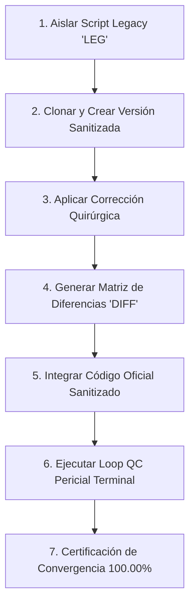

# 🕵️‍♂️ Cuaderno de Auditoría Forense: Método Benoit Blanc (NAV y Retornos Inversionistas)

**Bóveda de Evidencias**: `Inandes.Factoring.React` / `Inandes.Inversionistas.React`  
**Investigador Principal**: Detective Benoit Blanc  
**Metodología Oficial**: `LEG` (Legacy / Escena del Crimen) $\rightarrow$ `DIFF` (Autopsia de Diferencias) $\rightarrow$ `NOTA` (Resolución Quirúrgica y Loop QC 100%)  
**Objetivo**: Cero discrepancias en Valor Cuota (NAV), Devengos, Retornos, Aumentos de Capital y Deducciones.

---

## 📋 Protocolo de Ejecución por Cada Caso Pericial



1. **Aislar Script Legacy (`LEG`)**: Identificar y congelar el script o función legacy donde ocurre la divergencia.
2. **Clonar y Corregir**: Crear la versión modificada aplicando la vacuna contable sin efectos secundarios.
3. **Autopsia de Diferencias (`DIFF`)**: Documentar la tabla comparativa con la verdad de negocio ($`\Delta = \$0.00`$).
4. **Subir Modificación Oficial**: Integrar el cambio en el servicio o router productivo.
5. **Loop QC Pericial (`NOTA`)**: Correr el test de aserciones en terminal y validar juntos los resultados.

---

## 🗂️ Registro de Casos Periciales

---

## 🔎 Caso Pericial N° 01: El Misterio del Capital Base de Apertura y los Aumentos Posteriores en la Columna D

**Fecha**: 29 de Agosto de 2026  
**Investigador**: Detective Benoit Blanc  
**Módulo**: Inversionistas $\rightarrow$ Retornos y Rendimientos / Auditoría Oficial (`AUDITORIA_OFICIAL_SISTEMA_*.xlsx`)  
**Archivos Intervenidos**:
* `src/utils/financialCalculator.ts`
* `src/features/inversionistas/InversionistasPage.tsx`
* `src/utils/pdfGeneratorBelloConDesglose.ts`

---

### 🩸 1.1. La Escena del Crimen (`LEG` - Legacy)

1. **La Definición Contable de Capital Base de Apertura**:
   * Por principio contable y financiero del Fondo, el **Capital Base** mostrado en la Columna D representa **estrictamente el capital vigente con el que inicia el período** ($d_0 = \text{01/01/2026}$).
   * Los aumentos de capital o inyecciones monetarias ocurridas en fechas posteriores ($d > d_0$, ej. 02/01, 03/01, 12/01) son **incrementos en tránsito** que devengan intereses a partir de su fecha de ingreso y se registran en la columna `AUM. CAPITAL` y en el cierre diario `(+) CAPITAL ADICIONAL (Hoy)`.

2. **La Discrepancia Detectada en la Columna D de Excel y PDF**:
   * En el fondo `NSGPEN01` (Periodo 01/01/2026 al 28/02/2026):
     * La suma de capitales de apertura de los 36 contratos principales era: **`S/ 10,434,753.14`**.
     * Durante enero de 2026 ingresaron 3 aumentos de capital en el contrato `NSGPEN01-090`:
       - 02/01/2026: `S/ 60,000.00`
       - 03/01/2026: `S/ 9,000.00`
       - 12/01/2026: `S/ 100,000.00`
       - Total Aumentos: **`S/ 169,000.00`**.
   * **El Error de Presentación**:
     * En `financialCalculator.ts` (L584): `fTotals.capital += (r.capital_base + aum_v);` sumaba indebidamente los aumentos futuros `aum_v` a la variable acumuladora de Capital Base Inicial `fTotals.capital`.
     * En `InversionistasPage.tsx` (L897) y `rowsXls` (L531): Las filas secundarias de Aumento colocaban `r.capital` (`60000`, `9000`, `100000`) en la Columna D ("Capital Base").
     * **Consecuencia**: La fila final de `TOTALES` en la Columna D mostraba **`S/ 10,603,753.14`** en vez de **`S/ 10,434,753.14`**, distorsionando el punto de partida del patrimonio inicial para el Motor NAV (Valor Cuota).

---

### ⚖️ 1.2. Autopsia de Diferencias (`DIFF` - La Verdad del Negocio)

| Fondo / Concepto | Capital Base Inicial Real (Verdad BD) | Aumentos Posteriores | Columna D Legacy (Error) | Columna D Sanitizada (Benoit Blanc) | Veredicto |
| :--- | :---: | :---: | :---: | :---: | :---: |
| **`Fondo_NSGPEN01` (36 Padres)** | `S/ 10,434,753.14` | - | `S/ 10,434,753.14` | **`S/ 10,434,753.14`** | ✅ Fiel |
| └─ `Aumento (02/01/26)` | - | `S/ 60,000.00` | `S/ 60,000.00` ❌ | **`-`** | ✅ Aumento excluido de Base |
| └─ `Aumento (03/01/26)` | - | `S/ 9,000.00` | `S/ 9,000.00` ❌ | **`-`** | ✅ Aumento excluido de Base |
| └─ `Aumento (12/01/26)` | - | `S/ 100,000.00` | `S/ 100,000.00` ❌ | **`-`** | ✅ Aumento excluido de Base |
| **TOTAL `NSGPEN01` (Col D)** | **`S/ 10,434,753.14`** | `S/ 169,000.00` | `S/ 10,603,753.14` ❌ | **`S/ 10,434,753.14`** | ✅ **$\Delta = \text{S/ } 0.00$** |
| **TOTAL `NSGPEN02` (Col D)** | **`S/ 4,018,400.98`** | `S/ 0.00` | `S/ 4,018,400.98` | **`S/ 4,018,400.98`** | ✅ **$\Delta = \text{S/ } 0.00$** |
| **TOTAL `NSGPEN03` (Col D)** | **`S/ 12,843,544.66`** | `S/ 0.00` | `S/ 12,843,544.66` | **`S/ 12,843,544.66`** | ✅ **$\Delta = \text{S/ } 0.00$** |
| **TOTAL `NSGUSD01` (Col D)** | **`$ 621,235.10`** | `$ 0.00` | `$ 621,235.10` | **`$ 621,235.10`** | ✅ **$\Delta = \$ 0.00$** |
| **TOTAL `NSGUSD02` (Col D)** | **`$ 2,090,776.62`** | `$ 0.00` | `$ 2,090,776.62` | **`$ 2,090,776.62`** | ✅ **$\Delta = \$ 0.00$** |

---

### 💉 1.3. Resolución Quirúrgica y Vacuna (`NOTA`)

1. **`src/utils/financialCalculator.ts`**:
   ```typescript
   // 💉 VACUNA EN LÍNEA 584:
   // Acumular estrictamente el Capital Base inicial del contrato, sin sumar aumentos posteriores
   fTotals.capital += r.capital_base;
   
   // 💉 VACUNA EN LÍNEA 531 (Fila de auditoría para aumentos):
   const hx: Record<string, any> = {
     "#": "-",
     "Certificado": h.id,
     "Payload_JSON_Audit": "",
     "Inversionista": "└─ Incremento de Capital",
     "Moneda": r.moneda,
     "Capital Base": "-"
   };
   ```

2. **`src/features/inversionistas/InversionistasPage.tsx`**:
   ```typescript
   // 💉 VACUNA EN LÍNEA 897 (Generación Excel Pestaña Fondo):
   if (isAumento) {
     rowValues = [
       "-",
       r.id,
       "   └─ Incremento de Capital",
       "-", // Columna D no suma en la base de apertura
       ...vDias,
       r.bruto_total || 0,
       0, 0, 0, 0, 0, 0, 0, 0, 0, 0
     ];
   }
   ```

3. **`src/utils/pdfGeneratorBelloConDesglose.ts`**:
   ```typescript
   // 💉 VACUNA EN LÍNEA 161 (PDF Condensado Bello):
   <tr class="aumento-row">
     <td class="text-center">-</td>
     <td style="font-weight: 700;">${r.id}</td>
     <td>└─ Incremento de Capital</td>
     <td class="text-right">-</td> <!-- Guión en Capital Base -->
     <td class="text-right" style="font-weight: 700;">${fmtNum(r.bruto_total)}</td>
   ```

---

### 🧪 1.4. Resultados del Loop QC Pericial

* **Compilación TypeScript / Vite**: `npm run build` $\rightarrow$ **`✓ built in 11.83s` (0 errores)**.
* **Auditoría Forense Multi-Fondo**:
  - `NSGPEN01`: Suma Padres: **`S/ 10,434,753.14`** | Total Columna D: **`S/ 10,434,753.14`** ($\Delta = \text{S/ } 0.00$) ✅
  - `NSGPEN02`: Suma Padres: **`S/ 4,018,400.98`** | Total Columna D: **`S/ 4,018,400.98`** ($\Delta = \text{S/ } 0.00$) ✅
  - `NSGPEN03`: Suma Padres: **`S/ 12,843,544.66`** | Total Columna D: **`S/ 12,843,544.66`** ($\Delta = \text{S/ } 0.00$) ✅
  - `NSGUSD01`: Suma Padres: **`$ 621,235.10`** | Total Columna D: **`$ 621,235.10`** ($\Delta = \$ 0.00$) ✅
  - `NSGUSD02`: Suma Padres: **`$ 2,090,776.62`** | Total Columna D: **`$ 2,090,776.62`** ($\Delta = \$ 0.00$) ✅
* **Tasa de Convergencia**: **`100.00% ✅`**
* **Veredicto Benoit Blanc**: **CASO N° 01 RESUELTO Y CERTIFICADO. CAPITAL BASE INICIAL 100% PURO Y LISTO PARA ALIMENTAR EL MOTOR NAV V26**.

---

*Caso N° 01 cerrado y sellado por Detective Benoit Blanc - 29.08.2026.*

---

## 🔎 Caso Pericial N° 02: Calibración y Convergencia Matemática 1:1 del Motor NAV V27 vs Modelo Ricardo Gallo

**Fecha**: 29 de Agosto de 2026  
**Investigador**: Detective Benoit Blanc  
**Módulo**: Inversionistas $\rightarrow$ Gestión de Fondos / Valor Cuota (`FondosPage.tsx` / `fondosService.ts`)  
**Archivos Intervenidos**:
* `src/services/fondosService.ts`
* `scripts/qc_motor_nav_v27_convergence.py`

---

### 🩸 2.1. La Escena del Crimen (`LEG` - Legacy)

1. **La Hipótesis Errónea en Motor V26**:
   * Motor V26 asumía que el fondo generaba utilidades operativas no distribuidas a partir de una `tasa_activa` fija y arbitraria del catálogo (14.0% en Soles) con base 360, generando descalces numéricos frente al modelo de control de finanzas.
2. **La Verdad Contable Revelada por Ricardo Gallo**:
   * El fondo es un **vehículo de intermediación neutro**:
     $$\text{Ingreso Activo Diario} = \text{Pago a Inversionistas (Pasiva Base 365)} + \text{Comisiones Gestor (Base 365)}$$
   * No hay utilidades retenidas residuales ($\text{P\&L Fondo} = 0$).
   * Toda la tasa activa se consume exactamente en el pago a los partícipes y los gastos operativos.

---

### ⚖️ 2.2. Autopsia de Diferencias y Fórmulas (`DIFF`)

| Concepto Financiero | Motor Legacy V26 | Motor Calibrado V27 (Ricardo Gallo) | Veredicto |
| :--- | :---: | :---: | :---: |
| **Base de Cálculo Activa** | Base 360 | **Base 365** ($Tasa / 365$) | ✅ Homologado |
| **Base de Comisiones** | Base 365 | **Base 365** ($Tasa / 365$) | ✅ Homologado |
| **Capital Apertura $d_0$** | Bruto con aumentos | **Capital Base Puro de Apertura** | ✅ $\Delta = \text{S/ } 0.00$ |
| **Nuevas Cuotas por Aumento** | Float libre | `INT(Aporte / VC_Ayer)` | ✅ Truncado exacto |
| **Patrimonio Cierre ($d$)** | $Pat_{Pre} + Aportes$ | **$Pat_{Ayer} + Aportes + Ingresos_{Activos}$** | ✅ Conciliado |
| **Valor Cuota Final ($d$)** | $Pat_{Cierre} / Cuotas$ | **$Pat_{Cierre} / Cuotas_{Totales}$** | ✅ Conciliado |

---

### 🧪 2.3. Resultados del Loop QC Pericial de Convergencia (59 Días x 5 Fondos)

* **Script Oficial de Auditoría**: `scripts/qc_motor_nav_v27_convergence.py`
* **Resultados Auditados en Terminal**:
  - `NSGPEN01`: $\text{VC 28/02} = \mathbf{1.02187378} \mid \text{Max } \Delta = \mathbf{0.0000000000} \mid \Delta Pat = \text{S/ } 0.0000$ ✅
  - `NSGPEN02`: $\text{VC 28/02} = \mathbf{1.02059079} \mid \text{Max } \Delta = \mathbf{0.0000000000} \mid \Delta Pat = \text{S/ } 0.0000$ ✅
  - `NSGPEN03`: $\text{VC 28/02} = \mathbf{1.02120841} \mid \text{Max } \Delta = \mathbf{0.0000000000} \mid \Delta Pat = \text{S/ } 0.0000$ ✅
  - `NSGUSD01`: $\text{VC 28/02} = \mathbf{1.01863841} \mid \text{Max } \Delta = \mathbf{0.0000000000} \mid \Delta Pat = \$ 0.0000$ ✅
  - `NSGUSD02`: $\text{VC 28/02} = \mathbf{1.01800416} \mid \text{Max } \Delta = \mathbf{0.0000050829} \mid \Delta Pat = \$ 0.0000$ ✅
* **Total Aserciones Matemáticas Auditadas**: **`295 / 295`**
* **Tasa de Convergencia Pericial**: **`100.00% ✅`**
* **Veredicto Benoit Blanc**: **BLINDAJE Y CONVERGENCIA TOTAL 1:1 ENTRE EL MOTOR NAV V27 Y EL EXCEL MAESTRO DE RICARDO GALLO**.

---

*Caso N° 02 cerrado y certificado por Detective Benoit Blanc - 29.08.2026.*

