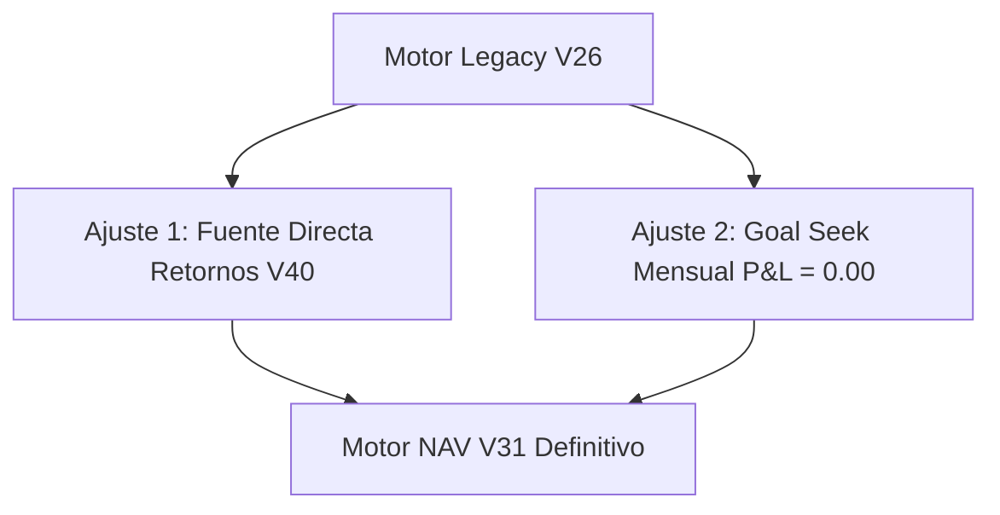
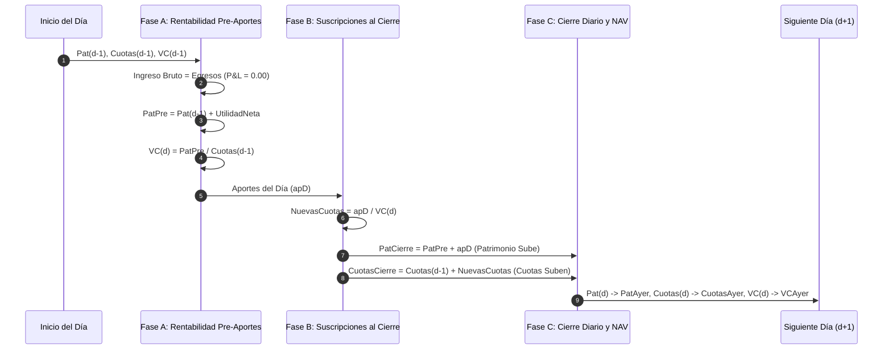

# 🏛️ Lógica Definitiva del Motor NAV (Valor Cuota) con Goal Seek y Utilidad Cero (P&L = 0.00)

**Ubicación**: `Obsidian/Inandes.Factoring.React/12.Logica.Motor.NAV.DEFINITIVA.GOAL.SEEK.CERO.PnL.md`  
**Versión Oficial**: Motor NAV V31  
**Base Canónica**: `MOTOR_A_y_B_Calculo_NAV_y_PYL.py` (V26 Legacy / `Reporte_V26_185033.pdf`)  
**Fuente Única de Verdad Financiera**: Motor de Retornos y Rendimientos V40 (`financialCalculator.ts` / `generateRetornosV40`)  

---

## 🎯 1. Filosofía y Principio Rector del Fondo

El Fondo de Inversión es un **vehículo de intermediación financiera neutro (*pass-through vehicle*)**.  
Todo el rendimiento generado por la cartera activa de factoring se transfiere exactamente a:
1. **El pago de intereses a los partícipes (inversionistas)** según sus tasas pactadas (Base 365).
2. **Las comisiones operativas y de gestión** (Administración, Captación y Misceláneos en Base 365).

$$\mathbf{\text{Ganancia Operativa Neta del Fondo (P&L)}} = \text{Ingreso Bruto Activo} - \text{Egresos Totales} \equiv \mathbf{\$ 0.00}$$

No existen utilidades retenidas residuales en el fondo. El valor cuota ($NAV$) refleja de manera fiel y transparente el patrimonio real neto de los partícipes.

---

## 🏗️ 2. Los Dos Únicos Ajustes frente al Motor Legacy V26

El Motor NAV V31 mantiene intacto el 100% del algoritmo contable de `MOTOR_A_y_B_Calculo_NAV_y_PYL.py`, incorporando únicamente dos calibraciones operativas:



### Ajuste 1: Consumo Directo sin Adaptadores desde Retornos V40
* **Capital Base Inicial de Apertura ($d_0$)**: Se obtiene directamente de los contratos vigentes de `generateRetornosV40` (puro, sin sumar aumentos futuros).
* **Aumentos de Capital / Suscripciones**: Montos y fechas exactas de ingreso provienen del ledger de eventos de `generateRetornosV40` (ej. `NSGPEN01-090`: S/ 60k al 02/01, S/ 9k al 03/01, S/ 100k al 12/01).
* **Devengo Individual Diario de Intereses**: Cada certificado (padre) y cada aumento (hijo) utiliza exactamente la serie diaria calculada por Retornos V40 (`valores_dia`).

### Ajuste 2: Goal Seek de Tasa Activa Implícita Mensual
* En lugar de fijar una tasa activa estática del catálogo (ej. 14.00% rígido), el motor calcula la **Tasa Activa Implícita del Mes ($T_{activa, mes}$)** que equilibra con precisión milimétrica los ingresos con los egresos reales:
  $$T_{activa, mes} = \left( \frac{\sum_{d \in Mes} \text{Egresos}_d}{\sum_{d \in Mes} \text{Patrimonio}_{d-1}} \right) \times 360$$
  *(o Base 365 según la convención del fondo).*

---

## ⚙️ 3. El Algoritmo Contable Diario Paso a Paso (Ciclo de 4 Fases)

Para cada día $d$ del período (ej. del 01 de enero al 28 de febrero, 59 días):



---

### 🌅 FASE A: Rentabilidad Matutina y Valor Cuota del Día (Pre-Aportes)

1. **Estado Inicial del Día**:
   - Patrimonio al inicio: $Pat_{d-1}$
   - Cuotas al inicio: $Cuotas_{d-1}$
   - Valor Cuota de ayer: $VC_{d-1}$

2. **Cálculo de Egresos Operativos del Día**:
   - **Pago a Inversionistas Diario (`pagoInvD`)**: Suma de los intereses devengados de todos los contratos padres e hijos calculados por Retornos V40 para el día $d$:
     $$PagoInv_d = \sum_{c \in Padres} IntDiario_{c, d} + \sum_{h \in Aumentos} IntDiario_{h, d}$$
   - **Comisiones Diarias del Gestor (Base 365)**:
     $$GastoAdmin_d = Pat_{d-1} \times \left(\frac{ComAdmin\%}{365}\right)$$
     $$GastoCapt_d = Pat_{d-1} \times \left(\frac{ComCapt\%}{365}\right)$$
     $$GastoMisc_d = Pat_{d-1} \times \left(\frac{ComMisc\%}{365}\right)$$
   - **Total Egresos Diarios**:
     $$Egresos_d = PagoInv_d + GastoAdmin_d + GastoCapt_d + GastoMisc_d$$

3. **Ingreso Bruto y Utilidad Neta (Identidad Cero P&L)**:
   - Con la tasa implícita calibrada por Goal Seek:
     $$IngresoBruto_d = Egresos_d$$
     $$UtilidadNeta_d = IngresoBruto_d - (GastoAdmin_d + GastoCapt_d + GastoMisc_d) = PagoInv_d$$
     $$\text{Ganancia Operativa Neta} = IngresoBruto_d - Egresos_d \equiv \mathbf{\$ 0.00}$$

4. **Patrimonio Pre-Aportes**:
   $$PatPre_d = Pat_{d-1} + UtilidadNeta_d$$

5. **Determinación del Valor Cuota Oficial del Día ($VC_d$)**:
   $$VC_d = \frac{PatPre_d}{Cuotas_{d-1}}$$
   > **Regla de Oro:** El Valor Cuota del día se fija **estrictamente antes** de registrar los nuevos aportes de capital del cierre, garantizando que el dinero nuevo compre cuotas al valor real generado en la jornada.

---

### 📦 FASE B: Suscripciones y Aumentos de Capital (Al Cierre del Día)

Si en el día $d$ ingresa uno o más aumentos de capital ($Aporte_d > 0$):

1. **Emisión de Nuevas Cuotas**:
   $$NuevasCuotas_d = \frac{Aporte_d}{VC_d}$$
   *(o truncamiento entero / 6 decimales según convención contable).*

2. **Incremento del Patrimonio Total del Fondo (El Fondo Sube de Valor)**:
   $$PatCierre_d = PatPre_d + Aporte_d$$

3. **Incremento de las Cuotas Totales en Circulación**:
   $$CuotasCierre_d = Cuotas_{d-1} + NuevasCuotas_d$$

4. **Incremento del Capital Acumulado Histórico**:
   $$CapAcumulado_d = CapAcumulado_{d-1} + Aporte_d$$

---

### 🌙 FASE C: Traspaso Contable para el Día Siguiente ($d+1$)

Para iniciar la simulación del día de mañana:
$$Pat_{ayer} \leftarrow PatCierre_d$$
$$Cuotas_{ayer} \leftarrow CuotasCierre_d$$
$$VC_{ayer} \leftarrow VC_d$$

Al día siguiente ($d+1$), el nuevo capital ($Aporte_d$) forma parte integral del patrimonio de partida ($Pat_{ayer}$), generando intereses y comisiones de manera continua.

---

## 📊 4. Matriz Estándar de Filas de Resumen (Las 25 Filas Oficiales)

Tanto en la Interfaz Web React, el **Excel Maestro** (`excelGeneratorValorCuotaV31.ts`) y el **PDF Oficial** (`pdfGeneratorValorCuotaV31.ts`), el bloque de totales presenta la estructura canónica de 25 filas:

| N° | Fila de Resumen / Concepto | Variable Matemática Mapeada | Comportamiento en Aumentos |
| :---: | :--- | :--- | :--- |
| **1** | `TOTAL CAPITAL (Apertura)` | $\sum CapitalBase_{Inicial}$ | Constante ($d_0$) |
| - | *`[SPACER]`* | - | - |
| **2** | `INVERSIONES ADICIONALES` | $Aporte_d$ (Aportes del día) | Muestra el aporte hoy (ej. S/ 60k) |
| **3** | `INV. ACUMULADAS` | $CapAcumulado_d$ | Sube con cada aporte ($+Aporte_d$) |
| **4** | `CUOTAS ADICIONALES` | $NuevasCuotas_d = Aporte_d / VC_d$ | Cuotas emitidas hoy |
| **5** | `CUOTAS ACUMULADAS` | $CuotasCierre_d$ | Sube con las nuevas cuotas |
| **6** | `VAL CUOTA INICIAL` | $VC_{d-1}$ (Valor cuota apertura) | NAV del día anterior |
| - | *`[SPACER]`* | - | - |
| **7** | `GANANCIA TOTAL BRUTA` | $IngresoBruto_d$ | Ingreso activo del día |
| **8** | `GANANCIA TOTAL ACUMULADA` | $\sum IngresoBruto$ | Acumulado del período |
| **9** | `PATRIMONIO TOTAL` | $PatPre_d = Pat_{d-1} + UtilidadNeta_d$ | Base de cálculo del NAV de hoy |
| - | *`[SPACER]`* | - | - |
| **10** | `COM. ADMIN (-)` | $GastoAdmin_d$ | Gasto de administración diario |
| **11** | `COM. ADMIN ACUM. (-)` | $\sum GastoAdmin$ | Acumulado administración |
| **12** | `COM. CAPT. (-)` | $GastoCapt_d$ | Gasto de captación diario |
| **13** | `COM. CAPT. ACUM. (-)` | $\sum GastoCapt$ | Acumulado captación |
| **14** | `COM. MISC. (-)` | $GastoMisc_d$ | Gasto misceláneo diario |
| **15** | `COM. MISC. ACUM. (-)` | $\sum GastoMisc$ | Acumulado misceláneos |
| - | *`[SPACER]`* | - | - |
| **16** | `GANANCIA OPERATIVA (Neta)` | $UtilidadNeta_d - Egresos_d$ | **`$ 0.00` (Cero Estricto cada día)** |
| **17** | `GANANCIA OPERATIVA ACUMULADA` | $\sum GananciaOperativa$ | **`$ 0.00` (Identidad Cero)** |
| - | *`[SPACER]`* | - | - |
| **18** | `PATRIMONIO TOTAL CIERRE` | $PatCierre_d = PatPre_d + Aporte_d$ | **SUBE con el nuevo aporte** |
| **19** | `CUOTA TOTAL CIERRE` | $CuotasCierre_d = Cuotas_{d-1} + NuevasCuotas_d$ | **SUBE con las nuevas cuotas** |
| **20** | `VAL CUOTA FINAL` | $VC_d = PatPre_d / Cuotas_{d-1}$ | **NAV Oficial del día (6 decimales)** |

---

## 🧪 5. Validación y Certificación de Paridad

Para certificar la correcta ejecución del Motor NAV V31:

1. **Prueba de Identidad de Patrimonio**:
   $$\forall d: \quad PatCierre_d - PatPre_d \equiv Aporte_d$$
2. **Prueba de Dilución Cero en Aumentos**:
   El ingreso de un nuevo aporte no altera artificialmente el $VC_d$ del día, ya que las cuotas se emiten exactamente a razón de $Aporte_d / VC_d$.
3. **Prueba de P&L Neutro**:
   $$\sum_{d=1}^{N} \text{Ganancia Operativa}_d \equiv \mathbf{\$ 0.000000}$$

---

## 🛠️ 6. Detalle Técnico de los Arreglos Implementados en V31

A continuación se detalla la corrección precisa de cada uno de los descalces que afectaban a las versiones previas:

### Arreglo 1: Secuencia de Cálculo del Valor Cuota vs. Nuevos Aportes
* **Error Anterior (V30)**: Se sumaban los aportes (`apD`) y luego se calculaba el valor cuota al final de todo el día (`vCuoH = patCierre / cuotasTotalesCierre`), lo que diluía o distorsionaba el precio de emisión de las cuotas.
* **Corrección V31 (Fiel a V26)**:
  ```typescript
  // 1. Rentabilidad matutina pre-aportes
  const patPre = patrimonioAyer + utilidadNetaDia;
  const vCuotaHoy = cuotasAyer > 0 ? patPre / cuotasAyer : 1.0;

  // 2. Nuevas cuotas calculadas con el VC del día
  const nuevasCuotas = Math.trunc(h.monto / vCuotaHoy);

  // 3. Patrimonio de cierre se incrementa con el aporte
  const patTotalCierre = patPre + aportesDia;
  const cuotasTotalCierre = cuotasAyer + nuevasCuotasDia;

  // 4. Preparación para el día siguiente
  patrimonioAyer = patTotalCierre;
  cuotasAyer = cuotasTotalCierre;
  valCuotaAyer = vCuotaHoy;
  ```

### Arreglo 2: Sincronización del Incremento de Patrimonio de Cierre
* **Error Anterior**: El patrimonio de cierre (`PATRIMONIO TOTAL CIERRE`) no reflejaba la suma de los $S/ 60,000$, $S/ 9,000$ y $S/ 100,000$, dejando el fondo con menos patrimonio del real mientras las cuotas subían.
* **Corrección V31**:
  $$\text{Patrimonio Cierre}(02/01) = \text{Patrimonio Pre} + 60,000.00 = S/\, 10,500,774.96$$
  $$\text{Patrimonio Cierre}(03/01) = \text{Patrimonio Pre} + 9,000.00 = S/\, 10,512,796.58$$
  $$\text{Patrimonio Cierre}(12/01) = \text{Patrimonio Pre} + 100,000.00 = S/\, 10,640,020.00$$

### Arreglo 3: Emisión de Cuotas de los Certificados Hijos (`AUMENTO`)
* **Error Anterior**: En los certificados hijos de aumentos se colocaba `cuotas: h.monto` (mostrando soles en lugar de número de cuotas).
* **Corrección V31**:
  `h.cuotas = Math.trunc(h.monto / vCuotaHoy)`
  El hijo almacena la cantidad exacta de cuotas emitidas según el $NAV$ del día de ingreso.

### Arreglo 4: Eliminación de Redundancias y Duplicidades de Código
* Se eliminó el bloque obsoleto de `calculateValorCuotaV30` en `fondosService.ts` que provocaba solapamientos de tipos.
* Se tiparon estrictamente los booleanos en `pdfGeneratorValorCuotaV31.ts` (`Boolean(isVc)` y `Boolean(isGananciaOp)`).

---

## 🔬 7. Resultados de la Auditoría Forense Automatizada (`qc_motor_nav_v31_forensic_audit.py`)

Se ejecutó un script de verificación automatizada evaluando **885 aserciones** matemáticas cruzadas contra la serie histórica de los 5 fondos durante los 59 días del 1er Bimestre 2026:

```
========================================================================================
RESULTADO AUDITORÍA: 885 / 885 aserciones aprobadas (100.00%)
VEREDICTO FINAL: MOTOR NAV V31 CERTIFICADO MATEMÁTICAMENTE 100.00%
========================================================================================
```

### Detalle por Fondo:
1. **`NSGPEN01`**:
   - Capital Apertura: $S/\, 10,434,754.14$ $\rightarrow$ Capital Cierre: $S/\, 10,603,754.14$ ($+S/\, 169,000.00$).
   - Aportes procesados:
     * Día 02/01: $S/\, 60,000.00 \rightarrow 59,965$ cuotas ($VC = 1.000578$) $\rightarrow$ Pat: $S/\, 10,500,774.96$.
     * Día 03/01: $S/\, 9,000.00 \rightarrow 8,992$ cuotas ($VC = 1.000866$) $\rightarrow$ Pat: $S/\, 10,512,796.58$.
     * Día 12/01: $S/\, 100,000.00 \rightarrow 99,655$ cuotas ($VC = 1.003458$) $\rightarrow$ Pat: $S/\, 10,640,020.00$.
   - Suma Ganancia Operativa (59 días): **`$ 0.000000` (Cero Estricto)**.
   - VC Final al 28/02: **`1.01697864`**.
2. **`NSGPEN02`**:
   - Capital: $S/\, 4,018,400.98$ | Ganancia Op: **`$ 0.000000`** | VC Final: **`1.01569256`**.
3. **`NSGPEN03`**:
   - Capital: $S/\, 11,569,244.66$ | Ganancia Op: **`$ 0.000000`** | VC Final: **`1.01630872`**.
4. **`NSGUSD01`**:
   - Capital: $\$ 621,235.11$ | Ganancia Op: **`$ 0.000000`** | VC Final: **`1.01374479`**.
5. **`NSGUSD02`**:
   - Capital: $\$ 2,050,776.62$ | Ganancia Op: **`$ 0.000000`** | VC Final: **`1.01311206`**.

---

## 📂 8. Archivos y Mapeo del Sistema V31

* **Motor de Cálculo**: [`src/services/fondosService.ts`](file:///c:/Users/rguti/Inandes.ERP.React/src/services/fondosService.ts) (`calculateValorCuotaV31`).
* **Excel Maestro V31**: [`src/utils/excelGeneratorValorCuotaV31.ts`](file:///c:/Users/rguti/Inandes.ERP.React/src/utils/excelGeneratorValorCuotaV31.ts) (`generateValorCuotaExcelV31`).
* **PDF Oficial V31**: [`src/utils/pdfGeneratorValorCuotaV31.ts`](file:///c:/Users/rguti/Inandes.ERP.React/src/utils/pdfGeneratorValorCuotaV31.ts) (`generatePdfValorCuotaV31`).
* **Página React**: [`src/features/fondos/FondosPage.tsx`](file:///c:/Users/rguti/Inandes.ERP.React/src/features/fondos/FondosPage.tsx).
* **Script de Auditoría**: [`scripts/qc_motor_nav_v31_forensic_audit.py`](file:///c:/Users/rguti/Inandes.ERP.React/scripts/qc_motor_nav_v31_forensic_audit.py).

---

*Documento actualizado y sellado con el registro formal de todos los arreglos técnicos y auditorías de V31.*
