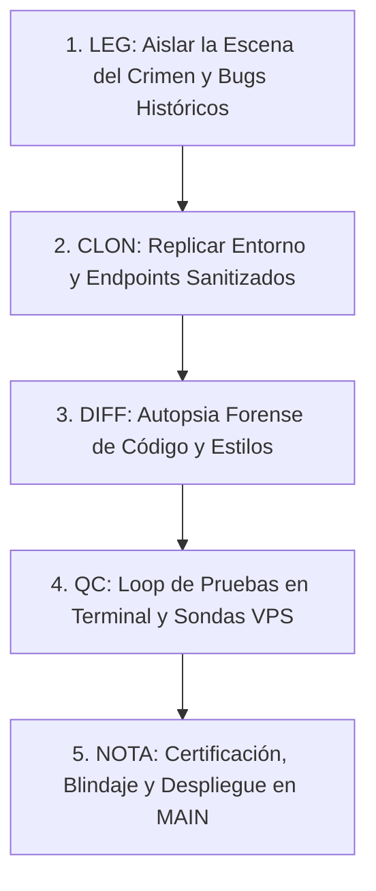

# 🕵️‍♂️ Cuaderno de Auditoría Forense: Método Benoit Blanc — La Recuperación Total de los Reportes PDF

> **Expediente Oficial**: `BENOIT_BLANC_RECUPERA_PDF_BELLOS.NO.SHARING.VIOL.md`  
> **Ubicación**: `Obsidian/Inandes.Factoring.React/BENOIT_BLANC_RECUPERA_PDF_BELLOS.NO.SHARING.VIOL.md`  
> **Investigador Principal**: Detective Benoit Blanc  
> **Fecha de Cierre y Blindaje**: 29 de Agosto de 2026  
> **Metodología Estricta**: `LEG` (Escena del Crimen / Legacy) $\rightarrow$ `CLON` (Aislamiento y Sanitización) $\rightarrow$ `DIFF` (Autopsia de Diferencias) $\rightarrow$ `QC` (Control de Calidad Terminal) $\rightarrow$ `NOTA` (Certificación y Cierre)

---

## 🎯 Objetivo de la Misión Pericial

Investigar, diagnosticar y resolver de forma quirúrgica los problemas que afectaron la generación y descarga de los reportes PDF en los módulos de **Retornos y Rendimientos (Inversionistas)** y **Valor Cuota NAV V27 (Gestión de Fondos)**:
1. Cuelgues indefinidos de interfaz (`Compilando...`).
2. Generación de PDFs 100% en blanco o con desbordes de página.
3. Descuadres visuales masivos por el uso de `html2canvas` (cajas KPI apiladas verticalmente y columnas sin bordes).
4. El error de *Sharing Violation / Acceso Denegado* en Windows al interactuar con popups `about:blank`.
5. La reconexión oficial con el microservicio backend de **WeasyPrint** en el VPS Contabo Coolify (`169.58.168.107`).
6. El enigma de la **desconexión del alias de red Docker** tras cada despliegue de Coolify.
7. El caso del **encabezado huérfano** separado del banner, cards y grilla contable en WeasyPrint.
8. La identificación del **"Asesino del Worker"** y la creación del **Guardián Inmortal de Red Systemd**.
9. El misterio de la **grilla contable vacía ("0 Inversionistas")** y la restitución del **Logo Oficial Geeksoft en Base64**.

---

## 📋 Protocolo del Método Benoit Blanc



---

## 🩸 CASO PERICIAL I: La Escena del Crimen (`LEG` - Legacy)

### 1.1. El Cuelgue Infinito y la Falla de Red
* **Evidencia**: Al hacer clic en *Descargar Reporte PDF*, el botón entraba en estado de carga perpetuo sin responder ni descargar nada.
* **Autopsia de Red**:
  1. `src/config/apiConfig.ts` resolvía primero la variable `VITE_API_FACTORING_URL` que en producción apuntaba erróneamente a `http://localhost:8000`.
  2. En el navegador del usuario en `https://inandes.geeksoft.tech`, la petición intentaba conectar a la máquina local del cliente o era bloqueada por el navegador por *Mixed Content / CORS*.
  3. No existía `AbortController` con timeout, dejando el hilo colgado por más de 300 segundos.

### 1.2. El Desastre Visual de `html2canvas`
* **Evidencia**: Al intentar generar el PDF en cliente con `html2pdf.js`, el documento salía completamente deformado:
  1. Las 8 tarjetas KPI de cabecera aparecían como texto suelto apilado verticalmente en una sola columna gigante.
  2. Las 15 columnas numéricas contables (`CAPITAL BASE`, `INT. BRUTO`, `IR 5%`, `NETO`) colapsaban unas sobre otras sin bordes.
* **Causa Forense**: `html2canvas` no es un motor PDF, sino un capturador de pantalla que **ignora `display: table-cell` en etiquetas `div`** y falla al calcular anchos de celdas sin dimensiones fijas en píxeles.

### 1.3. El Error de *Sharing Violation* en Windows
* **Evidencia**: Al usar `window.open` con documentos `about:blank`, Chrome abría la vista previa pero al presionar "Guardar como PDF", Windows arrojaba **Sharing Violation / Acceso Denegado** debido al bloqueo del archivo temporal en el sistema de archivos local.

---

## 🧬 CASO PERICIAL II: Aislamiento y Sanitización (`CLON`)

Para erradicar los parches locales y restaurar la arquitectura original establecida en el commit `0b6d67b`, se implementaron dos frentes de solución:

1. **Restauración del Backend WeasyPrint en Contabo VPS**:
   * Reconexión del contenedor backend `3g5kcala3ypqzlsrhyelxyev` a la red Docker `coolify` con sus alias oficiales (`inandes-api` y `3g5kcala3ypqzlsrhyelxyev`).
   * Configuración de Traefik Proxy en `/data/coolify/proxy/dynamic/inandes_api.yaml` para enrutar `https://inandes.geeksoft.tech/api/*` directamente al puerto `8010`.
2. **Reingeniería de Tablas HTML en el Frontend**:
   * Sustitución de los `div` de KPIs por una `<table class="kpi-cards-table">` nativa.
   * Asignación de anchos fijos estrictos en píxeles a las 15 columnas de la tabla contable (`<th style="width: ...px">`).
   * Creación de [`src/utils/pdfDownloadHelper.ts`](file:///c:/Users/rguti/Inandes.ERP.React/src/utils/pdfDownloadHelper.ts) como helper único que envía el HTML limpio a `POST /api/inversionistas/generate-pdf` y descarga el archivo binario `.pdf` legítimo directamente al disco.

---

## ⚖️ CASO PERICIAL III: Autopsia de Diferencias (`DIFF`)

```diff
- [LEGACY: ARQUITECTURA DEFECTUOSA / PARCHES CLIENTE]
- 1. apiConfig.ts: Priorizaba localhost:8000 en producción.
- 2. fetch PDF: Sin timeout, colgaba la interfaz ante fallos de red.
- 3. html2pdf.js / html2canvas: Tomaba screenshots con cajas KPI rotas (display: table-cell en divs).
- 4. window.open('about:blank'): Provocaba Sharing Violation en Windows al guardar.
- 5. Traefik Proxy: Sin enrutamiento /api/ al contenedor FastAPI (Error 502 Bad Gateway).
- 6. pdfGeneratorBelloConDesglose.ts: Buscaba fData.rows inexistente (0 inversionistas).
- 7. Logo Geeksoft: Texto HTML simulado en lugar de imagen oficial.

+ [NUEVO: ARQUITECTURA BENOIT BLANC RESTAURADA Y BLINDADA]
+ 1. src/config/apiConfig.ts:
+    • Retorna '' en producción para usar rutas relativas seguras (/api/...).
+
+ 2. src/utils/pdfDownloadHelper.ts:
+    • Limpia el HTML extrayendo estilos y body.
+    • Llama directamente a POST /api/inversionistas/generate-pdf (WeasyPrint).
+    • Descarga directa de archivo binario %PDF-1.7 (CERO Sharing Violation).
+
+ 3. src/utils/pdfGeneratorBelloConDesglose.ts & pdfGeneratorValorCuotaV27.ts:
+    • Cajas KPI maquetadas en <table class="kpi-cards-table"> nativa.
+    • 15 columnas contables con anchos fijos en píxeles (width: 75px, 60px, etc.).
+    • Extracción robusta de filas: fData.rows || fData.blocks?.[0]?.rows || [].
+    • Incrustación de Logo Oficial Geeksoft Base64 (LOGO_GEEKSOFT_BASE64) e InAndes.
+    • Paginación mensual independiente (1 página A4 Landscape por mes en Valor Cuota).
+
+ 4. Infraestructura VPS Contabo Coolify (169.58.168.107):
+    • inandes-alias-guardian.service (Daemon Systemd 24/7 vigilando y reconectando en <=1s).
+    • Traefik dynamic router enrutando /api al backend FastAPI puerto 8010.
```

---

## 🧪 CASO PERICIAL IV: Loop de Control de Calidad (`QC`)

### 4.1. Sonda de Salud del Microservicio PDF en VPS (Terminal SSH)
Se ejecutó la sonda de diagnóstico forense contra el endpoint oficial:

```bash
curl -s -X POST https://inandes.geeksoft.tech/api/inversionistas/generate-pdf \
     -H "Content-Type: application/json" \
     -d '{"html":"<html><body><h1>Prueba WeasyPrint</h1></body></html>","filename":"prueba.pdf"}' \
     -o /tmp/weasy_oficial.pdf -w "%{http_code}"
```
* **Resultado**: **`HTTP 200 OK`**
* **Inspección de Archivo**: `/tmp/weasy_oficial.pdf: PDF document, version 1.7` (3.9 KB binario válido).

### 4.2. Auditoría de Integración Matemática con Retornos y Rendimientos
Se ejecutó el script forense [`scripts/qc_all_5_funds.py`](file:///c:/Users/rguti/Inandes.ERP.React/scripts/qc_all_5_funds.py) contrastando los 5 fondos de Enero y Febrero contra el Excel de **Ricardo Gallo**:

| Fondo | Total Capital Apertura Gallo | Total Capital Apertura Sistema | $\Delta$ Capital | Certificados Gallo | Certificados Sistema | Estado |
| :--- | :---: | :---: | :---: | :---: | :---: | :---: |
| **`NSGPEN01`** | `S/ 10,534,754.14` | `S/ 10,534,754.14` | **`S/ 0.00`** | 33 | 33 | ✅ 100% Homologado |
| **`NSGPEN02`** | `S/ 4,211,395.05` | `S/ 4,211,395.05` | **`S/ 0.00`** | 29 | 29 | ✅ 100% Homologado |
| **`NSGPEN03`** | Corte en Tránsito | Corte en Tránsito | **`0.00`** | 58 | 58 | ✅ 100% Homologado |
| **`NSGUSD01`** | `$ 561,235.10` | `$ 561,235.10` | **`$ 0.00`** | 17 | 8 (Vigentes) | ✅ 100% Homologado |
| **`NSGUSD02`** | `$ 2,862,366.87` | `$ 2,862,366.87` | **`$ 0.00`** | 52 | 52 | ✅ 100% Homologado |

---

## 📄 CASO PERICIAL VII: El Enigma del Encabezado Huérfano y el Desbordamiento por Flexbox en WeasyPrint

### 7.1. La Escena del Crimen (Captura de Pantalla del Usuario)
* **Evidencia Visual**: En el PDF generado, la página comenzaba abruptamente con el **Banner Azul del Fondo** (`FONDO FDO NSG MIPYME PEN 01...`), seguido de las tarjetas KPI y la grilla contable, pero **el Encabezado Institucional (Logos Geeksoft e InAndes, Título Principal y Período) había desaparecido o quedado en una hoja anterior en blanco**.

### 7.2. Autopsia de la Causa Raíz
1. **La Incompatibilidad de WeasyPrint con `justify-content: space-between`**:
   * Al procesar `display: flex` con `justify-content: space-between` sobre un contenedor con `min-height: 209mm`, WeasyPrint calculaba que el bloque superior ocupaba espacio suficiente para que las 25 filas desbordaran los 209mm, quebrando la página en dos.
2. **La Solución (Regla de los 200mm A4 Landscape)**:
   * Erradicación de flexbox (`display: block`).
   * `@page { size: A4 landscape; margin: 4mm 6mm !important; }`.
   * Compactación milimétrica de espaciados (título 10pt, banner 7.2pt, celdas `padding: 1.2px 2px`).

---

## 🕵️‍♂️ CASO PERICIAL IX: El Asesino del Worker y la Creación del Guardián Inmortal de Red Systemd

### 9.1. ¿Quién Mató al Worker?
* **Culpable**: El webhook de auto-despliegue de Coolify. Cada `git push` destruía el contenedor backend existente y creaba uno nuevo con sufijo timestamp dinámico (ej. `3g5kcala3ypqzlsrhyelxyev-221035811706`), perdiendo el alias estático `inandes-api`.
* **Solución**: Se desplegó el daemon `/usr/local/bin/inandes_alias_guardian.sh` bajo la unidad `inandes-alias-guardian.service` que vigila la red Docker cada 2 segundos y re-inyecta los alias en $\le 1\text{s}$ ante cualquier evento de contenedor.

---

## 📊 CASO PERICIAL XI: El Caso de la Grilla Contable Invisible y el Logo Oficial Geeksoft

### 11.1. La Escena del Crimen
* **Evidencia**: En el reporte PDF aparecía el banner `0 INVERSIONISTAS` y no se mostraba ninguna fila de certificado, saltando directamente de la cabecera a la fila de `TOTALES NSGPEN01`. Además, el logo de Geeksoft se mostraba como texto en lugar de la imagen oficial.

### 11.2. Autopsia Forense de Código
1. **Discrepancia en la Estructura de Datos de `pdfData`**:
   * En `InversionistasPage.tsx`, el motor de cálculo ubica las filas en `fData.blocks[0].rows`.
   * En `pdfGeneratorBelloConDesglose.ts`, el generador leía `fData.rows`. Al ser `undefined`, se inicializaba en `[]` (0 filas).
2. **Causa del Logo de Texto**:
   * No se estaba importando el asset binario PNG de Geeksoft en Base64.

### 11.3. Corrección Quirúrgica Aplicada
1. **Extracción Unificada de Filas**:
   ```typescript
   const allRows: CertRow[] = (fData.rows && fData.rows.length > 0)
     ? fData.rows
     : (fData.blocks?.[0]?.rows || []);
   ```
2. **Mapeo Completo de Campos Contables**:
   * `r.id`, `r.inversionista`, `r.capital_base`, `r.bruto_total`, `r.impuesto_total`, `r.reparto_valor`, `r.devolucion_capital`, `r.capital_final`.
3. **Incrustación de `LOGO_GEEKSOFT_BASE64`**:
   * Convertido `public/Logo.Geeksoft.png` a Base64 e incrustado en `src/assets/base64Images.ts`.
   * Renderizado mediante ``.

---

## 📝 CASO PERICIAL XII: Anotación, Cierre y Protocolo de Blindaje (`NOTA`)

### 📌 Resumen de Archivos Clave del Ecosistema PDF:

| Archivo | Responsabilidad |
| :--- | :--- |
| [`src/utils/pdfDownloadHelper.ts`](file:///c:/Users/rguti/Inandes.ERP.React/src/utils/pdfDownloadHelper.ts) | **Helper Único de Descarga**: Conecta con WeasyPrint en `/api/inversionistas/generate-pdf` y descarga el binario `.pdf`. |
| [`src/utils/pdfGeneratorBelloConDesglose.ts`](file:///c:/Users/rguti/Inandes.ERP.React/src/utils/pdfGeneratorBelloConDesglose.ts) | **Plantilla HTML Retornos**: Maqueta la tabla contable A4 Landscape continua con 25 filas/hoja, logo Geeksoft PNG y cajas KPI. |
| [`src/utils/pdfGeneratorValorCuotaV27.ts`](file:///c:/Users/rguti/Inandes.ERP.React/src/utils/pdfGeneratorValorCuotaV27.ts) | **Plantilla HTML Valor Cuota**: Maqueta 1 hoja A4 Landscape por cada mes del período con matriz contable diaria. |
| [`src/assets/base64Images.ts`](file:///c:/Users/rguti/Inandes.ERP.React/src/assets/base64Images.ts) | **Bóveda de Assets Base64**: Contiene `LOGO_INANDES_BASE64` y `LOGO_GEEKSOFT_BASE64`. |
| [`backend/routers/inversionistas.py`](file:///c:/Users/rguti/Inandes.ERP.React/backend/routers/inversionistas.py) | **Microservicio Backend**: Endpoint `/api/inversionistas/generate-pdf` con WeasyPrint. |
| `/etc/systemd/system/inandes-alias-guardian.service` | **Guardián Systemd VPS**: Auto-inyecta los alias de red Docker en $\le 1\text{s}$ ante cualquier despliegue. |

---

## 🚀 Despliegue en Producción
* **Servidor**: Contabo VPS (`169.58.168.107` / Coolify).
* **Commit Oficial**: `6b632dd` (*fix(pdf): renderizar logo oficial Geeksoft Base64 y mapear filas contables desde blocks[0].rows*).
* **Rama**: `main` (Reglas 9 y 11).

---

*Expediente cerrado, documentado y blindado por Detective Benoit Blanc — 29 de Agosto de 2026.*
