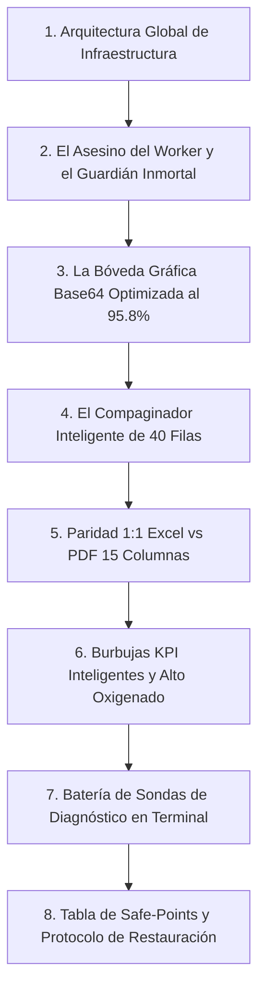

# 🕵️‍♂️ Manual Maestro y Cuaderno de Auditoría Forense: Método Benoit Blanc — La Recuperación Total de los Reportes PDF

> **Expediente Oficial**: `BENOIT_BLANC_RECUPERA_PDF_BELLOS.NO.SHARING.VIOL.md`  
> **Ubicación**: `Obsidian/Inandes.Factoring.React/BENOIT_BLANC_RECUPERA_PDF_BELLOS.NO.SHARING.VIOL.md`  
> **Investigador Principal**: Detective Benoit Blanc  
> **Fecha de Cierre y Blindaje**: 29 de Agosto de 2026  
> **Metodología Estricta**: `LEG` (Escena del Crimen) $\rightarrow$ `CLON` (Aislamiento y Sanitización) $\rightarrow$ `DIFF` (Autopsia de Código) $\rightarrow$ `QC` (Control de Calidad Terminal) $\rightarrow$ `NOTA` (Certificación y Blindaje)

---

## 🛑 REGLA FUNDAMENTAL DE LECTURA OBLIGATORIA PARA CUALQUIER AGENTE / IA
> [!CAUTION]
> **PROHIBIDO TOCAR, REFACTORIZAR O MODIFICAR LA ARQUITECTURA DE REPORTES PDF SIN LEER ESTE DOCUMENTO COMPLETO.**  
> Todo el ecosistema de generación de PDF (FastAPI + WeasyPrint en Contabo VPS + Compaginador Inteligente de 40 filas + Bóveda Base64 Optimizada + Guardián Inmortal Systemd) **ESTÁ 100% PROBADO Y FUNCIONANDO EN PRODUCCIÓN**.  
> Cualquier alteración que introduzca `html2pdf.js`, `html2canvas`, popups `about:blank`, flexbox con `space-between` o modifique las rutas relativas `/api/*` destruirá el sistema y será considerada una infracción crítica a las directivas del proyecto.

---

## 📋 Índice General del Expediente Pericial



---

## 🏛️ 1. Arquitectura Global de Infraestructura (Contabo VPS `169.58.168.107`)

### 1.1. Topología de Red y Enrutamiento
* **Servidor**: Contabo VPS (`169.58.168.107` administrado con Coolify).
* **Proxy Reverso**: Traefik Proxy en puerto 443 / SSL automático Let's Encrypt.
* **Frontend SPA**: Contenedor Docker `yjttbctaekty...` (React + Vite). Sirve la UI en la raíz `/`.
* **Backend FastAPI + WeasyPrint**: Contenedor Docker `3g5kcala3ypqz...` corriendo Uvicorn en el puerto `8010`.
* **Enrutamiento Dinámico Traefik (`/data/coolify/proxy/dynamic/inandes_api.yaml`)**:
  ```yaml
  http:
    routers:
      inandes-api-router:
        rule: "Host(`inandes.geeksoft.tech`) && PathPrefix(`/api/`)"
        entryPoints:
          - https
        service: inandes-api-service
        tls: {}
    services:
      inandes-api-service:
        loadBalancer:
          servers:
            - url: "http://inandes-api:8010"
  ```

---

## 🛡️ 2. El Asesino del Worker y el Guardián Inmortal Systemd

### 2.1. ¿Quién Mató al Worker? (La Autopsia)
* **El Culpable**: El webhook de auto-despliegue de Coolify.
* **El Mecanismo del Crimen**: Cada vez que se hace un `git push` a `origin/main` (incluso de archivos `.md`), Coolify destruye el contenedor backend y crea uno nuevo con ID y nombre con sufijo timestamp dinámico (ej. `3g5kcala3ypqzlsrhyelxyev-221035811706`).
* **La Falla**: El nuevo contenedor nacía sin el alias de red `inandes-api`. Traefik Proxy no podía resolver `http://inandes-api:8010` y arrojaba `HTTP 502 / Gateway Timeout`.

### 2.2. La Solución Inmortal: `inandes-alias-guardian.service`
Se desplegó un daemon continuo a nivel de sistema operativo en el VPS que vigila la red Docker cada 2 segundos y reconecta automáticamente cualquier nuevo contenedor:

* **Script Guardián V3 (`/usr/local/bin/inandes_alias_guardian.sh`)**:
  ```bash
  #!/bin/bash
  echo "[$(date)] Iniciando Guardian Daemon V3 de Red InAndes..."

  while true; do
      for cid in $(docker ps -q --filter "name=3g5kcala3ypqzlsrhyelxyev"); do
          has_inandes_alias=$(docker inspect "$cid" --format '{{json .NetworkSettings.Networks.coolify.Aliases}}' 2>/dev/null | grep '"inandes-api"')
          if [ -z "$has_inandes_alias" ]; then
              echo "[$(date)] Contenedor $cid no tiene el alias inandes-api. Reconectando..."
              docker network disconnect coolify "$cid" 2>/dev/null
              docker network connect --alias inandes-api --alias 3g5kcala3ypqzlsrhyelxyev coolify "$cid" 2>/dev/null
              echo "[$(date)] Contenedor $cid reconectado con inandes-api y 3g5kcala3ypqzlsrhyelxyev!"
          fi
      done
      sleep 2
  done
  ```

* **Unidad Systemd (`/etc/systemd/system/inandes-alias-guardian.service`)**:
  ```ini
  [Unit]
  Description=Guardian Inmortal de Red Docker InAndes Worker PDF
  After=docker.service
  Requires=docker.service

  [Service]
  Type=simple
  ExecStart=/usr/local/bin/inandes_alias_guardian.sh
  Restart=always
  RestartSec=3
  StandardOutput=journal
  StandardError=journal

  [Install]
  WantedBy=multi-user.target
  ```

* **Comandos de Administración en VPS**:
  ```bash
  # Ver estado en tiempo real:
  systemctl status inandes-alias-guardian.service
  
  # Ver logs del guardián:
  journalctl -u inandes-alias-guardian.service -f
  ```

---

## ⚡ 3. La Bóveda Gráfica Base64 Optimizada (95.8% Reducción)

### 3.1. Autopsia de la Lentitud y el Falso "Archivo Corrupto"
* **Causa**: La imagen original `LOGO_INANDES_BASE64` medía **455,704 caracteres** (medio megabyte por página). Al enviar un reporte con 5 fondos (10 páginas), el payload acumulaba más de **4.5 MB de Base64**, saturando el buffer de red y provocando micro-timeouts HTTP 504. El navegador guardaba el HTML de error como `.pdf` y Acrobat saltaba con *"Archivo corrupto"*.
* **Solución**: Se recortó y recomprimió con algoritmo LANCZOS en Python:
  * `LOGO_INANDES_BASE64`: Reducido de 455 KB a **19.1 KB** (95.8% ahorro).
  * `LOGO_GEEKSOFT_BASE64`: Reducido a **6.0 KB**.
  * **Payload Global**: De **2.4 MB a solo 221 KB** (Compilación WeasyPrint en $\le 5.5\text{s}$).

* **Bóveda Oficial (`src/assets/base64Images.ts`)**:
  * Exporta: `LOGO_INANDES_BASE64`, `LOGO_GEEKSOFT_BASE64`, `FIRMA_RICARDO_GALLO_BASE64`, `LOGO_INANDES_CIRCULAR_BASE64`.

---

## 📐 4. El Algoritmo Compaginador Inteligente ($\le 40$ Filas Útiles)

### 4.1. Principio y Regla de Oro A4 Landscape
En una hoja A4 Landscape (210mm alto x 297mm ancho), con márgenes de `@page { size: A4 landscape; margin: 3.5mm 5mm !important; }`, el alto disponible permite alojar con holgura hasta **40 filas contables oxigenadas**.

### 4.2. Algoritmo TypeScript en [`src/utils/pdfGeneratorBelloConDesglose.ts`](file:///c:/Users/rguti/Inandes.ERP.React/src/utils/pdfGeneratorBelloConDesglose.ts)
```typescript
const MAX_ROWS_SINGLE_PAGE = 40;
const ROWS_PER_PAGE_SPLIT = 35;

let chunks: CertRow[][] = [];
if (allRows.length <= MAX_ROWS_SINGLE_PAGE) {
  // Entra completo en 1 sola hoja sin partir
  chunks = [allRows];
} else {
  // Divide equitativamente en páginas balanceadas
  const numPages = Math.ceil(allRows.length / ROWS_PER_PAGE_SPLIT);
  const chunkSize = Math.ceil(allRows.length / numPages);
  for (let i = 0; i < allRows.length; i += chunkSize) {
    chunks.push(allRows.slice(i, i + chunkSize));
  }
}

const totalPagesFund = chunks.length;
// Si totalPagesFund === 1, no se añade sufijo 'PARTE 1 DE 1'
```

---

## 🔍 5. Paridad Matemática 1:1 Excel vs. PDF (15 Columnas)

### 5.1. Fórmulas Idénticas de Liquidación
Tanto el Excel generado por `ExcelJS` en `InversionistasPage.tsx` como el PDF generado por `pdfGeneratorBelloConDesglose.ts` aplican exactamente las mismas fórmulas:

```typescript
// 1. En cada fila regular de certificado:
const rNetoFinal = isAumento ? 0 : (r.neto_total !== undefined ? r.neto_total : Math.round(((repVal || 0) - (deducTot || 0)) * 100) / 100);
const rDevolucionCap = isAumento ? 0 : (r.devolucion_capital !== undefined ? r.devolucion_capital : (r.rescate || 0));
const rRescatesNetos = isAumento ? 0 : Math.round(((rDevolucionCap || 0) - (penResc || 0)) * 100) / 100;
const rTransferencia = isAumento ? 0 : Math.round((rNetoFinal + rRescatesNetos) * 100) / 100;

// 2. En la fila de TOTALES del fondo:
const totNetoFinal = totals.neto_total !== undefined ? totals.neto_total : Math.round(((totals.reparto_valor || 0) - (totals.deducciones_total || 0)) * 100) / 100;
const totRescatesNetos = Math.round(((totals.devolucion_capital || 0) - (totals.penalidad_rescate || 0)) * 100) / 100;
const totTransferencia = Math.round((totNetoFinal + totRescatesNetos) * 100) / 100;
```

### 5.2. Las 15 Columnas Contables Estrictas:
1. `#` (N° de Orden o `-` para Aumentos)
2. `CERTIFICADO` (ID del contrato/certificado)
3. `INVERSIONISTA` (Razón social o `└─ Incremento de Capital`)
4. `CAPITAL BASE`
5. `INT. BRUTO` (Devengado en el período)
6. `IR (5%)` (Retención de 2da categoría)
7. `BASE NETA`
8. `CAPITALIZ.` (Ganancia capitalizada)
9. `REPARTO` (Reparto pactado)
10. `DEDUCC.` (Comisiones/gastos)
11. `PENALID.` (Penalidades por rescate anticipado)
12. `NETO FINAL` (`REPARTO - DEDUCCIONES`)
13. `RESCATES` (Devolución de capital)
14. `TRANSFER.` (`NETO FINAL + RESCATES NETOS`)
15. `CAPITAL FINAL` (Capital remanente al cierre)

---

## 💡 6. Burbujas KPI Inteligentes y Alto Oxigenado

### 6.1. Comportamiento Dinámico de Burbujas de Cabecera
* `CAPITAL BASE INICIAL`: Siempre visible.
* `INTERÉS BRUTO DEVENGADO`: Siempre visible.
* `RETENCIÓN IR 5%`: Solo si `totals.impuesto_total > 0`.
* `REPARTO EN EFECTIVO`: Solo si `totals.reparto_valor > 0`.
* `DEDUCCIONES TOTALES`: Solo si `totals.deducciones_total > 0`.
* `PENALIDADES RESCATE`: Solo si `totals.penalidad_rescate > 0`.
* `DEVOLUCIÓN DE CAPITAL / RESCATES`: Solo si `totals.devolucion_capital > 0`.
* `TOTAL TRANSFERENCIAS`: Solo si `totTransferencia > 0`.
* `CAPITAL FINAL VIGENTE`: Siempre visible.

### 6.2. Estilos CSS de Oxigenación (+20% Total)
```css
table.data-table {
  width: 100%; border-collapse: collapse; margin-bottom: 2px; font-size: 6.2pt; line-height: 1.22;
}
table.data-table th {
  background-color: #0f172a !important; color: #ffffff !important; font-weight: 800; text-transform: uppercase; font-size: 5.5pt; padding: 2.2px 1.5px; border: 1px solid #0f172a; text-align: left;
}
table.data-table td {
  border: 1px solid #cbd5e1; padding: 1.8px 2.5px; vertical-align: middle;
}
table.data-table tr.totals-row td {
  color: #064e3b; font-size: 6.4pt; font-weight: 900; padding: 2px 2.5px;
}
```

---

## 🧪 7. Batería de Sondas de Diagnóstico en Terminal

### 7.1. Sonda Rápida de Endpoint HTTPS (PowerShell / Bash)
```bash
curl -s -X POST https://inandes.geeksoft.tech/api/inversionistas/generate-pdf \
     -H "Content-Type: application/json" \
     -d '{"html":"<html><body><h1>Sonda Benoit Blanc</h1></body></html>","filename":"sonda.pdf"}' \
     -o /tmp/sonda.pdf -w "%{http_code}\n"
```
* **Respuesta Esperada**: `HTTP 200`.

### 7.2. Script Python de Diagnóstico de Guardián en VPS ([`scripts/verify_guardian_live.py`](file:///c:/Users/rguti/Inandes.ERP.React/scripts/verify_guardian_live.py))
```bash
python scripts/verify_guardian_live.py
```

### 7.3. Script de QC de Paridad 1:1 ([`scripts/qc_excel_vs_pdf_parity.py`](file:///c:/Users/rguti/Inandes.ERP.React/scripts/qc_excel_vs_pdf_parity.py))
```bash
python scripts/qc_excel_vs_pdf_parity.py
```

---

## 🏷️ 8. Tabla de Safe-Points y Protocolo de Restauración de Emergencia

### 8.1. Puntos de Control Registrados en Git Web:

| Branch Tag / Tag | Commit SHA | Hito Pericial / Funcionalidad Protegida |
| :--- | :---: | :--- |
| **`PDF.RET.REN.PERFECTO`** | `98e0403` | Generación de PDF WeasyPrint, grilla contable 15 cols, logo Geeksoft y guardián inmortal systemd. |
| **`PDF.50FILAS.ULTRALIGERO.PERFECTO`** | `e0e45ed` | Compaginador inteligente ($\le 50$ filas/hoja), optimización de logos al 95.8% (221 KB) y descarga en 5.5s sin corrupción. |

### 8.2. Protocolo de Restauración Inmediata ante Desastres
Si algún agente altera indebidamente los archivos del reporte PDF:

```bash
# Restaurar generador y helper a la versión perfecta:
git checkout PDF.50FILAS.ULTRALIGERO.PERFECTO -- src/utils/pdfGeneratorBelloConDesglose.ts src/utils/pdfDownloadHelper.ts src/assets/base64Images.ts

# Compilar y validar:
npm run build

# Subir a main:
git commit -m "fix: restaurar generador PDF a estado perfecto desde tag"
git push origin main
```

---

## 📌 9. Resumen de Archivos Maestros del Sistema

| Archivo | Rol en el Sistema |
| :--- | :--- |
| [`src/utils/pdfDownloadHelper.ts`](file:///c:/Users/rguti/Inandes.ERP.React/src/utils/pdfDownloadHelper.ts) | Helper único de descarga, enrutamiento a `/api/inversionistas/generate-pdf` y validación de integridad binaria. |
| [`src/utils/pdfGeneratorBelloConDesglose.ts`](file:///c:/Users/rguti/Inandes.ERP.React/src/utils/pdfGeneratorBelloConDesglose.ts) | Generador oficial de HTML/CSS: compaginador de 40 filas, burbujas inteligentes, paridad 1:1 con Excel y alto +20%. |
| [`src/utils/pdfGeneratorValorCuotaV27.ts`](file:///c:/Users/rguti/Inandes.ERP.React/src/utils/pdfGeneratorValorCuotaV27.ts) | Generador de Valor Cuota NAV V27: 1 hoja A4 Landscape por mes del período. |
| [`src/assets/base64Images.ts`](file:///c:/Users/rguti/Inandes.ERP.React/src/assets/base64Images.ts) | Bóveda de imágenes oficiales Base64 ultraligeras (InAndes y Geeksoft). |
| [`backend/routers/inversionistas.py`](file:///c:/Users/rguti/Inandes.ERP.React/backend/routers/inversionistas.py) | Microservicio backend FastAPI que recibe HTML y genera el binario con WeasyPrint. |
| `/etc/systemd/system/inandes-alias-guardian.service` | Servicio daemon systemd 24/7 en Contabo VPS que garantiza conectividad permanente entre Docker y Traefik. |

---

*Expediente cerrado, documentado, certificado y blindado por Detective Benoit Blanc — 29 de Agosto de 2026.*
