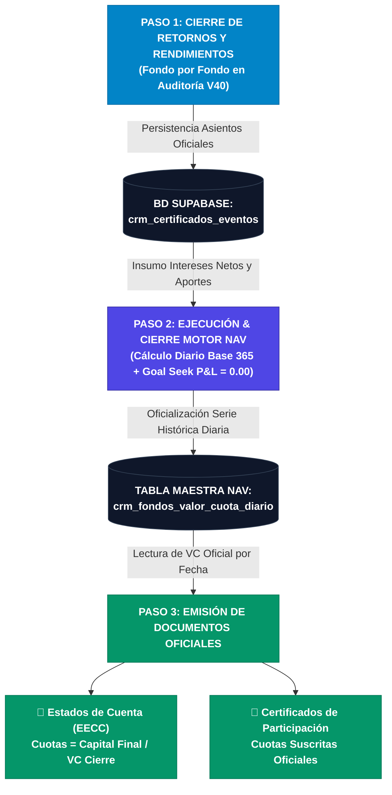

# 🏛️ 00.J — Plan de Inyección NAV: Integración con Inversionistas, EECC y Certificados

> **DOCUMENTO MAESTRO DE ARQUITECTURA Y SECUENCIA DE CIERRE CONTABLE**
> *InAndes Grupo Financiero — Sistema ERP Factoring & Inversionistas*

---

## 🎯 1. Visión y Propósito

El presente documento establece el flujo operativo y la arquitectura de datos para la **obtención, persistencia y consumo del Valor Cuota (NAV)**. 

El Valor Cuota calculado por el Motor NAV V31 (Goal Seek P&L = $0.00) es el **eje vertebrador de la fe pública y contable**. Garantiza que todos los documentos emitidos (Estados de Cuenta a inversionistas y Certificados de Participación oficiales) cuenten con un respaldo matemático inmutable, ya sea para auditorías retrospectivas (hacia atrás) o para nuevas emisiones (hacia adelante).

---

## 🔄 2. Secuencia Canónica de Cierre en 3 Pasos

El proceso contable es **estrictamente secuencial y unidireccional**:

### 🔹 PASO 1: Cierre de Retornos y Rendimientos (Fondo por Fondo)
1. **Cálculo de Auditoría V40**:
   - Para cada fondo y ciclo (bimestre o trimestre), se calcula el devengue diario de intereses por contrato/inversionista.
   - Se aplican deducciones, penalidades por rescate, retención del Impuesto a la Renta de 2da Categoría (5%) y capitalizaciones.
2. **Oficialización en Base de Datos**:
   - Se insertan los asientos definitivos en `crm_certificados_eventos` con tipo de evento `cierre_fin_ciclo` / `cierre_fin_contrato`.
   - Se fija el `capital_final_saldo` de cada inversionista para el período.

---

### 🔹 PASO 2: Ejecución y Cierre del Motor NAV (Persistencia Diaria)
1. **Procesamiento del Devengue Diario del Fondo**:
   - Consume los intereses brutos y las tasas de comisiones (Administración, Captación, Misceláneos).
   - Ejecuta el algoritmo de equilibrio exacto:
     $$\text{Ganancia Operativa}_d \equiv \mathbf{\$ 0.000000} \quad \forall d$$
   - Modela las suscripciones y aumentos de capital al cierre de cada día sin dilución de Valor Cuota:
     $$\text{Nuevas Cuotas}_d = \left\lfloor \frac{\text{Aporte}_d}{VC_d} \right\rfloor$$
2. **Oficialización en la Tabla Histórica Diaria**:
   - Al cerrar el fondo, el motor guarda la serie completa día por día en la tabla de base de datos dedicada:
     $$\mathbf{crm\_fondos\_valor\_cuota\_diario}$$
   - Campos clave: `(id_fondo, fecha, patrimonio_pre, aportes_dia, patrimonio_cierre, cuotas_cierre, valor_cuota, ganancia_operativa, cerrado_flag)`.

---

### 🔹 PASO 3: Emisión de Estados de Cuenta y Certificados
Una vez consolidada la serie del Paso 2, los módulos de cara al cliente consumen de forma desacoplada la tabla de Valor Cuota:

#### A. Estados de Cuenta (EECC - Módulo Inversionistas)
- Extrae el Valor Cuota oficial a la fecha de corte (`fEnd`):
  $$VC_{\text{cierre}} = \text{Consultar}(id\_fondo, fEnd)$$
- Calcula las cuotas de cierre del partícipe:
  $$\text{Número de Cuotas} = \frac{\text{Monto de la Inversión al Cierre}}{VC_{\text{cierre}}}$$
- Genera el desglose con paridad 1:1 entre capital, intereses netos, rescates y cuotas resultantes.

#### B. Certificados de Participación (Módulo Certificados)
- Al emitir un certificado con fecha de corte o fecha de ingreso de aumento ($d$):
  - Consulta el $VC_d$ oficial de esa fecha en la base de datos.
  - Certifica la tenencia legal exacta:
    > *"mantiene en la cuenta del [FONDO], la suma de [MONEDA] [MONTO], para la suscripción de **[CUOTAS]** cuotas de participación..."*
- Respeta la nomenclatura inmutable: `[ID_CONTRATO].[YYYYMMDD]`.

---

## 🗄️ 3. Estructura de la Base de Datos Histórica del NAV

Para dar soporte a la consulta retrospectiva (hacia atrás) y prospectiva (hacia adelante), la tabla de persistencia del NAV almacena:

| Campo | Tipo | Descripción |
|---|---|---|
| `id` | `UUID / BIGINT` | Identificador único del registro |
| `id_fondo` | `VARCHAR(50)` | Código del fondo (ej. `NSGPEN01`, `NSGUSD01`) |
| `fecha` | `DATE` | Fecha contable del día (ej. `2026-01-15`) |
| `patrimonio_apertura` | `NUMERIC(18,6)` | Patrimonio antes de la utilidad del día |
| `interes_bruto_dia` | `NUMERIC(18,6)` | Rendimiento generado en el día |
| `comision_admin_dia` | `NUMERIC(18,6)` | Gasto diario por administración |
| `comision_capt_dia` | `NUMERIC(18,6)` | Gasto diario por captación |
| `comision_misc_dia` | `NUMERIC(18,6)` | Gasto diario misceláneo |
| `ganancia_operativa` | `NUMERIC(18,6)` | P&L Operativo del día ($\equiv 0.00$) |
| `patrimonio_pre` | `NUMERIC(18,6)` | Patrimonio pre-aportes del día |
| `aportes_dia` | `NUMERIC(18,6)` | Inyecciones/suscripciones recibidas en el día |
| `patrimonio_cierre` | `NUMERIC(18,6)` | Patrimonio oficial al cierre del día |
| `cuotas_cierre` | `NUMERIC(18,6)` | Número total de cuotas al cierre del día |
| `valor_cuota` | `NUMERIC(18,6)` | **NAV Oficial del día (6 decimales)** |
| `cerrado_oficial` | `BOOLEAN` | `true` si el período fue cerrado oficialmente |
| `created_at` | `TIMESTAMPTZ` | Marca de tiempo de oficialización |

---

## 🔒 4. Reglas de Negocio Intangibles

1. **Inmutabilidad del Cierre**:
   - Ningún certificado o EECC puede emitirse con un Valor Cuota simulado al azar o manual. Todo cálculo debe originarse en la tabla oficial `crm_fondos_valor_cuota_diario`.
2. **Consistencia Hacia Atrás (Auditoría Forense)**:
   - Si se requiere reimprimir un Estado de Cuenta o Certificado de un período pasado (ej. Enero-Febrero 2024), el sistema consulta el registro histórico cerrado sin recalcular ni alterar los números ya auditados.
3. **Reversibilidad Ordenada (Rollback en Cascada)**:
   - Si se detecta un error de digitación en un contrato y se debe revertir un período:
     a) Se anulan los EECC y certificados del período.
     b) Se ejecuta el rollback del cierre NAV del fondo.
     c) Se ejecuta el rollback del cierre de Retornos y Rendimientos.
     d) Se corrige el contrato y se re-ejecuta el ciclo: Paso 1 $\rightarrow$ Paso 2 $\rightarrow$ Paso 3.

---

*Documento registrado en la Bóveda de Obsidian — InAndes ERP React*
