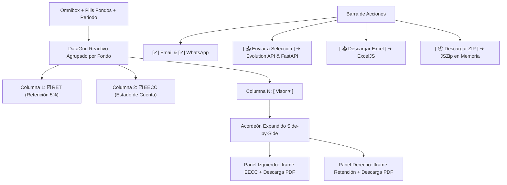

# 📄 Estandarización de UI: Certificados y EECC / Retenciones (Side-by-Side)

**Fecha:** 10 de Septiembre de 2026  
**Módulos Afectados:**  
1. `src/features/inversionistas/CertificadosPage.tsx`  
2. `src/features/inversionistas/InversionistasPage.tsx` (Pestaña C: **📄 EECC / Retenciones**)  
**Servidor de Producción:** VPS Contabo (`169.58.168.107` / Coolify / `inandes.geeksoft.tech`)

---

## 1. Objetivos del Requerimiento

Unificar y estandarizar la experiencia de usuario (UX) tanto en la emisión de Certificados de Participación como en la auditoría y despacho de Estados de Cuenta (EECC) y Certificados de Retención del 5% IR:

1. **Eliminación del Rolodex:** Reemplazo por un Omnibox de alta precisión en tiempo real.
2. **Fondos en Orden Canónico:** Disposición de izquierda a derecha de los fondos de inversión:
   $$\text{TODOS} \longrightarrow \text{PEN 1} \longrightarrow \text{PEN 2} \longrightarrow \text{PEN 3} \longrightarrow \text{USD 01} \longrightarrow \text{USD 02} \longrightarrow \text{CON 01}$$
3. **Selector de Período Integrado:** Al final de la fila de filtros para ajustar Año (`2024-2027`), Ciclo (`Bimestre`/`Trimestre`) y N° de Período (`B1-B6` / `Q1-Q4`).
4. **Doble Columna de Checkboxes Paralelos:**
   - Columna `☑️ RET`: Selección exclusiva de Certificados de Retención (5% IR).
   - Columna `☑️ EECC`: Selección exclusiva de Estados de Cuenta (EECC).
5. **Conexión de Canales Reales de Envío:**
   - **WhatsApp:** Integración con Evolution API (`/wa-api/message/sendText/inandes_oficial`).
   - **Email:** Integración con FastAPI Backend (`/api/inversionistas/enviar-reportes`).
   - **Auditoría Forense:** Registro en tabla Supabase `audit_logs`.
6. **Visor Acordeón Side-by-Side:**
   - Expansión bajo la fila seleccionada con visualización dual: EECC a la izquierda y Retención a la derecha, con botones independientes de descarga en PDF.

---

## 2. Arquitectura de Componentes

---

## 3. Endpoints y Conectores de Infraestructura

| Canal / Función | Endpoint / Servicio | Parámetros Clave |
| :--- | :--- | :--- |
| **WhatsApp Oficial** | `${getEvolutionApiUrl()}/message/sendText/inandes_oficial` | `number`, `text` (Instancia: `inandes_oficial`, API Key en headers) |
| **Email Oficial** | `${getApiBaseUrl()}/api/inversionistas/enviar-reportes` | `email`, `inversionista_nombre`, `id_certificado`, `periodo_corte`, `moneda`, `monto_transferido` |
| **Compilador PDF WeasyPrint** | `${getApiBaseUrl()}/api/inversionistas/generar-pdf` | `html`, `orientation: 'portrait'` |
| **Auditoría Supabase** | `supabase.from('audit_logs').insert(...)` | `modulo: 'inversionistas_documentos'`, `accion: 'envio_notificaciones'` |

---

## 4. Registro de Control de Calidad (QC)

- **Compilación TypeScript & Vite:** `npm run build` exit code `0` (tiempo: 3.18s).
- **Commits en Repositorio Oficial (`origin/main`):**
  - `52bc93d`: feat(certificados): estandarizar UI con omnibox, orden canonico de fondos, selector de periodo y acciones masivas.
  - `39174f5`: feat(certificados): conectar canales reales de envio WhatsApp (Evolution API) e Email con auditoria forense.
  - `4b26a3c`: feat(inversionistas): modernizar Tab C EECC y Retenciones con omnibox, fondos ordenados, doble checkbox y visor acordeon side-by-side.
- **Auto-Despliegue:** Notificado vía Webhook a Coolify en VPS Contabo (`169.58.168.107` / `https://inandes.geeksoft.tech`).
