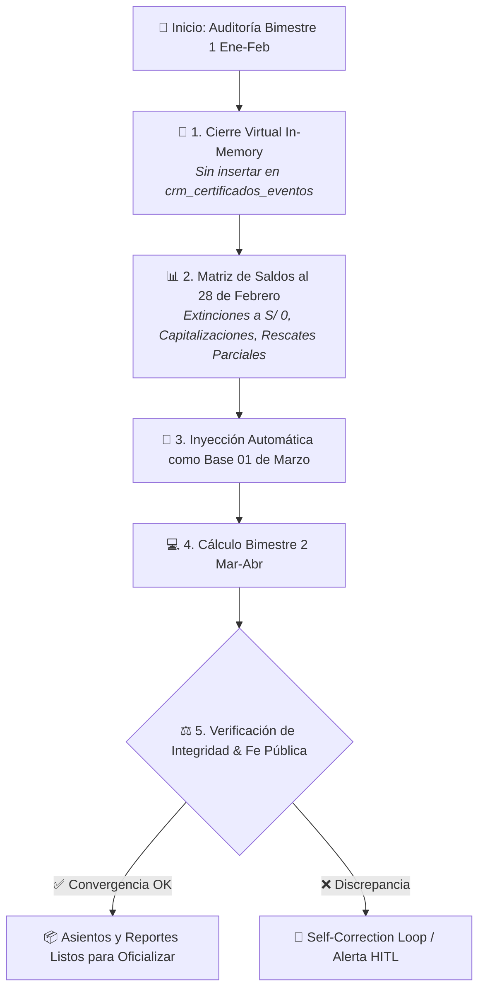
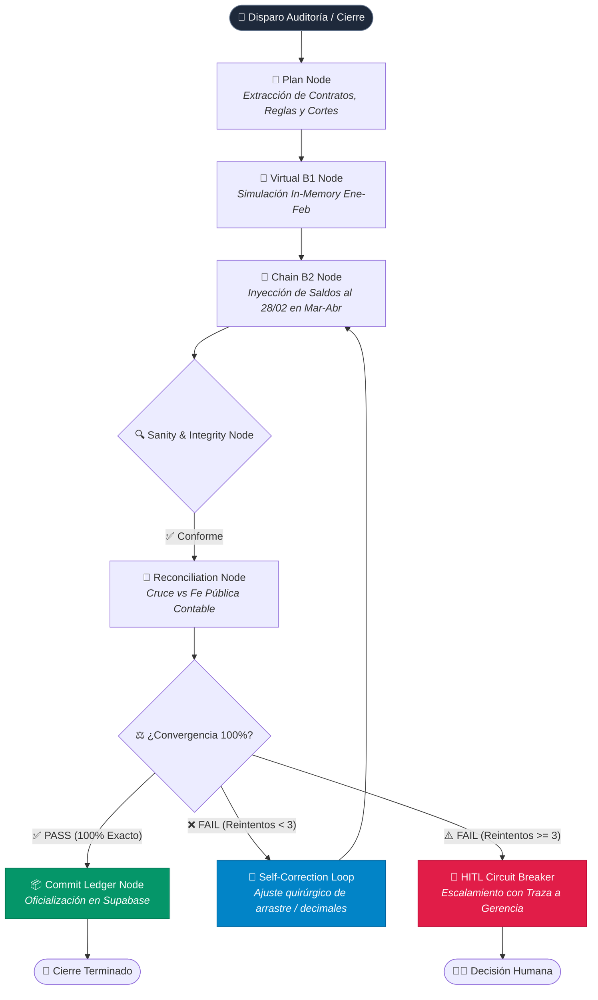

# 🔄 01. LOOP — Protocolo de Auditoría y Rescates Totales en Cierre de Fondos

> **Documento Oficial de Control y Especificación de Fe Pública Contable para Contratos Extinguidos y Rescates**

---

## 🎯 Propósito y Visión de Negocio

El objetivo primario del módulo de Inversionistas y Retornos en **InAndes ERP React** es producir informes de auditoría (pantalla UI, archivos Excel `AUDITORIA_OFICIAL_SISTEMA_*.xlsx` y documentos PDF) que **garanticen convergencia matemática exacta al 100%** con los cuadernos de control de la gerencia de finanzas.

---

## ⚖️ Principio Inviolable de Fe Pública Contable

### 📌 Regla de Oro: Preservación de Evidencia de Cierre
- **PROHIBICION DE INVISIBILIZAR REGISTROS:** Ningún contrato que se extinga, venza o rescate totalmente en un período de corte (ejemplo: `2026-02-28`) puede "desaparecer" o ser omitido del reporte de ese período.
- **Evidencia Transparente:** En la liquidación del período en que ocurre la devolución, el contrato **DEBE FIGURAR OBLIGATORIAMENTE** en las tablas web, reportes PDF y hojas de Excel mostrando:
  1. **Capital Base Inicial**
  2. **Interés Bruto Devengado** (ej. 59 días de devengue)
  3. **Impuesto a la Renta de 2da Categoría (5%)**
  4. **Base Neta a Reparto**
  5. **Monto Devuelto por Rescate** (Columna `RESCATES`)
  6. **Saldo Final de Capital = S/ 0.00** (para Rescates Totales) o **Saldo Remanente Activo** (para Rescates Parciales).

---

## 🛠️ Arquitectura Técnica y Solución en Código

### 1. Inclusión de Contratos Extinguidos en `financialCalculator.ts`
Para evitar que un contrato cerrado sea excluido de las consultas SQL del período, la función `generateRetornosV40` realiza la extracción de contratos en estado `['emitido', 'cerrado_por_rescate', 'cerrado_fin_contrato']` y los evalúa con la siguiente regla de resiliencia:

```typescript
// Filtrar solo los contratos vigentes o cerrados en el periodo evaluado usando comparaciones ISO String
const fStartStr = fStart.toISOString().split('T')[0];

const contratosMaster = rawContratosMaster.filter(c => {
  if (c.estado === 'emitido') return true;
  const fFinStr = c.fecha_fin ? c.fecha_fin.split('T')[0] : '2099-12-31';
  if (fFinStr >= fStartStr) return true;
  const evs = eventsByContrato[c.id_contrato] || [];
  const cierreEv = evs.find(e => e.tipo_evento === 'cierre_fin_contrato' || e.tipo_evento === 'cierre_por_rescate');
  if (!cierreEv) return true;
  const cFinStr = cierreEv.fecha_periodo_fin ? cierreEv.fecha_periodo_fin.split('T')[0] : '2000-01-01';
  return cFinStr >= fStartStr;
});
```

---

### 2. Prioridad Absoluta de la Tasa Pactada Contractual (`tasa_pactada`)
El cálculo del devengue diario de intereses en `financialCalculator.ts` utiliza **única y estrictamente la tasa pactada contractual del maestro de contratos (`row.tasa_pactada`)**:

```typescript
// Regla inviolable: El cálculo diario utiliza la tasa pactada del contrato maestro (ej. 9.00% EA Perales)
const t_hoy = row.tasa_pactada;
```

Queda estrictamente prohibido que cuotas de cronogramas secundarios u otras variables virtuales sobreescriban la tasa contractual pactada del contrato.

---

### 3. Protocolo Obligatorio de Re-oficialización tras Ajustes de Tasas o Fórmulas
Si una corrección de cálculo o ajuste de tasa (ej. corregir Perales de 8.50% a 9.00%) se realiza **después de haber presionado "Registrar Asientos en Base de Datos"**:

1. **Obligatoriedad del Rollback:** Es estrictamente necesario ejecutar un **Rollback ("Roleo")** para purgar los 187 registros preexistentes en `crm_certificados_eventos`.
2. **Re-oficialización Limpia:** Tras el Rollback, se debe volver a presionar **"Registrar Asientos en Base de Datos"** para grabar en Supabase los nuevos eventos oficializados con los valores corregidos al centavo.

---

### 4. Resiliencia de Rollback ("Roleo") Atómico
En la fase de pruebas y convergencia con los Excels del usuario, los ensayos se repiten múltiples veces. La función `handleRollback` en [`InversionistasPage.tsx`](file:///C:/Users/rguti/Inandes.ERP.React/src/features/inversionistas/InversionistasPage.tsx) ejecuta una reversión atómica limpia:

1. **Restablecimiento de Contratos:** Cambia automáticamente de vuelta a `'emitido'` cualquier contrato con fecha de vencimiento en el período.
2. **Reversión de Cronogramas:** Conmuta de `'PROCESADO'` de vuelta a `'PENDIENTE'` todas las cuotas de deducciones y rescates con `fecha_proyectada_cobro <= fEnd`.
3. **Depuración de Ledger:** Elimina los asientos en `crm_certificados_eventos` para permitir re-simulaciones ilimitadas.

---

### 5. Determinación Inviolable del Capital Base Inicial en `financialCalculator.ts`
Para evitar que un contrato cerrado en el mismo período evaluado tome su `capital_final_saldo = 0.00` como capital base inicial del período actual, la búsqueda de cierres anteriores en `eventsByContrato` evalúa únicamente eventos con fecha **estrictamente menor al inicio del período (`< fStart`)**:

```typescript
// Buscar el último evento de cierre oficializado PREVIO al inicio de este periodo (< fStart)
const closingEvents = events.filter(e => 
  ['cierre_fin_ciclo', 'cierre_fin_contrato'].includes(e.tipo_evento) &&
  e.fecha_periodo_fin &&
  new Date(e.fecha_periodo_fin.split('T')[0] + 'T00:00:00') < fStart
);
```

Esto garantiza que al re-simular o recalcular el período `2026-01-01` a `2026-02-28` después de un cierre o roleo, el capital inicial sea **SIEMPRE el saldo vigente al 01/01/2026** (`S/ 200,000` Perales / `S/ 190,000` Parodi), manteniendo la fe pública contable intacta.

---

### 6. Naming Dinámico con DATETIME Anti-Caché en Exportación de Excel
Para evitar que Chrome o Edge almacenen en caché o sobrescriban un archivo preexistente con el mismo nombre estático (`AUDITORIA_OFICIAL_SISTEMA_2026-02-28.xlsx`), la función `handleExportExcelV40` adjunta una marca de tiempo **`DATETIME` única e incremental** (`YYYYMMDD_HHMMSS`) a cada descarga:

```typescript
const nowStamp = new Date().toISOString().replace(/[-:]/g, '').replace('T', '_').slice(0, 15);
a.download = `AUDITORIA_OFICIAL_SISTEMA_${fEnd}_${nowStamp}.xlsx`;
```

Esto garantiza que **cada clic en el botón de exportación fuerce la descarga de un archivo nuevo e inconfundible en las descargas del usuario**, impidiendo que el navegador entregue una versión antigua en caché.

---

### 7. Prohibición Absoluta de Valores Hardcodeados en Tasas de Interés
- **Principio de Pureza Dinámica:** El motor contable (`financialCalculator.ts`), el generador de PDF (`pdfGeneratorBelloConDesglose.ts`) y las vistas de retornos procesan la tasa de interés **exclusiva y dinámicamente desde la base de datos** (`crm_contratos.tasa_pactada`).
- **PROHIBICION DE CONSTANTES:** Queda estrictamente prohibido insertar literales numéricos o tasas por defecto escritas a mano (ej. `8.5`, `9.0`, `10.5`) en las funciones de cálculo o estructuras de código para evitar contaminar los resultados de auditoría.
- **Auditabilidad:** Si un contrato carece de tasa en la base de datos o figura en `null`/`0`, el motor devolverá `0.00` de interés, forzando la corrección explícita de la omisión en Supabase sin enmascarar los datos con adivinanzas o fallbacks silenciosos.

---

## 📊 Matriz de Rescates Auditados al 28/02/2026

Listado oficial comprobado en el archivo Excel `AUDITORIA_OFICIAL_SISTEMA_2026-02-28.xlsx`:

| # | Fondo | Código Contrato | Inversionista | Capital Inicial | Tasa Pactada | Rescate Devuelto | Saldo Capital Final | Tipo Operación |
|---|-------|-----------------|---------------|-----------------|--------------|------------------|---------------------|----------------|
| 1 | `NSGPEN01` | `NSGPEN01-001` | Parra Forero Gladys Yanneth | S/ 1,900,000.00 | 10.50% | **S/ 325,000.00** | **S/ 1,575,000.00** | Rescate Parcial |
| 2 | `NSGPEN01` | `NSGPEN01-046` | Castillo De Milla Julia | S/ 50,000.00 | 8.50% | **S/ 50,000.00** | **S/ 0.00** | Rescate Total (Cierre) |
| 3 | `NSGPEN01` | `NSGPEN01-077` | Acha Agustín Juan Miguel | S/ 230,000.00 | 8.50% | **S/ 10,000.00** | **S/ 220,000.00** | Rescate Parcial |
| 4 | `NSGPEN01` | `NSGPEN01-090` | Pérez Aliaga César Saul | S/ 220,940.74 | 8.50% | **S/ 81,213.35** | **S/ 314,692.85** | Rescate Parcial |
| 5 | `NSGPEN03` | `NSGPEN03-024` | Navarrete Carlos Alberto | S/ 120,000.00 | 8.50% | **S/ 20,000.00** | **S/ 100,000.00** | Rescate Parcial |
| 6 | `NSGPEN03` | `NSGPEN03-050` | Perales Bazalar María Agueda | S/ 200,000.00 | **9.00%** | **S/ 200,000.00** | **S/ 0.00** | Rescate Total (Cierre) |
| 7 | `NSGPEN03` | `NSGPEN03-063` | Parodi Velásquez Jorge Antonio | S/ 190,000.00 | 8.50% | **S/ 190,000.00** | **S/ 0.00** | Rescate Total (Cierre) |
| 8 | `NSGUSD01` | `NSGUSD01-038` | Villegas Pozo Renán Alfieri | $ 60,000.00 | 8.50% | **$ 60,000.00** | **$ 0.00** | Rescate Total (Cierre) |

---

## 🤖 8. Arquitectura del Loop Encadenado Autónomo (Cierre Virtual en Memoria)

### 🎯 Objetivo del Loop
Permitir la simulación y auditoría multi-período continua **sin requerir la persistencia previa de asientos en la base de datos** (`crm_certificados_eventos`).



### 📋 Fases del Protocolo de Ejecución:
1. **Fase 1: Cierre Virtual In-Memory (Ene - Feb 2026):**
   - El motor ejecuta la liquidación completa del 01/01/2026 al 28/02/2026 puramente en memoria RAM.
   - Aplica devengues diarios, retenciones del 5% IR, deducciones ordinarias y cronograma de rescates.
   - Genera la matriz de saldos de cierre (`capital_final_saldo`) al 28/02/2026 para cada partícipe.
2. **Fase 2: Arrastre In-Memory al Bimestre Siguiente (Mar - Abr 2026):**
   - Sin obligar al usuario a presionar "Registrar Asientos en BD" en Ene-Feb, el motor encadena automáticamente los saldos simulados del 28/02 como el `capital_base` inicial al 01/03/2026.
3. **Fase 3: Reglas Estrictas de Verificación en Marzo-Abril:**
   - **Contratos Extinguidos:** Contratos con saldo `0.00` al 28/02 (ej. Milla S/ 50k, Perales S/ 200k, Parodi S/ 190k) son omitidos y no devengan intereses.
   - **Contratos con Rescate Parcial:** Arrancan estrictamente con el capital remanente (ej. Parra arranca con S/ 1,575,000.00).
   - **Contratos con Capitalización:** Arrancan con el capital base incrementado por los intereses netos capitalizados del B1.

---

## ⚡ 9. Patrón Agéntico LangGraph + MCP (Inspirado en AST-Healing-Coder)

> **Referencia Técnica del Modelo:** [AST-Healing-Coder (LangGraph + MCP)](https://github.com/Hi1talib1World/langgraph-mcp-coding-assistant-project)

La arquitectura de auditoría financiera de InAndes ERP adopta los patrones de diseño de grafos autónomos y auto-corrección:



### 🧩 Componentes del Grafo Agéntico:
1. **`PlanNode`:** Lee contratos vigentes, frecuencias de cupones y reglas de fondo sin mutar el estado de la base de datos.
2. **`VirtualCloseNode` (Ene-Feb):** Procesa el cierre virtual del periodo previo y emite el estado financiero intermedio.
3. **`ChainRollForwardNode` (Mar-Abr):** Conecta el estado del nodo B1 hacia el periodo B2 asegurando fe pública de arrastre.
4. **`SanityCheckNode`:** Inspecciona invariantes contables (sin tasas en 0, sin saldos negativos, sumatorias de reparto + capitalización idénticas al neto).
5. **`SelfCorrectionLoop` (Auto-Sanación):** En caso de detectar inconsistencias por redondeo o colisión de IDs en cronogramas, aplica correcciones quirúrgicas (máximo 3 iteraciones) antes de comprometer datos.
6. **`HITLCircuitBreaker` (Human-in-the-Loop):** Si la discrepancia matemática no converge tras 3 intentos, el circuito se abre y transfiere el control con un reporte de diagnóstico a la Gerencia de Finanzas.

---

*Documento actualizado en la base de conocimiento oficial de InAndes ERP React.*

