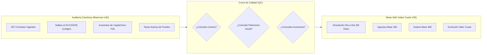

# 🧭 Procedimiento y Protocolo de Control de Calidad (QC) — Motor NAV (Valor Cuota)

> **Documento Técnico de Referencia para el Ciclo de Control de Calidad (QC)**  
> **Módulo:** CRM Inversionistas — Fondos y Valor Cuota (NAV v26)  
> **Período de Evaluación:** Enero — Febrero 2026 (Bimestre 1 / 59 días calendario)  
> **Archivo XLSX Generado:** `reports/Reporte_NAV_QC_Ene_Feb_2026.xlsx`  
> **Fecha de Creación:** 22 de Agosto de 2026  

---

## 1. 🎯 Objetivo del Loop de QC

Establecer un circuito cerrado e iterativo de verificación de calidad (**QC Loop**) para asegurar la precisión matemática, la integridad de datos y la coherencia financiera del **Motor de Valor Cuota (NAV - Net Asset Value)** frente a los reportes auditados del sistema.

El objetivo central es que el archivo exportado en Excel (`.xlsx`) refleje con fidelidad absoluta:
1. La apertura patrimonial exacta al **01/01/2026** (derivada del cierre contable al 31/12/2025).
2. El devengue diario continuo (día por día) durante todo el bimestre.
3. La correcta aplicación de comisiones y gastos operativos del fondo.
4. La dilución y emisión de nuevas cuotas por aumentos de capital intermedios.
5. La evolución del **Valor Cuota Inicial (1.0000)** al **Valor Cuota Final**.

---

## 2. 🏛️ El "Ingrediente Perfecto": Integración con la Auditoría Oficial (Retornos V40)

El Motor de Auditoría y Retornos (`financialCalculator.ts` / `Reportes_Auditoria_2026-02-28`) ha sido previamente auditado y certificado al 100%. Dado que ambos motores comparten la misma cartera de inversión, el **Motor NAV utiliza este estándar canónico como referencia de contraste**:

### Variables Canónicas Compartidas:
- **Padrón de Contratos:** 187 contratos distribuidos en 6 fondos oficiales.
- **Saldos Iniciales de Apertura:** Extraídos de los eventos `emision_inicial`, `emision`, `cierre_fin_ciclo` con fecha $\le$ 31/12/2025 en `crm_certificados_eventos`.
- **Aumentos de Capital:** Sincronización de nuevas aportaciones en fechas intermedias (ej. Enero 2026).

---

## 3. 🔬 Metodología de Ejecución del Loop de QC

El ciclo de control de calidad se ejecuta en 4 etapas sistemáticas:

### Etapa 1: Extracción y Validación de Insumos Base
- Consulta directa a Supabase (`egvcinsbyropumybatdf`) sobre `crm_fondos`, `crm_contratos` y `crm_certificados_eventos`.
- Mapeo de comisiones maestras del fondo:
  - Tasa Activa Anual (ej. $14.00\%$)
  - Comisión de Administración ($1.00\%$)
  - Comisión de Captación ($2.00\%$)
  - Comisión Misceláneos ($0.00\%$)

### Etapa 2: Simulación Diaria Día por Día (59 Columnas)
Para cada día $t$ entre el `01/01/2026` y el `28/02/2026`:
1. **Ingreso Bruto Diario (Base 360):**
   $$\text{Ingreso\_Bruto}(t) = \text{Patrimonio}(t-1) \times \frac{\text{Tasa\_Activa}}{360.0}$$
2. **Gastos Operativos Diarios (Base 365):**
   $$\text{Gastos}(t) = \text{Patrimonio}(t-1) \times \frac{\text{Com\_Admin} + \text{Com\_Capt} + \text{Com\_Misc}}{365.0}$$
3. **Utilidad Neta Diaria (Ganancia Operativa):**
   $$\text{Utilidad\_Neta}(t) = \text{Ingreso\_Bruto}(t) - \text{Gastos}(t)$$
4. **Valor Cuota de Hoy:**
   $$\text{VC}(t) = \frac{\text{Patrimonio}(t-1) + \text{Utilidad\_Neta}(t)}{\text{Cuotas}(t-1)}$$
5. **Nuevas Suscripciones:**
   $$\text{Nuevas\_Cuotas} = \frac{\text{Aporte\_Capital}}{\text{VC}(t)}$$

### Etapa 3: Estructuración Matricial del Libro Excel (XLSX)
- Generación de un archivo `.xlsx` limpio con una pestaña por cada fondo (`NSGPEN01`, `NSGPEN02`, `NSGPEN03`, `NSGUSD01`, `NSGUSD02`, `NSLCON01`).
- Disposición horizontal pura: Fila 1 con cabeceras de días (`01/01` a `28/02`), filas de contratos, sub-filas de aumentos con sangría y bloque inferior de totales y comisiones acumuladas.

### Etapa 4: Auditoría Cruzada y Feedback
- El agente genera el libro, valida las sumas y métricas clave en consola.
- Se pone a disposición el enlace directo local para inspección visual y fórmulas por parte de la dirección.
- Incorporación de observaciones recibidas para el siguiente ciclo.

---

## 4. 📊 Resultados Consolidados del Primer Ciclo QC (Ene-Feb 2026)

| Fondo | Moneda | Contratos | Patrimonio Inicial (01/01) | Ganancia Bruta Acum. | Comisiones Acum. (Admin+Capt) | Utilidad Neta Acum. | Patrimonio Cierre (28/02) | Valor Cuota Final |
| :--- | :---: | :---: | :---: | :---: | :---: | :---: | :---: | :---: |
| **NSGPEN01** | PEN | 34 | S/ 10,384,753.14 | S/ 243,783.92 | S/ 51,523.80 | S/ 192,260.12 | S/ 10,746,013.26 | **1.0183** |
| **NSGPEN02** | PEN | 25 | S/ 4,018,400.98 | S/ 93,024.82 | S/ 19,660.82 | S/ 73,364.00 | S/ 4,091,764.98 | **1.0183** |
| **NSGPEN03** | PEN | 72 | S/ 12,843,544.66 | S/ 297,324.35 | S/ 62,839.59 | S/ 234,484.77 | S/ 13,078,029.43 | **1.0183** |
| **NSGUSD01** | USD | 9 | $ 621,235.10 | $ 11,799.83 | $ 3,033.41 | $ 8,766.42 | $ 630,001.52 | **1.0141** |
| **NSGUSD02** | USD | 45 | $ 2,090,776.62 | $ 41,593.77 | $ 10,213.44 | $ 31,380.33 | $ 2,122,156.95 | **1.0150** |
| **NSLCON01** | USD | 2 | $ 80,000.00 | $ 1,518.20 | $ 390.63 | $ 1,127.57 | $ 81,127.57 | **1.0141** |

---

## 5. 📁 Acceso Directo al Artefacto Generado

- **Ruta Física del Archivo (Versión Actualizada con Nomenclatura Profesional):**  
  [`Reporte_NAV_QC_Ene_Feb_2026_V2.xlsx`](file:///C:/Users/rguti/Inandes.ERP.React/reports/Reporte_NAV_QC_Ene_Feb_2026_V2.xlsx)

---

## 6. 📐 Estándar Oficial de Filas de Resumen (Nomenclatura Canónica)

Tras el ciclo de alineación de Control de Calidad, las 20 filas de resumen del Motor NAV adoptan la siguiente estructura autoexplicativa:

| Fila Oficial | Propósito Contable |
| :--- | :--- |
| **`TOTAL CAPITAL (Apertura)`** | Saldo patrimonial al inicio del día ($t$). |
| **`(+) CAPITAL ADICIONAL (Hoy)`** | Flujo puntual de nuevos aportes / aumentos que ingresan en el día ($t$). |
| **`(=) CAPITAL ACUMULADO`** | Stock acumulado de capital nominal suscrito históricamente. |
| **`CUOTAS APERTURA`** | Saldo de participaciones emitidas vigentes al inicio del día. |
| **`(+) CUOTAS ADICIONALES (Hoy)`** | Nuevas cuotas emitidas por suscripciones del día ($\frac{\text{Aporte}}{\text{VC}_t}$). |
| **`(=) CUOTAS TOTALES CIERRE`** | Total de participaciones circulantes al cierre del día. |
| **`VAL CUOTA INICIAL`** | Precio liquidativo de la cuota al inicio del día. |
| **`GANANCIA TOTAL BRUTA (Base 360)`** | Intereses brutos generados por la cartera en el día ($\text{Base 360}$). |
| **`GANANCIA TOTAL ACUMULADA`** | Acumulado de intereses brutos en el período. |
| **`PATRIMONIO TOTAL (Pre-Aportes)`** | Patrimonio del día antes de recibir nuevas suscripciones. |
| **`COM. ADMIN (-) (Base 365)`** | Comisión de administración devengada en el día ($\text{Base 365}$). |
| **`COM. ADMIN ACUM. (-)`** | Acumulado de comisión de administración en el período. |
| **`COM. CAPT. (-) (Base 365)`** | Comisión de captación devengada en el día ($\text{Base 365}$). |
| **`COM. CAPT. ACUM. (-)`** | Acumulado de comisión de captación en el período. |
| **`COM. MISC. (-)` / `ACUM.`** | Comisión de misceláneos y gastos varios. |
| **`GANANCIA OPERATIVA (Neta)`** | Utilidad neta operativa del día ($\text{Bruto} - \text{Comisiones}$). |
| **`GANANCIA OPERATIVA ACUMULADA`** | Acumulado de utilidad neta en el período. |
| **`PATRIMONIO TOTAL CIERRE`** | Patrimonio final al cierre del día ($\text{Pre-Aportes} + \text{Capital Adicional}$). |
| **`VAL CUOTA FINAL`** | Precio liquidativo final de la cuota del día (4 a 9 decimales). |

