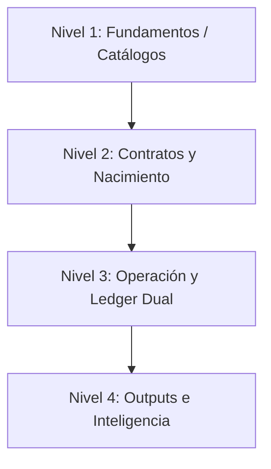

# 1. Estructura General del ERP — Flujograma Arquitectura V19

Este flujograma describe el comportamiento del flujo de fondos, contratos, ledger de eventos y los motores de cálculo del ERP Inandes CRM, actualizado a la **Versión 19**.

---

## Estructura del Proceso en 4 Niveles

### Nivel 1 — Fundamentos y Catálogos
Define las entidades base del sistema, que sirven de catálogos generales:
* **Fondo (`crm_fondos`):** Tasas de interés de referencia por plazo.
* **Asesor (`crm_asesores`):** Asesores que originan los contratos.
* **Inversionista (`crm_inversionistas`):** Ficha de clientes aprobados para compliance.

### Nivel 2 — Contratos y Nacimiento
Módulo que gobierna la originación de inversiones:
1. **Borradores:** Propuesta y ticket de inversión inicial en la UI.
2. **Cruce de Aprobación:** Cruce manual de carga del **Voucher de Depósito** bancario con la **Fecha de Depósito** valorizada.
3. **Contrato Vigente:** Transición al estado `emitido` (con su correspondiente correlativo natural e inicialización en `crm_certificados`).

### Nivel 3 — Operación y Ledger Dual
El corazón financiero del ERP. Trabaja bajo una estructura de **Ledger (Libro Mayor)** basada en eventos:
* **Eventos (`crm_certificados_eventos`):**
  * `aumento_capital`: Incremento de saldo del inversionista (por reinversión o depósito nuevo).
  * `rescate_capital`: Rescate o retiro parcial/total del capital.
  * `corte_retorno`: Liquidación y cálculo de rendimientos del ciclo.
* **Motores de Cálculo:**
  * **Motor A (Fondo/NAV):** Calcula diariamente el Valor Cuota del fondo basándose en el patrimonio, rendimientos brutos y comisiones de gestión (`generate_cuotas_v25.py`).
  * **Motor B (P&L del Certificado):** Calcula el interés bruto del inversionista al corte, aplica la retención fiscal del 5%, deduce préstamos y verifica el loop de capitalización.
    * **Feedback Loop:** Si el inversionista eligió *Capitalizar*, el interés neto se convierte en un nuevo evento `aumento_capital` de forma automática, reinvirtiendo en el fondo a valor cuota del día.

### Nivel 4 — Outputs y Generación
Módulo de cierre y entrega:
* **Orquestador:** Procesa en lotes (`integration_nsgusd01.py` o scripts consolidados) y emite los reportes oficiales.
* **Documentos generados:**
  * Estado de Cuenta Bimestral/Trimestral en PDF.
  * Certificado de Retención de Rentas de Segunda Categoría (IRS/SUNAT Perú).
  * Certificados de Participación física.

---

## Archivo de Automatización

El diagrama físico en PDF se genera ejecutando localmente:
* `Files.Legacy/FLUJOGRAMA_Arquitectura_CRM_V19.py`
