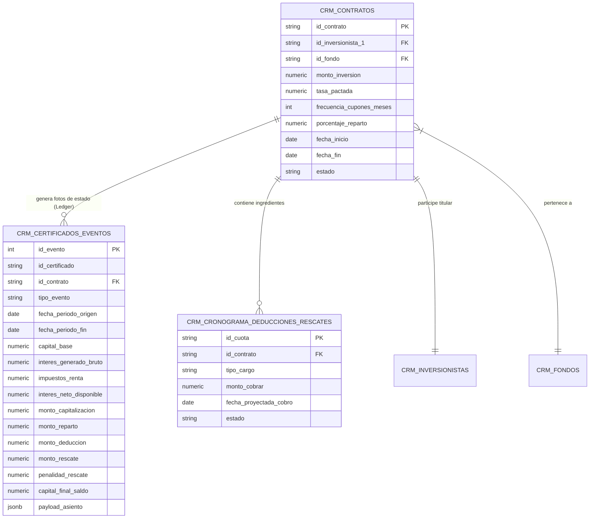

# 🔄 Suite de Control de Calidad (QC Master): Modelo E-R, Certificados, Ledger Inmutable, Cierres Encadenados y Rollback Atómico

> **Documento Oficial de Arquitectura, Auditoría Matemática y Capacidades del Sistema de QC**  
> **Proyecto:** InAndes ERP React — Módulo Inversionistas (`RichGutz/Inandes.ERP.React`)  
> **Referencias:** `Arquitectura.y.Logica.de.Retornos.v40.md` y `01.LOOP.AUDITORIA.FONDOS.CERRADOS.md`  
> **Entorno de Datos:** Supabase Cloud (`egvcinsbyropumybatdf`) — Producción Contabo Coolify

---

## 1. 🎯 Fundamento Conceptual y Modelo Entidad-Relación (E-R)

El modelo contable de InAndes se fundamenta en la estricta separación entre la entidad legal matriz (**Contrato**), la foto de estado contable en el tiempo (**Certificado / Asiento de Ledger**) y los movimientos transaccionales periódicos (**Ingredientes**):



### 1.1 Definición de Entidades
1. **Contrato Matriz (`crm_contratos`):**
   - Instrumento jurídico vinculante que relaciona al inversionista con un fondo bajo condiciones fijas (monto base, tasa, plazo, modalidad de cobro de cupón).
   - Estados posibles: `emitido`, `cerrado_fin_contrato`, `cerrado_por_rescate`.
2. **Certificado / Evento de Ledger (`crm_certificados_eventos`):**
   - Registro inmutable que captura el estado patrimonial y financiero de un contrato al cierre de un ciclo o evento de capital.
   - Tipos de eventos:
     - `emision_inicial`: Foto de apertura al `2025-12-31` o fecha de inicio para contratos nuevos.
     - `aumento_capital`: Aporte de capital fresco dentro del período evaluado.
     - `cierre_fin_ciclo`: Asiento oficial de corte bimestral/trimestral para contratos que continúan vigentes.
     - `cierre_fin_contrato` / `cierre_por_rescate`: Asiento oficial de extinción con saldo final `0.00`.
3. **Ingredientes del Período (`crm_cronograma_deducciones_rescates`):**
   - Transacciones programadas o ejecutadas en el período: `RESCATE_CAPITAL`, `DEDUCCION_ORDINARIA`, `PENALIDAD_RESCATE`.

---

## 2. 🔄 Ciclo Progresivo de Cierres Contables y Fe Pública

El ciclo opera mediante transición encadenada de saldos:

$$\text{Certificado Inicial (01/01)} + \text{Ingredientes Ene-Feb} \xrightarrow{\text{Cierre B1}} \text{Certificado (28/02/2026)}$$
$$\text{Certificado (28/02)} + \text{Ingredientes Mar-Abr} \xrightarrow{\text{Cierre B2}} \text{Certificado (30/04/2026)}$$

### 2.1 Reglas Inviolables de Negocio:
1. **Fe Pública en Extinción de Contratos:**
   - Todo contrato que liquide su capital a `0.00` (rescate total o vencimiento) figura en el reporte y Excel de ese corte con saldo `0.00` y rescate total reflejado, pero es **inmediatamente excluido** de la base activa de devengue para los períodos subsiguientes.
2. **Arrastre de Capital Activo en Rescates Parciales:**
   - El contrato arranca el siguiente ciclo únicamente con el saldo remanente (ej. Gladys Parra Forero pasa de S/ 1,900,000 $\rightarrow$ S/ 1,575,000 en Feb $\rightarrow$ S/ 1,250,000 en Abr).
3. **Capitalización Progresiva:**
   - La porción de intereses netos no repartida se suma al capital base del siguiente ciclo.
4. **Blindaje de Temporalidad de Nacimiento:**
   - Los contratos nuevos cuyas fechas de inicio sean posteriores a la fecha de corte evaluada (`fecha_inicio > fechaFin`) quedan **100% excluidos** de los reportes y asientos de ese período.

---

## 3. 🛡️ Algoritmo de Rollback ("Roleo") e Idempotencia Absoluta

El Rollback permite retroceder fechas de corte de manera segura sin destruir la historia previa ni los datos maestros:


### Protocolo de Ejecución del Rollback:
1. **Orden Cronológico Estricto:** Solo se puede revertir el último período oficializado (LIFO: Last In, First Out).
2. **Purgado Atómico del Ledger:** Elimina los asientos en `crm_certificados_eventos` de ese corte específico (`cierre_fin_ciclo` / `cierre_fin_contrato`).
3. **Preservación Inviolable de Ingredientes:** Los aumentos de capital, cuotas de cronograma y contratos matrices **NO se destruyen**.
4. **Reactivación de Estados:**
   - Contratos extintos en el período revertido regresan automáticamente a `estado = 'emitido'`.
   - Cuotas procesadas del cronograma regresan a `estado = 'PENDIENTE'`.
5. **Idempotencia Delta Cero:** Múltiples ciclos de cálculo $\rightarrow$ rollback $\rightarrow$ re-cálculo producen resultados numéricos idénticos al centavo ($\Delta = 0.00$).

---

## 4. 🧠 Capacidades Avanzadas de Nuestra Suite de QC

Nuestra suite agéntica de control de calidad (`qc_loop_runner.py` / `generate_both_reports.py`) cuenta con las siguientes capacidades industriales:

### 4.1 Capacidades de Auditoría y Verificación
1. **Multi-Periodo y Multi-Roleo Encadenado:**
   - Simula y oficializa cierres sucesivos (Feb 28 $\rightarrow$ Mar 31 $\rightarrow$ Abr 30) y ejecuta reversiones atómicas verificando la integridad del estado en cada paso.
2. **Blindaje de Temporalidad de Contratos Nuevos:**
   - Verifica que ningún contrato con fecha de emisión posterior figure en períodos anteriores (0/11 en Ene-Feb) y que se incorpore con sus días exactos de devengue en su período real (11/11 en Mar-Abr).
3. **Alineación 1:1 de 15 Columnas (Excel $\equiv$ PDF):**
   - Garantiza que los libros de Excel exportados contengan exactamente las 15 columnas en el orden, formato y definición del reporte PDF oficial:
     `#` | `Certificado` | `Inversionista` | `Capital Base` | `INT. BRUTO` | `IR (5%)` | `BASE NETA` | `CAPITALIZACION` | `REPARTO` | `DEDUCCIONES` | `PENALIDAD` | `NETO FINAL` | `RESCATES` | `TRANSFERENCIAS` | `CAPITAL FINAL`.
4. **Cálculo de Flujo de Caja Líquido Bancario (`TRANSFERENCIAS`):**
   - Formula exacta: $\text{Transferencia} = \text{Neto Final} + (\text{Rescates} - \text{Penalidad})$, representando el valor neto exacto que la fiduciaria/empresa abona a la cuenta bancaria del partícipe.
5. **Reasignación Atómica de Correlativos sin Huérfanos:**
   - Capacidad de migrar claves primarias y dependencias entre tablas (`crm_contratos`, `crm_certificados`, `crm_certificados_eventos`, `crm_cronograma_deducciones_rescates`) manteniendo integridad referencial absoluta.
6. **Manejo Integral de Rescates y Penalidades:**
   - Audita rescates totales (saldo a 0.00 y reparto íntegro del cupón), rescates parciales y descuentos de multas/penalidades contractuales.

---

## 5. 📋 Matriz de Rescates y Movimientos Auditados

### 5.1 Bimestre 1 (Enero - Febrero 2026, Corte: 28/02/2026)
| # | Fondo | Código Contrato | Inversionista | Capital Inicial | Tasa | Rescate / Movimiento | Capital Final | Estado Resultante |
|---|-------|-----------------|---------------|-----------------|------|----------------------|---------------|-------------------|
| 1 | `NSGPEN01` | `NSGPEN01-001.20160101` | Parra Forero Gladys | S/ 1,900,000.00 | 10.50% | **S/ 325,000.00** | **S/ 1,575,000.00** | Activo (Vigente) |
| 2 | `NSGPEN01` | `NSGPEN01-046.20160101` | Castillo De Milla Julia | S/ 50,000.00 | 8.50% | **S/ 50,000.00** | **S/ 0.00** | Extinto (`cierre_fin_contrato`) |
| 3 | `NSGPEN01` | `NSGPEN01-077.20160101` | Acha Agustín Juan Miguel | S/ 230,000.00 | 8.50% | **S/ 10,000.00** | **S/ 220,000.00** | Activo (Vigente) |
| 4 | `NSGPEN01` | `NSGPEN01-090.20160101` | Pérez Aliaga César Saul | S/ 220,940.74 | 8.50% | Aumentos S/ 169k - Rescate S/ 81k | **S/ 314,692.85** | Activo (Vigente) |
| 5 | `NSGPEN03` | `NSGPEN03-024.20230206` | Navarrete Carlos Alberto | S/ 120,000.00 | 8.50% | **S/ 20,000.00** | **S/ 100,000.00** | Activo (Vigente) |
| 6 | `NSGPEN03` | `NSGPEN03-050.20240219` | Perales Bazalar María | S/ 200,000.00 | 9.00% | **S/ 200,000.00** | **S/ 0.00** | Extinto (`cierre_fin_contrato`) |
| 7 | `NSGPEN03` | `NSGPEN03-063.20250207` | Parodi Velásquez Jorge | S/ 190,000.00 | 8.50% | **S/ 190,000.00** | **S/ 0.00** | Extinto (`cierre_fin_contrato`) |
| 8 | `NSGUSD01` | `NSGUSD01-038.20160101` | Villegas Pozo Renán | $ 60,000.00 | 8.50% | **$ 60,783.16** | **$ 0.00** | Extinto (`cierre_fin_contrato`) |

### 5.2 Bimestre 2 (Marzo - Abril 2026, Corte: 30/04/2026)
| # | Fondo | Código Contrato | Inversionista | Capital Inicial al 01/03 | Rescate / Movimiento | Capital Final al 30/04 |
|---|-------|-----------------|---------------|--------------------------|----------------------|------------------------|
| 1 | `NSGPEN01` | `NSGPEN01-001.20160101` | Parra Forero Gladys | S/ 1,575,000.00 | **S/ 325,000.00** | **S/ 1,250,000.00** |
| 2 | `NSGPEN02` | `NSGPEN02-006.20240916` | Inversionista 006 | S/ 157,005.93 | **S/ 157,005.93 [TOTAL]** | **S/ 0.00** |
| 3 | `NSGUSD02` | `NSGUSD02-021.20240901` | Inversionista 021 | $ 38,881.61 | **$ 38,881.61 [TOTAL]** | **$ 0.00** |
| 4 | `NSGUSD02` | `NSGUSD02-014.20260314` | Guzmán Manrique Patricia | **$ 20,000.00 (Nuevo)** | Devengue 48 días @ 7.00% | **$ 20,000.00** |
| 5 | `NSGPEN01` | `NSGPEN01-046.20160101` | Castillo De Milla Julia | **OMITIDO (Extinto en Feb)** | **-** | **S/ 0.00** |
| 6 | `NSGPEN03` | `NSGPEN03-050.20240219` | Perales Bazalar María | **OMITIDO (Extinto en Feb)** | **-** | **S/ 0.00** |
| 7 | `NSGPEN03` | `NSGPEN03-063.20250207` | Parodi Velásquez Jorge | **OMITIDO (Extinto en Feb)** | **-** | **S/ 0.00** |
| 8 | `NSGUSD01` | `NSGUSD01-038.20160101` | Villegas Pozo Renán | **OMITIDO (Extinto en Feb)** | **-** | **$ 0.00** |

---

## 6. 📝 Bitácora de Ejecución del Loop de Control de Calidad

```
[11:50:57] ==================================================
[11:50:57] INICIANDO LOOP DE CONTROL DE CALIDAD Y CONVERGENCIA
[11:50:57] ==================================================
[11:50:57] Fase 0: Saneando base de datos a estado de apertura 01/01/2026...
[11:50:59] Fase 1: Calculando Bimestre 1 (2026-01-01 a 2026-02-28)...
[11:51:00] Bimestre 1 calculado: 185 asientos generados.
[11:51:00]   -> Verificacion Contratos Futuros Mar-Abr (0/11 presentes en B1): OK (100% Excluidos de Ene-Feb)
[11:51:00]   -> Verificacion Parra Forero (S/ 1,900k -> S/ 1,575k): OK
[11:51:00]   -> Verificacion Castillo De Milla (S/ 50k -> S/ 0.00 EXTINTO): OK
[11:51:00]   -> Verificacion Perales Bazalar (S/ 200k @ 9% -> S/ 0.00 EXTINTO): OK
[11:51:00]   -> Verificacion Parodi Velasquez (S/ 190k -> S/ 0.00 EXTINTO): OK
[11:51:00]   -> Verificacion Villegas Pozo ($ 60k -> $ 0.00 EXTINTO): OK
[11:51:00] Registrando 185 asientos oficiales en DB para el corte 2026-02-28...
[11:51:01] Oficializacion completada para 2026-02-28. Asientos insertados: 185.
[11:51:01] Fase 2: Calculando Bimestre 2 (2026-03-01 a 2026-04-30)...
[11:51:03] Bimestre 2 calculado: 192 asientos generados.
[11:51:03]   -> Verificacion Inclusion Correcta Mar-Abr (11/11 presentes en B2): OK
[11:51:03]   -> Verificacion de Exclusion de Contratos Extintos en B2: OK (100% Excluidos)
[11:51:03]   -> Verificacion Parra Forero B2 (S/ 1,575k -> S/ 1,250k): OK
[11:51:03] Registrando 192 asientos oficiales en DB para el corte 2026-04-30...
[11:51:04] Oficializacion completada para 2026-04-30. Asientos insertados: 192.
[11:51:04] Fase 3: Probando Rollback de Bimestre 2 (2026-04-30)...
[11:51:04] Ejecutando Rollback de 2026-04-30...
[11:51:06] Rollback completado para 2026-04-30.
[11:51:06]   -> Verificacion Integridad B1 tras Rollback B2: OK
[11:51:06] Fase 4: Probando Rollback de Bimestre 1 (2026-02-28)...
[11:51:06] Ejecutando Rollback de 2026-02-28...
[11:51:08] Rollback completado para 2026-02-28.
[11:51:08]   -> Verificacion Vuelta a Estado Inicial 01/01/2026: OK
[11:51:08] Fase 5: Re-calculando Bimestre 1 (Run 2)...
[11:51:09]   -> Idempotencia B1 (Run 1 == Run 2): CONVERGENCIA 100% EXACTA
[11:51:09] Registrando 185 asientos oficiales en DB para el corte 2026-02-28...
[11:51:11] Oficializacion completada para 2026-02-28. Asientos insertados: 185.
[11:51:11] Fase 6: Re-calculando Bimestre 2 (Run 2)...
[11:51:12]   -> Idempotencia B2 (Run 1 == Run 2): CONVERGENCIA 100% EXACTA
[11:51:12] Ejecutando Rollback de 2026-02-28...
[11:51:14] Rollback completado para 2026-02-28.
[11:51:14] ==================================================
[11:51:14] EXITO TOTAL: LOOP DE CONTROL DE CALIDAD COMPLETADO CON CONVERGENCIA 100%
[11:51:14] ==================================================
```

---

## 7. ⚖️ Tabla de Trazabilidad y Garantías del Sistema

| # | Fase del Loop | Tipo de Operación | Período Afectado | Impacto en Base de Datos Supabase | Resultado de Verificación |
|---|---|---|---|---|---|
| 1 | **Fase 1** | Cierre Oficial B1 | `2026-01-01` $\rightarrow$ `2026-02-28` | Inserta 185 asientos en `crm_certificados_eventos`. Cierra contratos extintos. Procesa cuotas Feb. | ✅ Rescates de Parra, Milla, Perales, Parodi y Villegas exactos. |
| 2 | **Fase 2** | Cierre Oficial B2 | `2026-03-01` $\rightarrow$ `2026-04-30` | Inserta 192 asientos. Procesa cuotas Abr. Excluye extintos de Feb. | ✅ Extintos de Feb no devengan en B2. Parra aplica 2do rescate. |
| 3 | **Fase 3** | **ROLEO #1 (Rollback B2)** | `2026-04-30` | Elimina los 192 asientos de Abr. Reactiva contratos de Abr a `'emitido'` y cuotas a `'PENDIENTE'`. | ✅ Asientos de B1 (28/02) permanecen **100% intactos (185 registros)**. |
| 4 | **Fase 4** | **ROLEO #2 (Rollback B1)** | `2026-02-28` | Elimina los 185 asientos de Feb. Reactiva contratos de Feb a `'emitido'` y cuotas a `'PENDIENTE'`. | ✅ Retorno limpio a estado de apertura `01/01/2026` (0 cierres en BD). |
| 5 | **Fase 5** | Re-cálculo B1 (Run 2) | `2026-01-01` $\rightarrow$ `2026-02-28` | Re-calcula y compara campo por campo vs Run 1. Inserta 185 asientos. | ✅ **Idempotencia B1:** Delta 0.00 exacto. |
| 6 | **Fase 6** | Re-cálculo B2 (Run 2) | `2026-03-01` $\rightarrow$ `2026-04-30` | Re-calcula y compara campo por campo vs Run 1. Inserta 192 asientos. | ✅ **Idempotencia B2:** Delta 0.00 exacto. |
| 7 | **Fase 7** | **ROLEO #3 (Rollback B2)** | `2026-04-30` | Elimina asientos de Abr. Reactiva cuotas y contratos. | ✅ Limpieza atómica de B2. |
| 8 | **Fase 8** | **ROLEO #4 (Rollback B1)** | `2026-02-28` | Elimina asientos de Feb. Reactiva cuotas y contratos. | ✅ BD queda 100% limpia en apertura para el usuario. |

---

## 8. 🛠️ Inventario Detallado de Herramientas y Scripts

| # | Archivo / Script | Ubicación en Disco | Propósito y Responsabilidad |
|---|---|---|---|
| 1 | **`qc_loop_runner.py`** | `scratch/qc_loop_runner.py` | Suite agéntica automatizada de QC. Ejecuta el ciclo multi-período, oficialización en Supabase, verificación de rescates, rollback atómico e idempotencia Run 1 vs Run 2 con delta cero. |
| 2 | **`generate_both_reports.py`** | `scratch/generate_both_reports.py` | Generador y validador de los libros de Excel (`TEST_REPORTE_OFICIAL_*.xlsx`) auditando hojas de fondos y columnas 1:1 con el PDF. |
| 3 | **`migrate_and_run_qc.py`** | `scratch/migrate_and_run_qc.py` | Script de migración atómica sin huérfanos para reasignación de claves primarias y ledger. |
| 4 | **`rollback_all_to_jan.py`** | `scratch/rollback_all_to_jan.py` | Reversión completa de períodos cerrados hacia el estado base de apertura al 01/01/2026. |
| 5 | **`transcribe_whisper.py`** | `audio_transcrip/transcribe_whisper.py` | Motor de transcripción local de requerimientos de audio con OpenAI Whisper. |
| 6 | **`financialCalculator.ts`** | `src/utils/financialCalculator.ts` | Motor de cálculo financiero TypeScript en frontend con blindaje temporal y soporte de 15 columnas oficiales. |
| 7 | **`pdfGeneratorBelloConDesglose.ts`** | `src/utils/pdfGeneratorBelloConDesglose.ts` | Generador de reportes PDF oficiales con desglose de cupones, rescates, penalidades y transferencias. |
| 8 | **`Plan_QC_FINAL-CERTIFICADOS_ROLLBACK.md`** | `Obsidian/Inandes.Inversionistas.React/Backend/...` | Documento maestro de arquitectura y especificación de control de calidad. |
