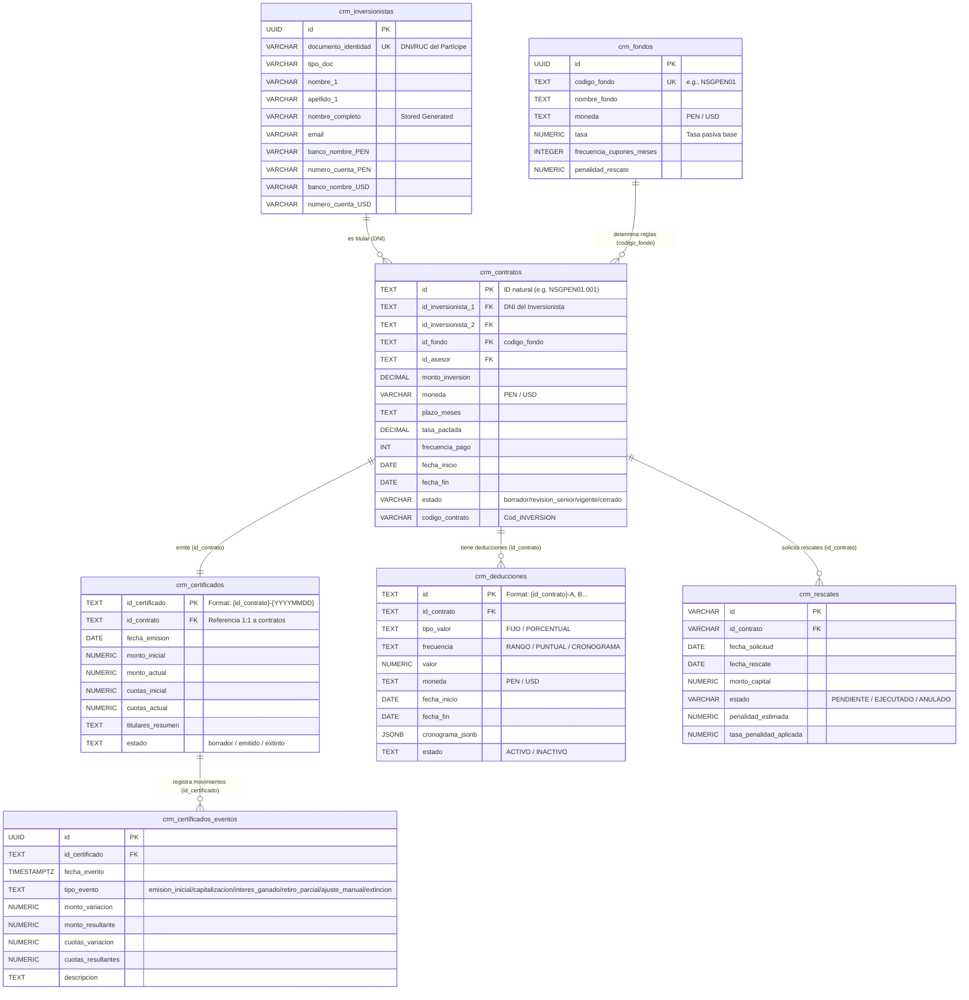

# 🗄️ Modelo de Datos y Esquema Supabase (ER)

La persistencia de datos del ERP de InAndes se gestiona en **Supabase** (PostgreSQL). Para soportar la migración interactiva e importaciones desde Google Sheets, el modelo de datos evolucionó hacia un esquema híbrido que utiliza **claves naturales en texto** en las relaciones de negocio y UUIDs en registros operacionales de auditoría.

---

## 🗺️ 1. Diagrama de Modelo Entidad-Relación (ER)

A continuación se presenta el flujo relacional del CRM de Inversionistas en formato Mermaid:

---

## 🔑 2. Estrategia de Claves Naturales y Lookup Lógico
En el diseño original de Supabase se utilizaban únicamente UUIDs de Postgres. Para evitar la duplicidad de datos al migrar de Google Sheets (donde los identificadores de contratos son de tipo `'NSGPEN01.001'`), se adoptó la siguiente estrategia:

*   **Identificación del Contrato**: El campo `id` de `crm_contratos` es de tipo `TEXT` y guarda el valor del Excel (ej. `'NSGPEN02.045'`).
*   **Identificación del Inversionista en Contratos**: El campo `id_inversionista_1` en `crm_contratos` guarda de manera directa el **DNI** (`documento_identidad`) del inversionista, evitando subconsultas anidadas durante la importación.
*   **Identificación del Fondo**: El campo `id_fondo` de `crm_contratos` almacena el código corto (ej. `'NSGPEN01'`), no el UUID de `crm_fondos`.
*   **Identificación del Certificado**: Cada certificado tiene un `id_certificado` de tipo `TEXT` que concatena el contrato y la fecha (ej. `'NSGPEN01.001-20260228'`).

---

## 🗂️ 3. Diccionario Físico de Datos (Restricciones y Tipos)

### Tabla `crm_inversionistas`
*   `documento_identidad`: `VARCHAR(20) NOT NULL UNIQUE` (Llave de búsqueda/relación).
*   `nombre_completo`: `VARCHAR(400) GENERATED ALWAYS AS (apellido_1 || ' ' || COALESCE(apellido_2, '') || ' ' || nombre_1 || ' ' || COALESCE(nombre_2, '')) STORED` (Autogenerado contablemente).
*   `banco_nombre_PEN` / `numero_cuenta_PEN` / `cci_PEN`: Datos para moneda local.
*   `banco_nombre_USD` / `numero_cuenta_USD` / `cci_USD`: Datos para moneda extranjera.
*   `estado_compliance`: `'borrador'`, `'solicitado'`, `'aprobado'`, `'rechazado'` (Control de workflow).

### Tabla `crm_contratos`
*   `id`: `TEXT PRIMARY KEY` (Clave de migración).
*   `moneda`: `VARCHAR(3) NOT NULL CHECK (moneda IN ('USD', 'PEN'))`.
*   `estado`: `VARCHAR(20) DEFAULT 'borrador' CHECK (estado IN ('borrador', 'revision_senior', 'esperando_firma', 'vigente', 'rechazado', 'finalizado'))`.

### Tabla `crm_certificados`
*   `id_certificado`: `TEXT PRIMARY KEY` (Formato: `{id_contrato}-{fecha}`).
*   `id_contrato`: `TEXT NOT NULL REFERENCES crm_contratos(id) ON DELETE CASCADE` (Relación 1:1 lógica).
*   `estado`: `TEXT DEFAULT 'emitido' CHECK (estado IN ('borrador', 'emitido', 'extinto'))`.

### Tabla `crm_certificados_eventos`
*   `tipo_evento`: `TEXT NOT NULL CHECK (tipo_evento IN ('emision_inicial', 'capitalizacion', 'interes_ganado', 'retiro_parcial', 'ajuste_manual', 'extincion'))` (Ledger inmutable).
*   `monto_variacion`: `NUMERIC(20,2)` (Variación aplicada al capital).
*   `monto_resultante`: `NUMERIC(20,2)` (Snapshot de capitalización posterior).

### Tabla `crm_deducciones`
*   `id`: `TEXT PRIMARY KEY` (Formato: `{id_contrato}-A`).
*   `tipo_valor`: `TEXT CHECK (tipo_valor IN ('FIJO', 'PORCENTUAL'))`.
*   `frecuencia`: `TEXT CHECK (frecuencia IN ('RANGO', 'PUNTUAL', 'CRONOGRAMA'))`.
*   `cronograma_jsonb`: `JSONB` (Estructura `{"YYYY-MM-DD": monto}` para deducciones programadas).

### Tabla `crm_rescates`
*   `id_contrato`: `VARCHAR(50) NOT NULL REFERENCES crm_contratos(id)` (Vínculo al contrato).
*   `estado`: `VARCHAR(20) NOT NULL DEFAULT 'PENDIENTE'` (Estados: `'PENDIENTE'`, `'EJECUTADO'`, `'ANULADO'`).
