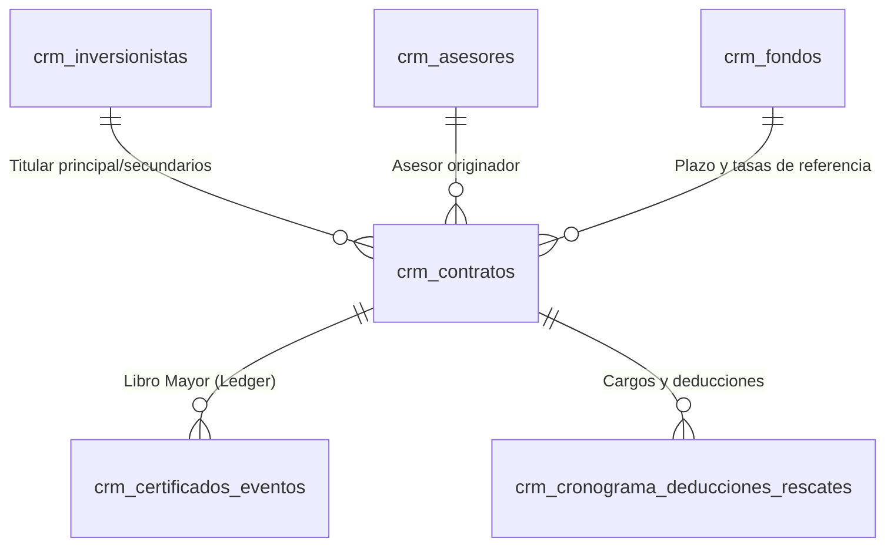

# Modelo de Entidad Relación y Ciclo de Eventos (CRM V3/V4)

Este documento detalla la estructura física de la base de datos de Inandes ERP, sus relaciones y el ciclo de vida contable gobernado por eventos.

---

## 1. Diagrama Entidad-Relación (MER)



> [!IMPORTANT]
> **Decisión de Diseño V3/V4:**
> Se ha eliminado la redundancia de estados paralelos quitando la tabla física `crm_certificados`. La "existencia" y balances actuales de una inversión son **propiedades derivadas** de la combinación entre el contrato (`crm_contratos`) y el historial contable (`crm_certificados_eventos`).

---

## 2. Diccionario de Tablas Clave

### A. Catálogos Base (Nivel 1)

#### public.crm_inversionistas
*   **codigo_inversionista (PK):** Identificador natural del inversionista (ej. `INV-2026-102`).
*   **tipo_doc / documento_identidad:** DNI, RUC, Pasaporte, Carnet de Extranjería.
*   **nombre_completo:** Concatenación de nombres y apellidos.
*   **estado_compliance:** Estado de aprobación del perfil de cumplimiento (`borrador`, `pendiente`, `aprobado`).
*   **banco_nombre_pen / banco_nombre_usd / cci_pen / cci_usd:** Cuentas bancarias configuradas para el reparto de dividendos y caja.

#### public.crm_asesores
*   **id (PK):** Identificador único (UUID).
*   **codigo:** Código correlativo (ej. `AS-2026-881`).
*   **nombre_completo:** Nombre del asesor comercial.
*   **banco_nombre_pen / banco_nombre_usd / cci_pen / cci_usd:** Cuentas configuradas para liquidar comisiones del Motor C.

#### public.crm_fondos
*   **id_fondo_plazo (PK):** Identificador de la variante de plazo (ej. `NSGPEN01-12M`).
*   **id_fondo:** Código del fondo raíz (ej. `NSGPEN01`, `NSGUSD02`).
*   **moneda:** PEN o USD.
*   **plazo_inversion:** Plazo en meses (12, 24, 36, ND).
*   **tasa:** Tasa pasiva de interés anual (TEA Pasiva %).
*   **tasa_activa:** Tasa activa de interés anual (TEA Activa %).
*   **frecuencia_cupones_meses:** Frecuencia de pagos en meses (1: Mensual, 2: Bimestral, 3: Trimestral).
*   **comision_asesor_mantenimiento / comision_asesor_primer_ano:** Tasas para cálculo de comisiones.

---

### B. Módulo de Contratos (Nivel 2)

#### public.crm_contratos
*   **id_contrato (PK):** Código natural único de contrato.
*   **id_inversionista_1 (al 4):** Referencia a `crm_inversionistas.codigo_inversionista`.
*   **porcentaje_participacion_1 (al 4):** Porcentaje de copropiedad sobre el capital.
*   **id_fondo_plazo:** Referencia a `crm_fondos.id_fondo_plazo`.
*   **id_asesor:** Referencia a `crm_asesores.id`.
*   **monto_inversion / moneda:** Importe y divisa del ticket original.
*   **porcentaje_reparto:** Porcentaje de dividendos cobrado en caja (0% a 100%).
*   **tasa_pactada:** TEA pactada formalmente en el contrato escrito (TEA %).
*   **fecha_inicio / fecha_fin:** Fechas que delimitan el periodo de vigencia.
*   **estado:** `borrador` ➔ `emitido` (Activo) ➔ `cerrado_fin_contrato` / `cerrado_por_rescate` (Cerrado).

---

### C. Módulo Contable y Ledger (Nivel 3)

#### public.crm_certificados_eventos
*   **id_evento (PK):** Identificador correlativo del asiento.
*   **id_contrato / id_certificado:** Referencias al contrato originador y al código del certificado asignado.
*   **tipo_evento:** Tipo de asiento (`emision_inicial`, `aumento_capital`, `cierre_fin_ciclo`, `cierre_fin_contrato`, `cierre_por_rescate`).
*   **capital_base:** Capital con el que inicia el periodo de cálculo.
*   **interes_generado_bruto:** Intereses brutos del periodo calculados por el motor contable.
*   **impuestos_renta:** Retención del 5% de impuesto a la renta de segunda categoría (Ley Peruana).
*   **interes_neto_disponible:** Interés neto final a distribuir (`bruto - impuestos`).
*   **monto_capitalizacion:** Interés neto reinvertido (si `% reparto < 100%`).
*   **monto_reparto:** Interés neto cobrado en caja por el inversionista.
*   **monto_rescate / penalidad_rescate:** Monto de retiro anticipado y su penalidad.
*   **capital_final_saldo:** Capital de cierre de este hito temporal.
*   **payload_asiento:** Copia detallada en formato JSONB de la ejecución de auditoría (Motor V40).

#### public.crm_cronograma_deducciones_rescates
*   **id_cuota (PK):** Identificador de la cuota programada.
*   **id_certificado / id_contrato:** Asignación del cargo.
*   **tipo_cargo:** `DEDUCCION_ORDINARIA` (ej. cuotas de préstamos internos) o `RESCATE_CAPITAL` (retiros programados).
*   **monto_cobrar / fecha_proyectada_cobro:** Monto y fecha proyectada del cargo.
*   **estado:** `PENDIENTE` o `COBRADO`.

---

## 3. Ciclo de Vida Contable del Certificado (Ledger)

A continuación se detalla el comportamiento del saldo y estado derivado de la inversión en cada evento de la tabla `crm_certificados_eventos`:

```
[Borrador] 
    │
    ▼ (Cruce voucher)
[emision_inicial] ────► Asigna Capital Base e inicializa cuotas @ Valor Cuota del día
    │
    ├───► [aumento_capital] ──► Aporte adicional o reinversión. Aumenta Capital Base y cuotas.
    │
    ├───► [cierre_fin_ciclo] ─► Liquida intereses (Motor B V40)
    │           ├──► Reparto (100%): Saldo base no cambia.
    │           └──► Capitalización: Loop a "aumento_capital" incrementando el saldo.
    │
    ├───► [cierre_fin_contrato] ➔ Vence contrato. Devuelve capital. Saldo final = 0.00.
    │
    └───► [cierre_por_rescate] ──► Retiro anticipado. Aplica penalidad. Saldo final = 0.00.
```

### Evento A: `emision_inicial`
*   **Estado Contractual:** Pasa de `propuesto` / `pendiente_aprobacion` a `emitido`.
*   **Efecto Financiero:**
    *   Registra el primer hito con `capital_base` = `monto_inversion`.
    *   Inicializa las cuotas del partícipe dividiendo el capital entre el Valor Cuota del día del fondo (`generate_cuotas_v25.py`).
    *   La inversión pasa a estar activa comercialmente.

### Evento B: `cierre_fin_ciclo`
*   **Estado Contractual:** Se mantiene en `emitido`.
*   **Efecto Financiero:**
    *   El **Motor B (V40)** calcula el interés devengado.
    *   Resta la retención fiscal del 5% (`impuestos_renta`).
    *   Consulta la tabla `crm_cronograma_deducciones_rescates`. Si existen deducciones ordinarias vigentes en el periodo, las cobra y las asigna a `monto_deduccion`, reduciendo el neto disponible.
    *   **Feedback Loop:**
        *   Si el contrato tiene `% reparto = 100` (Reparto): El interés neto se asigna a `monto_reparto` y sale como caja al inversionista. El `capital_final_saldo` se mantiene idéntico.
        *   Si el contrato tiene `% reparto = 0` (Capitalización): El interés neto se suma a `monto_capitalizacion`. Esto dispara internamente un nuevo evento automático de tipo `aumento_capital` (reinversión) a valor cuota de la fecha de corte, aumentando el capital del partícipe para el siguiente ciclo.

### Evento C: `aumento_capital`
*   **Estado Contractual:** Se mantiene en `emitido`.
*   **Efecto Financiero:**
    *   Registra una inyección de capital en el ledger.
    *   El motor calcula las nuevas cuotas suscritas según el Valor Cuota de ese día.
    *   El nuevo saldo acumulado (`capital_final_saldo`) sirve como el nuevo `capital_base` sobre el cual se calcularán intereses diarios de forma proporcional.

### Evento D: `cierre_fin_contrato`
*   **Estado Contractual:** Cambia a `cerrado_fin_contrato`.
*   **Efecto Financiero:**
    *   El motor calcula el último interés proporcional del miniciclo de cierre.
    *   Se devuelve el capital acumulado al inversionista.
    *   El `capital_final_saldo` se registra como `0.00`. No se vuelven a devengar rendimientos.

### Evento E: `cierre_por_rescate`
*   **Estado Contractual:** Cambia a `cerrado_por_rescate`.
*   **Efecto Financiero:**
    *   El motor calcula el interés ganado hasta la fecha del retiro anticipado.
    *   Se extrae la penalidad configurada en `crm_fondos.penalidad_rescate` sobre el capital base y se registra en `penalidad_rescate`.
    *   El saldo activo se lleva a `0.00`, se cancelan las cuotas en circulación y se emite la orden de desembolso final de caja por el remanente.
