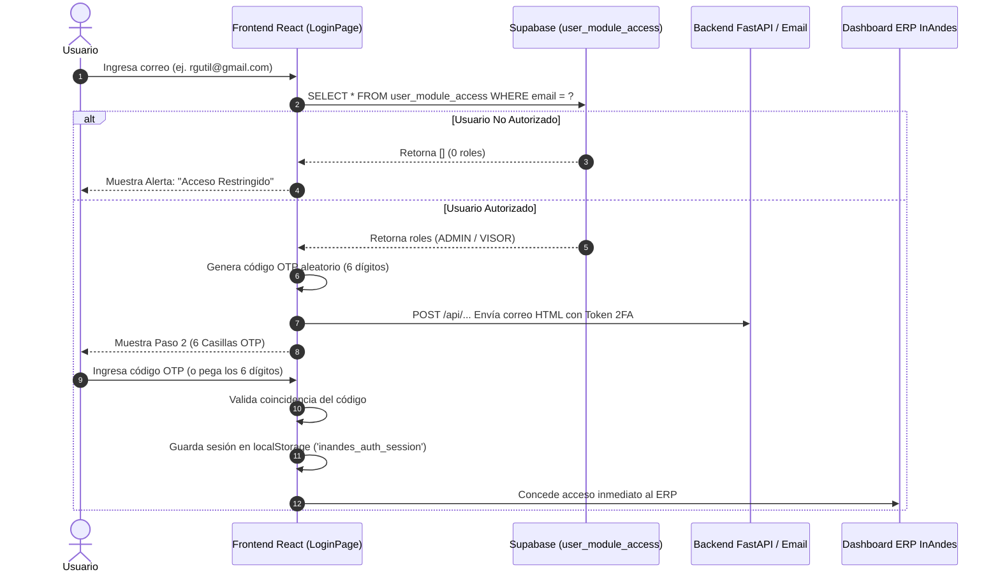

# Protocolo de Autenticación 2FA Independiente (Sin Dependencia de Google OAuth)

---

## 📌 1. Motivación y Objetivo

Para blindar el ERP frente a contingencias externas, suspensiones de cuentas de Google Cloud Platform y bloqueos de dominios o proveedores OAuth, se implementó un **sistema de autenticación soberano de dos factores (2FA)** por código transaccional de 6 dígitos (OTP), basado en la arquitectura de **APEFAC** (`OtpLogin.jsx`).

Este sistema:
1. **Elimina al 100% la dependencia de Google Cloud Console** (Client ID, Client Secret, OAuth Consent Screen, Redirect URIs).
2. Valida directamente los permisos del usuario en la tabla `user_module_access` de Supabase.
3. Envía un código OTP cifrado de 6 dígitos válido por 10 minutos al correo corporativo autorizado.
4. Mantiene la sesión del usuario en el navegador con `inandes_auth_session` en `localStorage`.

---

## 🏗️ 2. Flujo Operativo del 2FA

---

## 📋 3. Componentes y Archivos Clave

| Archivo | Responsabilidad |
| :--- | :--- |
| `src/features/auth/LoginPage.tsx` | Componente visual 2FA con 2 pasos, auto-focus, paste listener, countdown 60s y plantilla de correo. |
| `src/App.tsx` | Listener de sesión que prioriza `inandes_auth_session` de `localStorage` antes de cualquier gateway. |
| `src/components/layout/MasterTemplate.tsx` | `handleLogout` que destruye la sesión `inandes_auth_session` y recarga limpiamente. |
| `src/services/authService.ts` | Conexión con `user_module_access` en Supabase para obtener módulos y roles. |

---

## 🛡️ 4. Lista de Usuarios Autorizados en Base de Datos

Los usuarios habilitados para ingresar mediante 2FA se gestionan desde `user_module_access`:

| Usuario / Correo | Nombre Completo | Módulos | Roles |
| :--- | :--- | :--- | :--- |
| `rgutil@gmail.com` | Richard Gutierrez | CRM, FACTORING | ADMIN, ADMIN |
| `rgallo@inandes.com` | Ricardo Gallo | CRM, FACTORING | ADMIN, VISOR |
| `jparra@inandes.com` | Yanneth Parra | CRM, FACTORING | VISOR, VISOR |
| `operaciones@inandes.com` | Lucy Carpio | FACTORING | VISOR |
| `analistajr01@inandes.com` | Christie Awa | FACTORING | ADMIN |
| `contabilidad01@inandes.com` | Carlos Luna | CRM | VISOR |
