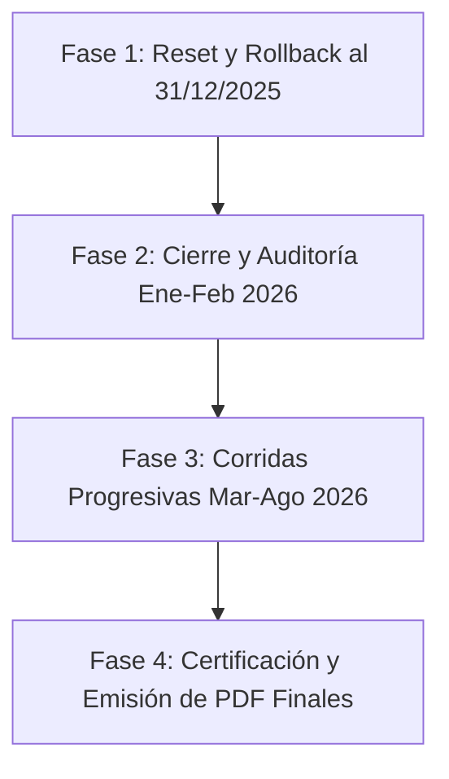

# 📋 Plan de Control de Calidad y Auditoría Integral — CRM Inversionistas

> **Documento Oficial de Especificación y Protocolo de Auditoría Centavo a Centavo**
> 
> *Basado en la transcripción de requerimientos de dirección y control de calidad (Agosto 2026)*

---

## 🎯 Contexto y Objetivo General

Se retoma el ciclo final de **Control de Calidad y Auditoría Financiera Centavo a Centavo** del CRM Inversionistas en la arquitectura **React 19 + Supabase**.

El objetivo es validar y auditar el cálculo de retornos, devengue de cuotas y saldos de los fondos bimestrales y trimestrales, contrastando los resultados generados por el ERP contra el modelo maestro en Excel de **Ricardo Gallo (Director/Dueño)**.

---

## 📊 Fases de Ejecución del Protocolo de Calidad

### 📍 FASE 1: Snapshot de Seguridad y Retorno de Estado al 31 de Diciembre de 2025
* **Objetivo:** Garantizar la preservación 100% inmutable de los datos cargados al **31/12/2025** ANTES de ejecutar cualquier operación de reseteo o rollback.
* **Acción Técnica de Resguardo Realizada (EJECUTADO ✅):**
  - Se congeló el snapshot relacional completo de la base de datos en `c:\Users\rguti\Inandes.ERP.React\backups\`:
    - `crm_inversionistas`: **220 registros** respaldados.
    - `crm_contratos`: **189 registros** respaldados.
    - `crm_certificados_eventos`: **379 registros** respaldados (Ledger contable completo).
    - `crm_fondos` (17 registros) y `crm_asesores` (19 registros).
  - Se creó el script de restauración inmediata en 1 clic: `backups/restore_snapshot_31_12_2025.py`.
* **Próximo Paso de Fase 1:**
  - Analizar e invocar la función de reseteo contable de la base de datos (`regresar_todo` / rollback de asientos) asegurando que el estado base retorne limpiamente al 31/12/2025.

---

### 📍 FASE 2: Cierre Bimestral/Trimestral (01/01/2026 ➔ 28/02/2026)
* **Objetivo:** Correr el cierre de ciclo para todos los fondos bimestrales y el fondo trimestral con fecha de corte **28 de Febrero de 2026**.
* **Acción Técnica:**
  - Ejecutar el motor de cálculo V40 (`financialCalculator.ts` / `inversionistasService.ts`).
  - Procesar la distribución de interés bruto, retención fiscal del 5% de Impuesto a la Renta de Segunda Categoría, y evaluar la modalidad (*Pagar Cupón* vs *Capitalizar*).
  - **Auditoría Comparativa:** Cruzar los saldos devengados y valor cuota al 28/02/2026 contra la hoja de trabajo oficial en Excel de **Ricardo Gallo**.

---

### 📍 FASE 3: Corridas Progresivas Mensuales (Marzo ➔ Agosto 2026)
* **Objetivo:** Avanzar progresivamente en el tiempo ejecutando los cierres de ciclo correspondientes a los meses de **Marzo, Abril, Mayo, Junio, Julio y Agosto de 2026**.
* **Acción Técnica:**
  - Correr cierre de Marzo 2026 ➔ Comparar vs Excel Ricardo Gallo.
  - Correr cierre de Abril 2026 ➔ Comparar vs Excel Ricardo Gallo.
  - Continuar iterativamente hasta completar el corte a **Finales de Agosto de 2026**.
  - Verificar que el loop de retroalimentación de capitalización (*feedback loop*) genere correctamente los eventos `aumento_capital` en Supabase a valor cuota del día.

---

### 📍 FASE 4: Certificación Final y Emisión de Reportes
* **Objetivo:** Emisión oficial de los documentos de cierre contable y verificación de cero discrepancias.
* **Entregables:**
  - Estados de Cuenta en PDF por cada partícipe.
  - Certificados de Retención de 2da Categoría.
  - Cuadro de Mapeo de Auditoría Centavo a Centavo (React vs Excel).

---

## 🛠️ Herramientas y Componentes Involucrados

| Componente | Archivo / Función | Responsabilidad |
|------------|-------------------|-----------------|
| **Función Reset** | `regresar_todo` / `inversionistasService.ts` | Retorno de base de datos al 31/12/2025 |
| **Motor V40** | `financialCalculator.ts` | Cálculo in-memory de intereses, waiver e impuestos |
| **Persistencia** | `inversionistasService.ts` | Inserción de eventos en `crm_certificados_eventos` |
| **Base de Datos** | Supabase (`egvcinsbyropumybatdf`) | Ledger inmutable de transacciones |
| **Reportes PDF** | WeasyPrint Engine | Generación de Estados de Cuenta y Certificados |

---

*Última actualización: 2026-08-06 (Generado a partir de la transcripción oficial Whisper)*
