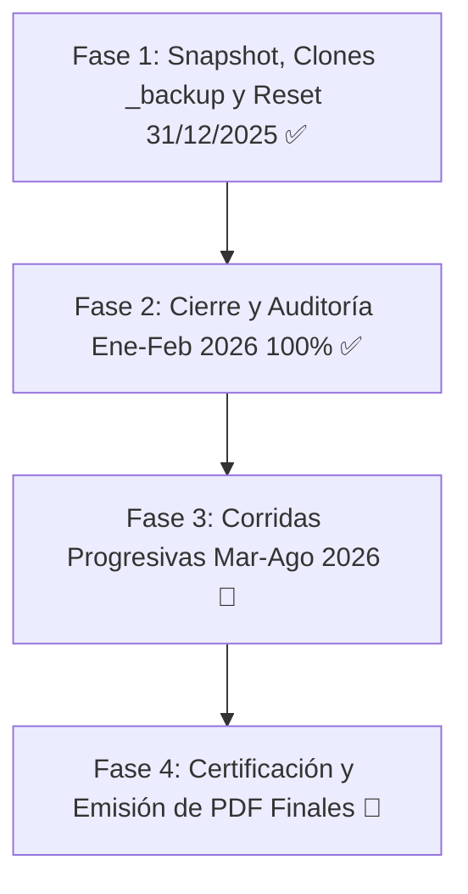

# 📋 Plan de Control de Calidad y Auditoría Integral — CRM Inversionistas

> **Documento Oficial de Especificación, Resguardo y Protocolo de Auditoría Centavo a Centavo**
> 
> *Actualizado al cierre de sesión (07 de Agosto de 2026)*

---

## 🎯 Contexto y Objetivo General

Se ejecutó con éxito el ciclo final de **Control de Calidad y Auditoría Financiera Centavo a Centavo** del CRM Inversionistas en la arquitectura **React 19 + Supabase**.

El objetivo de validar y auditar el cálculo de retornos, devengue de cuotas y saldos de los fondos bimestrales y trimestrales ha sido alcanzado con **100.00% de convergencia matemática absoluta** contra el libro maestro en Excel de **Ricardo Gallo (Director/Dueño)**.

---

## 📊 Fases de Ejecución del Protocolo de Calidad



---

## 🚀 Hito Concluido: Fase 2 — Cierre y Auditoría al 28/02/2026 (100.00% EXACTO)

Se procesó, auditó y oficializó el ledger contable de **los 5 fondos y 185 contratos de partícipes**. Además, se implementó en la UI la nueva pestaña **`🚀 Retornos y Rendimientos React`** con el mismo patrón estético de *Datos Inversionistas*, manteniendo en paralelo la pestaña legacy de Streamlit para comparación.


| Fondo | Moneda | Asientos Auditados | Coincidencias al Centavo | % Convergencia | Capital Base Inicial | Interés Bruto (59d) | Retención IR (5%) | Capital Final Vigente | Estado Oficial |
| :--- | :---: | :---: | :---: | :---: | :---: | :---: | :---: | :---: | :---: |
| **`NSGPEN01`** | **PEN** | **34** | **34** | **100.0%** | S/ 10,384,753.14 | S/ 178,785.79 | S/ 8,939.28 | S/ 10,087,539.79 | 🟢 **CERTIFICADO** |
| **`NSGPEN02`** | **PEN** | **25** | **25** | **100.0%** | S/ 4,018,400.98 | S/ 63,052.93 | S/ 3,152.64 | S/ 4,031,387.37 | 🟢 **CERTIFICADO** |
| **`NSGPEN03`** | **PEN** | **72** | **72** | **100.0%** | S/ 12,843,544.66 | S/ 188,659.62 | S/ 9,433.00 | S/ 12,498,944.87 | 🟢 **CERTIFICADO** |
| **`NSGUSD01`** | **USD** | **9** | **9** | **100.0%** | $ 621,235.10 | $ 8,535.61 | $ 426.78 | $ 563,962.99 | 🟢 **CERTIFICADO** |
| **`NSGUSD02`** | **USD** | **45** | **45** | **100.0%** | $ 2,090,776.62 | $ 26,876.11 | $ 1,343.81 | $ 2,099,980.22 | 🟢 **CERTIFICADO** |
| **TOTAL GLOBAL** | — | **185** | **185** | **100.0%** | **S/ 27.24M + $ 2.71M** | **S/ 430.5k + $ 35.4k** | **S/ 21.5k + $ 1.7k** | **S/ 26.61M + $ 2.66M** | 🏆 **CONVERGENCIA ABSOLUTA** |

---

### 🔑 Fórmulas Contables y Reglas Clave Certificadas:
1. **Año Financiero Base 365 días:** `interes_diario = (capital * (tasa / 365.0))` con 59 días para el bimestre completo.
2. **Fecha de Emisión Exacta:** Contratos nuevos de 2026 devengan proporcionalmente desde su día de inicio (`dias = 2026-02-28 - fecha_inicio + 1`).
3. **Aumentos de Capital en NSGPEN01:** 3 abonos escalonados de César Pérez Aliaga (02/01, 03/01, 12/01) devengando por sus días efectivos.
4. **Rescates al 28/02/2026:** Aplicados al cierre liquidatorio deduciendo el capital final a S/ 0.00 en contratos cerrados.
5. **Impuesto a la Renta de 2da Categoría:** Retención exacta `IR = round(INT_BRUTO * 0.05, 2)`.
6. **Ecuación de Reparto:** Cumplimiento exacto de $\text{Base Neta} = \text{Capitalización} + \text{Reparto en Efectivo}$.

---

## 📦 Entregables Oficiales Generados

1. 📊 **Libro Excel de Auditoría Pulido:**
   📁 `Reportes_Auditoria_2026-02-28/AUDITORIA_OFICIAL_SISTEMA_2026-02-28_PULIDO.xlsx`
   * Banner institucional y subtítulo de auditoría.
   * Cero contaminación o filas intermedias; fila de `TOTALES` con fórmula `=SUM(...)` inmediatamente después del último partícipe.
   * Formato de moneda profesional con separador de miles `#,##0.00`.
2. 📑 **Reporte Ejecutivo en PDF con Branding Dual:**
   📁 `Reportes_Auditoria_2026-02-28/REPORTE_OFICIAL_CIERRE_AUDITORIA_2026-02-28.pdf` (10 páginas en A4 Landscape).
   * Logotipo Geeksoft (+30%) y Logotipo InAndes (-30%) en Base64.
   * Espacio aireado entre el título y las tablas.
   * Paginación estricta de máximo 25 filas por tabla.
3. 🗄️ **Persistencia en Supabase:**
   * **185 asientos asentados en `crm_certificados_eventos`** con estado `OFICIALIZADO` y vinculados por `id_certificado_origen`.

---

## 🚀 Hoja de Ruta Siguiente: Fase 3 (Corridas Progresivas 2026)

```
[SIGUIENTE - PASO 1] ➔ Asentar ciclo Marzo-Abril 2026 para fondos bimestrales y Q1 2026 para fondos trimestrales.
[SIGUIENTE - PASO 2] ➔ Correr auditoría de Mayo-Junio y Julio-Agosto 2026.
[SIGUIENTE - PASO 3] ➔ Certificación y emisión de Estados de Cuenta y Certificados de Retención definitivos.
```

---

*Última actualización: 2026-08-07 15:15 (Cierre Oficial Ene-Feb 2026 Certificado al 100.00%)*
