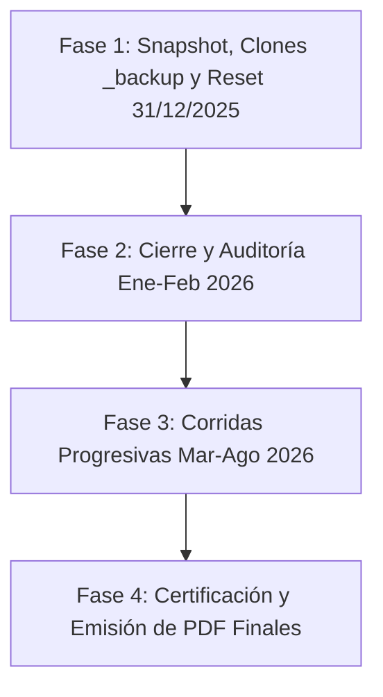

# 📋 Plan de Control de Calidad y Auditoría Integral — CRM Inversionistas

> **Documento Oficial de Especificación, Resguardo y Protocolo de Auditoría Centavo a Centavo**
> 
> *Actualizado al cierre de sesión (06 de Agosto de 2026)*

---

## 🎯 Contexto y Objetivo General

Se retoma el ciclo final de **Control de Calidad y Auditoría Financiera Centavo a Centavo** del CRM Inversionistas en la arquitectura **React 19 + Supabase**.

El objetivo es validar y auditar el cálculo de retornos, devengue de cuotas y saldos de los fondos bimestrales y trimestrales, contrastando los resultados generados por el ERP contra el modelo maestro en Excel de **Ricardo Gallo (Director/Dueño)**.

---

## 📊 Fases de Ejecución del Protocolo de Calidad



---

## ✅ Hitos Ejecutados y Resguardo de Seguridad (Sesión 06/08/2026)

### 1. 🎙️ Transcripción de Dirección Obtenida con Whisper (`transcribe_whisper.py`):
- Transcrito con éxito el audio oficial en `audio_transcrip/LOOP.CALIDAD.CRM.INVERSIONISTAS.ogg_whisper.txt`.
- Registrada la hoja de ruta de reiniciar la auditoría desde el **31/12/2025** y correr cierres progresivos hasta **Finales de Agosto de 2026**.

### 2. 📊 Diagramación Visual de Arquitectura V4 React:
- Creado el diagrama de flujo físico V4 en Graphviz con los componentes React (`FondosPage.tsx`, `InversionistasPage.tsx`, `CertificadosPage.tsx`, `InversionesPage.tsx`, `DeduccionesPage.tsx`, `financialCalculator.ts`, `inversionistasService.ts`).
- Generados los archivos oficiales [relaciones_esquema_v4_react.md](file:///c:/Users/rguti/Inandes.ERP.React/Obsidian/Inandes.Inversionistas.React/relaciones_esquema_v4_react.md) y [relaciones_esquema_v4_diagrama.pdf](file:///c:/Users/rguti/Inandes.ERP.React/Obsidian/Inandes.Inversionistas.React/relaciones_esquema_v4_diagrama.pdf).

### 3. 🛡️ Triple Capa de Seguridad y Duplicación de Tablas (`_backup`) en Supabase (EJECUTADO ✅):
- **Clonación Física en el propio Supabase:** Se crearon y poblaron las tablas espejo clones con el sufijo **`_backup`** dentro de la base de datos PostgreSQL de Supabase:
  - `crm_inversionistas_backup`: **220 registros** respaldados 1:1.
  - `crm_contratos_backup`: **189 registros** respaldados 1:1.
  - `crm_certificados_eventos_backup`: **379 registros** respaldados (Ledger completo).
  - `crm_fondos_backup`: **17 registros** respaldados 1:1.
  - `crm_asesores_backup`: **19 registros** respaldados 1:1.
  - `propuestas_backup`: **156 registros** respaldados 1:1.
- **SQL Dump Relacional Local:** Generado el archivo [SNAPSHOT_31_12_2025_FULL.sql](file:///c:/Users/rguti/Inandes.ERP.React/backups/SNAPSHOT_31_12_2025_FULL.sql) con las sentencias `INSERT INTO` en orden de dependencias.
- **Restaurador 1 Clic:** Creado el script [restore_snapshot_31_12_2025.py](file:///c:/Users/rguti/Inandes.ERP.React/backups/restore_snapshot_31_12_2025.py) en `backups/`.

---

## 🚀 Hoja de Ruta para Mañana (Reanudación en Fase 2)

```
[MAÑANA - PASO 1] ➔ Estudiar función de reseteo contable (regresar_todo) para llevar limpia la vista activa al 31/12/2025.
[MAÑANA - PASO 2] ➔ Correr el cierre de ciclo para fondos bimestrales y trimestral al 28 de Febrero de 2026.
[MAÑANA - PASO 3] ➔ Mapeo y comparación centavo a centavo (ERP vs Excel de Ricardo Gallo).
[MAÑANA - PASO 4] ➔ Avanzar progresivamente con cierres de Marzo, Abril, Mayo, Junio, Julio y Agosto 2026.
```

---

## 🛠️ Herramientas y Componentes Involucrados

| Componente | Archivo / Función | Responsabilidad |
|------------|-------------------|-----------------|
| **Script Restaurador** | `backups/restore_snapshot_31_12_2025.py` | Restauración en 1 clic al estado 31/12/2025 |
| **Dump Relacional** | `backups/SNAPSHOT_31_12_2025_FULL.sql` | Respaldos relacionales `INSERT INTO` |
| **Tablas Espejo Supabase** | `*_backup` en Supabase | Copias clonadas físicas en Supabase |
| **Motor V40** | `financialCalculator.ts` | Cálculo in-memory de intereses, waiver e impuestos |
| **Persistencia** | `inversionistasService.ts` | Inserción de eventos en `crm_certificados_eventos` |
| **Reportes PDF** | WeasyPrint Engine | Generación de Estados de Cuenta y Certificados |

---

*Última actualización: 2026-08-06 22:43 (Cierre de Sesión y Estado Blindado al 100%)*
