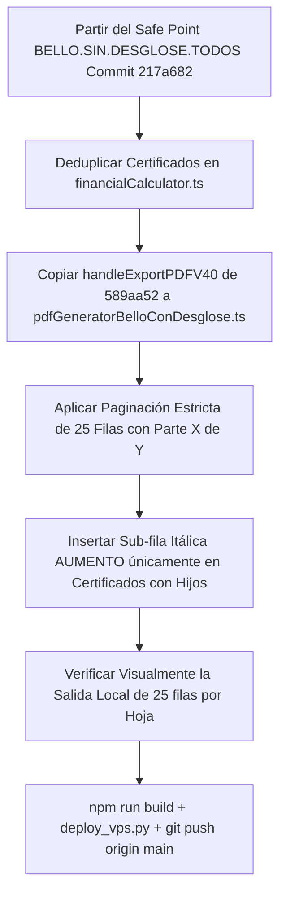

# 📄 Especificación y Diagnóstico: REPORTE BELLO CON DESGLOSE

> **Nota Hija de [00.A — Módulo de Inversionistas](file:///C:/Users/rguti/Inandes.ERP.React/Obsidian/Inandes.Inversionistas.React/00.A.INVERSIONISTAS.md)**  
> **Fecha:** 10 de Agosto de 2026  
> **Safe Point Relacionado:** `BELLO.SIN.DESGLOSE.TODOS` (Commit `217a682`)

---

## 1. 🎯 Objetivo del Requerimiento

El objetivo es lograr un **Único Generador Oficial de PDF** en el módulo de Inversionistas que cumpla con los siguientes criterios intangibles:

1. **Clonación 1:1 del Formato Bello Original (`commit 589aa52` / `217a682`):**
   - **Cabecera:** `INANDES ACTIVOS ALTERNATIVOS S.A.C.` | `REPORTE OFICIAL DE AUDITORÍA Y DEVENGUE DE RETORNOS (MOTOR V40)` | `FECHA DE CORTE: DEL [fStart] AL [fEnd]`.
   - **Logo Oficial:** Logo **EFI** posicionado arriba a la derecha (`data:image/png;base64,${LOGO_EFI_BASE64}`).
   - **Paginación Troceada Estricta:** Máximo **25 filas por hoja** (`ROWS_PER_PAGE = 25`).
   - **Badge de Fondo:** `FONDO [NOMBRE_FONDO] ([ID_FONDO]) — MONEDA: [MONEDA] | [N] INVERSIONISTAS (Parte X de Y)`.
   - **Tabla Contable:** Estilo Navy `#0f172a`, Int. Bruto azul `#0284c7`, IR (5%) rojo `#dc2626`, Reparto verde `#059669`, Rescates rojo `#dc2626` y Capital Final azul marino `#1e3a8a`.
   - **Pie de Página Legal:** Sin bloques de firma.

2. **Única Capacidad Adicional Habilitada:**
   - La inserción de sub-filas desglosadas en itálica azul `└─ Incremento de Capital` únicamente debajo de aquellos certificados que registraron aumentos de capital dentro del período (ej. `NSGPEN01-090`).

3. **Universalidad (TODOS vs. FONDO ÚNICO):**
   - Funcionar de forma idéntica e impecable tanto al seleccionar **"TODOS LOS FONDOS"** como al filtrar **"UN SOLO FONDO INDIVIDUAL"**.

---

## 🔍 2. Diagnóstico: ¿Por qué no salió en las primeras 2 horas?

Al analizar retrospectivamente la sesión, se identificaron **4 causas raíz** que deformaron el reporte:

### ❌ Causa 1: Recrear el diseño de memoria en lugar de clonar el código exacto
En lugar de tomar el template HTML/CSS que ya funcionaba en el commit `589aa52`, se intentó armar un generador HTML/CSS nuevo en TypeScript, alterando padding, fuentes, tamaños de celdas y la posición de los logos (colocando InAndes en lugar del logo EFI).

### ❌ Causa 2: Ruptura de la regla de Paginación Troceada (25 filas/hoja)
El Bello original debe partir el listado de inversionistas en **bloques fijos de 25 filas por hoja** con la etiqueta `(Parte X de Y)`. Al eliminar o alterar esta lógica de corte por bloques, el navegador intentaba meter 30 a 36 filas en una sola hoja A4, haciendo que el texto se deformara o que los saltos de página automáticos generaran hojas con 2 o 3 filas sueltas.

### ❌ Causa 3: Duplicación de Contratos en la Data (`pdfData`)
En la consulta/cálculo de ciertos fondos (ej. `NSGPEN03`), contratos como `NSGPEN03-018` y `NSGPEN03-019` aparecían duplicados en el array de filas (uno con fecha de fin `.20251231` y otro con `.20260228`). Esto provocaba que el reporte tuviera el doble de filas (16 páginas en vez de 9) y mostrara montos repetidos.

### ❌ Causa 4: Alteración no solicitada de elementos (Bloques de Firmas)
Se agregaron bloques de firma y textos de aprobación en el pie de página que no pertenecían al formato Bello original.

---

## 🛠️ 3. Plan de Acción y Pasos de Ejecución (Metodología para la Próxima Sesión)

Para garantizar el éxito inmediato en el siguiente intento, se seguirá este procedimiento paso a paso:

### Pasos Detallados:

1. **Punto de Partida Inviolable:**
   - Asegurar que el trabajo comience sobre el commit `217a682` (`BELLO.SIN.DESGLOSE.TODOS`).

2. **Deduplicación de Data (`financialCalculator.ts`):**
   - Asegurar que en el bucle que construye `rowsPdf`, cada contrato aparezca una sola vez por período contable, evitando registros históricos extemporáneos.

3. **Clonación Directa del Template (Sin modificar una coma):**
   - Copiar la función `handleExportPDFV40` exacta del commit `589aa52` en el módulo `pdfGeneratorBelloConDesglose.ts`.

4. **Preservación de Paginación y Logos:**
   - Mantener el logo **EFI** a la derecha (`data:image/png;base64,${LOGO_EFI_BASE64}`).
   - Mantener el troceado de 25 filas por hoja y el banner `(Parte X de Y)`.

5. **Única Modificación Admitida:**
   - Añadir únicamente la fila itálica en azul `#0369a1` (`└─ Incremento de Capital`) cuando `tipo === 'AUMENTO'`.

6. **Verificación Previa a Push:**
   - Probar la generación en local, revisar que salgan 25 filas por hoja y que los totales coincidan exactamente antes de subir al VPS.

---

*Nota registrada para continuidad inmediata entre sesiones.*
