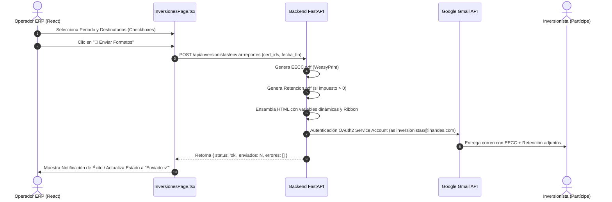

# 📧 Configuración y Envío de Correos (EECC y Certificados)

> **DOCUMENTO TÉCNICO Y PROCEDIMIENTO OPERATIVO**
> **Remitente Oficial:** `inversionistas@inandes.com`
> **Proyecto:** InAndes ERP & CRM Inversionistas

---

## 1. 🎯 Objetivo del Sistema de Envíos

Permitir que el ERP (React Frontend + FastAPI Backend) envíe de forma individual o masiva los reportes periódicos de los partícipes a sus correos registrados, incluyendo:
1. **Estado de Cuenta (EECC) en PDF:** Desglose de saldo inicial, devengue de intereses, retención tributaria, retiros/rescates, reinversión y saldo final.
2. **Certificado de Retención de Renta (2da Categoría) en PDF:** Sustento tributario oficial generado con la liquidación del periodo.
3. **Cuerpo del Correo con Marca InAndes:** Plantilla HTML institucional (`email_eecc_body.html`) con ribbon gráfico y resumen visual de la inversión.

---

## 2. 🔐 ¿Cómo configurar la cuenta corporativa `inversionistas@inandes.com`?

Dado que `@inandes.com` es un dominio corporativo administrado en **Google Workspace**, existen dos métodos para que el sistema pueda enviar correos desde esa dirección:

---

### ⭐ OPCIÓN 1 (Oficial y Recomendada): Delegación de Dominio con Service Account
*Este método NO requiere la contraseña de la cuenta ni interacción manual. Utiliza la Google Service Account ya creada para el proyecto.*

#### Datos Técnicos de la Service Account:
- **Proyecto Google Cloud:** `inandes-email-sender`
- **Email de Service Account:** `inandes-email-sender@inandes-email-sender.iam.gserviceaccount.com`
- **Client ID de la Service Account:** `118437227448807368976`
- **Archivo de Credenciales:** `backend/gmail_service_account.json`

#### 📋 Paso a paso para el Administrador de Google Workspace:
*(Compartir estas instrucciones literales con el Administrador TI del dominio inandes.com)*

1. Ingresar a la **Consola de Administración de Google Workspace**: [https://admin.google.com](https://admin.google.com) con una cuenta Super Admin.
2. En el menú de navegación izquierdo, ir a:
   👉 **Seguridad (Security)** > **Control de acceso y datos (Access and data control)** > **Controles de API (API controls)**.
3. Bajar hasta la tarjeta **Delegación en todo el dominio (Domain-wide delegation)** y hacer clic en **Gestionar la delegación en todo el dominio (Manage Domain-wide delegation)**.
4. Hacer clic en el botón azul **Añadir nuevo (Add new)**.
5. Rellenar los campos solicitados:
   - **ID de cliente (Client ID):** `118437227448807368976`
   - **Ámbitos de OAuth (OAuth scopes):** 
     ```
     https://mail.google.com/, https://www.googleapis.com/auth/gmail.send
     ```
6. Hacer clic en **Autorizar (Authorize)**.

> **Resultado:** En menos de 2 minutos queda autorizado. El backend de Python podrá enviar correos a nombre de `inversionistas@inandes.com` mediante la API de Google sin bloqueos de seguridad.

---

### ⚡ OPCIÓN 2 (Alternativa Rápida): Contraseña de Aplicación SMTP (App Password)
*Si se tiene acceso directo al buzón `inversionistas@inandes.com` y la organización permite contraseñas de aplicación.*

1. Iniciar sesión en [https://myaccount.google.com](https://myaccount.google.com) con el usuario `inversionistas@inandes.com`.
2. Ir a **Seguridad** y verificar que la **Verificación en 2 pasos** esté activada.
3. Buscar la sección **Contraseñas de aplicaciones** ([https://myaccount.google.com/apppasswords](https://myaccount.google.com/apppasswords)).
4. Escribir el nombre de la app (ej: `InAndes ERP Backend`) y pulsar **Crear**.
5. Google generará una clave de 16 caracteres (ej: `abcd efgh ijkl mnop`).
6. Configurar en el archivo `.env` del backend:
   ```env
   SMTP_SERVER=smtp.gmail.com
   SMTP_PORT=587
   SMTP_USER=inversionistas@inandes.com
   SMTP_PASSWORD=abcd efgh ijkl mnop
   ```

---

## 3. 📂 Estructura de Archivos en el Worktree del Proyecto

Los elementos necesarios han sido centralizados en el repositorio `Inandes.ERP.React`:

| Componente | Ubicación en el Repositorio | Función |
|---|---|---|
| **Credencial Service Account** | `backend/gmail_service_account.json` | Llave privada para autenticar ante Google Gmail API |
| **Plantilla HTML Correo** | `backend/templates/email_eecc_body.html` | Diseño institucional responsivo con ribbon y datos dinámicos |
| **Ribbon Gráfico de Cabecera** | `backend/templates/ribbon_inandes.jpg` | Imagen oficial de InAndes incrustada en el correo |
| **Plantilla PDF EECC** | `backend/templates/estado_cuenta_inversionista_v1.html` | Generador WeasyPrint del Estado de Cuenta |
| **Plantilla PDF Retención** | `backend/templates/retencion_renta_v1.html` | Generador WeasyPrint del Certificado de Retención |
| **Endpoint Backend** | `backend/routers/inversionistas.py` | Endpoints `/eecc`, `/retenciones` y orquestador de envíos |
| **Frontend UI Widget** | `src/features/inversiones/InversionesPage.tsx` | Pestaña / Modal con selector de destinatarios y botón de envío |

---

## 4. 🔄 Flujo de Ejecución del Widget de Envío



---

## 5. 📝 Check-list para Puesta en Marcha
- [x] Copiar plantillas HTML y assets de marca al worktree de `Inandes.ERP.React`.
- [x] Centralizar `gmail_service_account.json` con Client ID `118437227448807368976`.
- [ ] Autorizar el Client ID en la consola de Google Workspace Admin (Opción 1) O generar App Password (Opción 2).
- [ ] Probar un envío de prueba individual dirigido a `rgutil@gmail.com` para validar entrega y formato PDF.
- [ ] Integrar el modal interactivo de confirmación en la UI de React.
