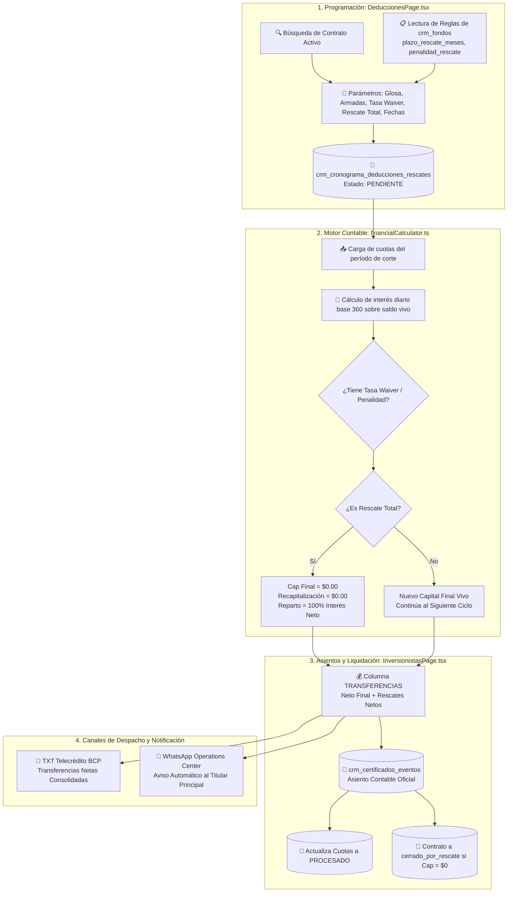

# 💸 Circuito Integral de Rescates Parciales y Totales de Capital (AS BUILT)

> **DOCUMENTO TÉCNICO Y FINANCIERO OFICIAL (V1.0 - PRODUCCIÓN)**  
> **Proyecto:** InAndes ERP (CRM Inversionistas · Módulo de Deducciones y Motor V40)  
> **Ubicación en Código:** `src/features/deducciones/DeduccionesPage.tsx` · `src/services/deduccionesService.ts` · `src/utils/financialCalculator.ts` · `src/features/inversionistas/InversionistasPage.tsx`  
> **Base de Datos:** Supabase Cloud (`egvcinsbyropumybatdf`)  
> **Fecha:** Setiembre 2026  

---

## 1. 🎯 Resumen Ejecutivo

El circuito de **Rescates de Capital** permite amortizar de forma anticipada o al vencimiento el capital invertido por los partícipes de los fondos de inversión de InAndes Grupo Financiero. El sistema soporta:

1. **Rescates Parciales (Amortización Programada):** Devolución fraccionada o puntual de capital en una o múltiples armadas, recalculando el capital vivo remanente y los intereses diarios devengados.
2. **Rescates Totales (Extinción de Certificado):** Liquidación del 100% del capital inicial más aumentos, anulando la recapitalización (`cap_z = 0.00`), entregando el 100% de los rendimientos netos acumulados y extinguiendo el certificado a `$0.00` para cerrar el contrato formalmente en el Ledger (`cerrado_por_rescate`).
3. **Mecanismos de Penalidad y Negociación:**
   - **Penalidad Fija de Rescate (`penalidad_rescate`):** Porcentaje de comisión cobrado al partícipe sobre el monto rescatado según las reglas de permanencia mínima del fondo.
   - **Tasa de Interés Waiver (`tasa`):** Tasa reducida de salida o pactada por Gerencia Comercial para el devengue durante el período de desinversión.

---

## 2. 🏛️ Arquitectura del Circuito End-to-End

---

## 3. 🗄️ Modelo de Datos y Tablas Involucradas

### A. `crm_cronograma_deducciones_rescates` (Cola de Programación)
| Columna | Tipo | Descripción |
|---|---|---|
| `id_cuota` | `text` (PK) | Clave natural: `RES.{cert}.{fecha_creacion}.{fecha_cobro}.{idx}.{total}` |
| `id_agrupador` | `text` | Identificador del plan de cuotas para trazabilidad grupal |
| `id_certificado` | `text` | Certificado origen del partícipe |
| `id_contrato` | `text` | Contrato maestro en `crm_contratos` |
| `tipo_cargo` | `text` | `'RESCATE_CAPITAL'` · `'PENALIDAD_RESCATE'` · `'DEDUCCION_ORDINARIA'` |
| `glosa_descripcion` | `text` | Detalle visible (incluye `[RESCATE TOTAL]` si aplica) |
| `moneda` | `text` | `'USD'` o `'PEN'` |
| `monto_cobrar` | `numeric` | Importe bruto de la armada de rescate |
| `fecha_proyectada_cobro` | `date` | Fecha de corte oficial (ej. `2026-02-28`, `2026-06-30`) |
| `estado` | `text` | `'PENDIENTE'` $\rightarrow$ `'PROCESADO'` $\rightarrow$ `'ANULADO'` |
| `prioridad` | `integer` | Nivel de ejecución contable (Prioridad `3` para rescates) |
| `tasa` | `numeric` | Tasa de Interés Waiver porcentual acordada |

### B. `crm_certificados_eventos` (Ledger Contable de Cierres)
- `monto_rescate`: Importe total de capital devuelto en el período.
- `penalidad_rescate`: Importe total de penalidades cobradas en el período.
- `capital_final_saldo`: Saldo remanente de capital al cierre del ciclo.
- `tipo_evento`: `'cierre_fin_ciclo'` (parcial) o `'cierre_fin_contrato'` (total).

### C. `crm_fondos` (Reglas del Fondo)
- `plazo_rescate_meses`: Período mínimo de permanencia sin penalidad (ej. 12 meses).
- `plazo_opcion_de_rescate_dias`: Tiempo máximo legal de preaviso para desembolso (ej. 30 días).
- `penalidad_rescate`: Porcentaje de penalidad base del tarifario (ej. 2.0%).

---

## 4. 🧠 Lógica de Negocio Detallada

### 4.1. Tasa de Interés Waiver vs. Penalidad Fija

| Concepto | Penalidad Fija (`penalidad_rescate`) | Tasa Waiver (`resTasaWaiver`) |
|---|---|---|
| **Definición** | Descuento directo en efectivo sobre el monto a devolver. | Ajuste en la tasa de interés anual que devenga el capital durante el retiro. |
| **Fórmula** | $\text{Penalidad} = \text{Monto Rescate} \times \left(\frac{\text{Penalidad Fondo}}{100}\right)$ | $\text{Interés Día} = \text{Capital Remanente} \times \left(\frac{\text{Tasa Waiver}}{360}\right)$ |
| **Uso Típico** | Retiro anticipado estándar según reglamento. | Exoneración o acuerdo comercial negociado con Gerencia. |
| **Impacto en Caja** | Reduce el neto a transferir al cliente. | Reduce el interés bruto acumulado en el período. |

---

### 4.2. Tratamiento Matemático en el Motor V40 (`financialCalculator.ts`)

#### A. Devengue Diario con Saldo Vivo:
Para cada día $d$ del período contable:
$$\text{cap\_rem}(d) = \text{capital\_base} - \sum_{r \in \text{rescates}, \text{fecha}_r < d} \text{monto}_r$$

$$\text{Interés Diario} = \text{base\_hoy}(d) \times \left(\frac{\text{tasa\_pactada}}{360}\right)$$

#### B. Conciliación y Liquidación al Cierre:
1. **Interés Bruto e Impuesto a la Renta (5%):**
   $$\text{BRUTO} = \sum \text{Interés Diario}$$
   $$\text{IR (5\%)} = \text{round}(\text{BRUTO} \times 0.05, 2)$$
   $$\text{BASE NETA} = \text{BRUTO} - \text{IR}$$

2. **Reparto vs. Recapitalización:**
   - **Caso Normal / Rescate Parcial:**
     $$\text{CAPITALIZACIÓN} = \text{round}(\text{BASE NETA} \times (1 - \text{reparto\_pct}), 2)$$
     $$\text{REPARTO} = \text{round}(\text{BASE NETA} \times \text{reparto\_pct}, 2)$$
   - **Caso Rescate Total:**
     $$\text{CAPITALIZACIÓN} = \$0.00$$
     $$\text{REPARTO} = \text{BASE NETA} \quad (100\% \text{ en efectivo})$$
     $$\text{RESCATES} = \text{Capital Base} + \text{Aumentos}$$
     $$\text{CAPITAL FINAL} = \$0.00$$

3. **Cálculo de la Columna TRANSFERENCIAS (Efectivo a Bancos):**
   $$\text{Neto Final} = \text{REPARTO} - \text{Deducciones Ordinarias}$$
   $$\text{Rescates Netos} = \text{RESCATES} - \text{PENALIDAD\_RESCATE}$$
   $$\mathbf{TRANSFERENCIAS} = \mathbf{Neto\ Final} + \mathbf{Rescates\ Netos}$$

---

## 5. 📋 Ciclo de Vida Operativo y Cierre de Contratos

1. **Registro:** El operador ingresa a `DeduccionesPage.tsx`, busca al partícipe y agenda el rescate (1 o más armadas).
2. **Auditoría Previa:** En `InversionistasPage.tsx`, el motor V40 corre en memoria e incluye los rescates en la previsualización del balance.
3. **Grabación de Asientos:** Al pulsar *"Registrar Cierre Oficial"*:
   - Se insertan los registros en `crm_certificados_eventos`.
   - Las cuotas de `crm_cronograma_deducciones_rescates` pasan a `PROCESADO`.
   - Si `capital_final_saldo <= 0` o fue rescate total, el contrato en `crm_contratos` se actualiza automáticamente a `estado = 'cerrado_por_rescate'`.
4. **Despacho:** 
   - El archivo **TXT Telecrédito BCP** contiene la suma de rendimientos y rescates.
   - El **WhatsApp Bot / Centro de Operaciones** notifica al partícipe principal el monto transferido y su cuenta destino.

---

## 6. ⚠️ Red Flags y Reglas Intangibles del Módulo

1. **Prohibido Modificar Asientos Procesados Directamente:** Un rescate procesado solo se reversa mediante el botón *"Reversar Cierre"* de la UI para mantener la integridad referencial.
2. **Cero Recapitalización en Rescate Total:** Si un contrato tiene rescate total, la recapitalización DEBE ser obligatoriamente `$0.00` para evitar que queden centavos residuales en el capital final.
3. **Base 360:** Todo el devengue diario de intereses en el motor financiero se calcula con divisor exacto `360`.
4. **Validación de Titularidad:** Todo abono de rescates se programa y despacha al Partícipe Principal (`id_inversionista_1`) titular de la cuenta bancaria.
