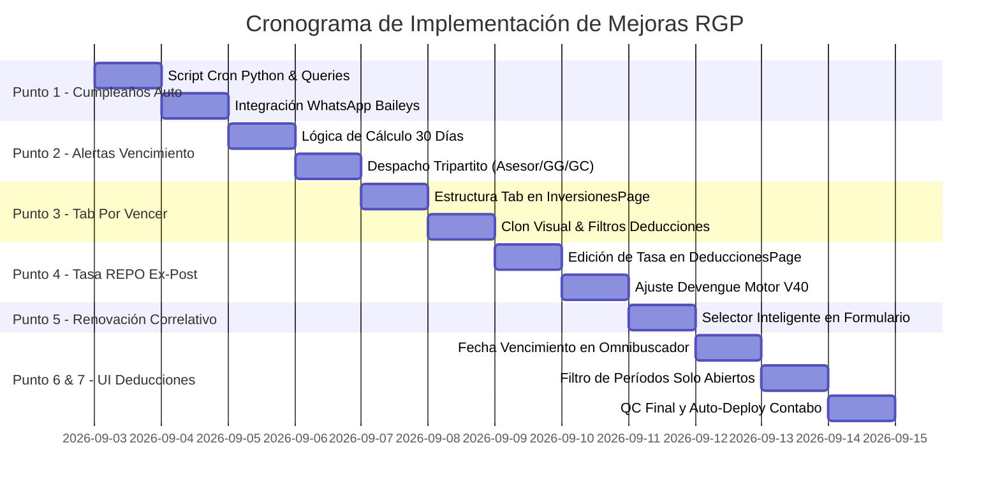

# 📋 Plan Maestro de Mejoras y Automatizaciones — RGP 03.09.2026
## Basado en el Método Canónico Benoit Blanc (V3.0 Agentic Edition)

> **Documento Pericial:** `Obsidian/Mudanza.Contabo/Mudanza.Contabo/15.Mejoras.RGP.03.09.16.md`  
> **Auditor / Responsable:** Antigravity AI Pair-Programmer (Benoit Blanc Protocol)  
> **Fecha:** 03 de Septiembre de 2026  
> **Estado:** 🟡 EN PLANIFICACIÓN DETALLADA (Documentado al 100%)  

---

## 🧭 1. Resumen Ejecutivo de Requerimientos del Usuario

El presente plan consolida siete mejoras operativas, financieras y de control contable solicitadas por la dirección del fondo:

| # | Módulo / Componente | Requerimiento Central | Tipo de Operación |
|:--:|---|---|---|
| **1** | **Bot WhatsApp — Saludos de Cumpleaños** | Automatización 100% desatendida vía cronjob diario en backend (sin botones manuales). | Backend Cron + Bot Baileys + DB |
| **2** | **Bot WhatsApp — Alertas de Vencimiento** | Despacho diario de alertas (30 días antes del vencimiento) a Asesor, Ricardo Gallo y Yanneth Parra. | Backend Cron + Bot Baileys + DB |
| **3** | **Contratos — Nuevo Tab "POR VENCER"** | Pestaña con layout clon de `DeduccionesPage.tsx` filtrando contratos que vencen en cortes contables no cerrados. | Frontend React (`InversionesPage.tsx`) + Supabase |
| **4** | **Rescates — Tasas Waiver / REPO Credicorp Ex-Post** | Tratamiento dinámico y editable de la tasa waiver por cada armada según la tasa REPO real liquidada al cierre. | Frontend React + Motor V40 (`financialCalculator.ts`) + DB |
| **5** | **Contratos — Asignación Inteligente de Correlativo en Renovaciones** | Posibilidad de reutilizar el número correlativo histórico que perteneció al inversionista (si está disponible). | Frontend React (`InversionesPage.tsx`) + Supabase |
| **6** | **Omnibuscadores — Fecha de Vencimiento Visible** | Inclusión explícita de la fecha de vencimiento (`fecha_fin`) en los items desplegables de búsqueda de contratos. | Frontend React (`DeduccionesPage.tsx`, `OmniBuscador`) |
| **7** | **Deducciones/Rescates — Fechas Válidas Solo en Períodos Abiertos** | Prohibición de fechas al pasado/cerradas. Los selectores deben mostrar únicamente períodos ABIERTOS de liquidación. | Frontend React (`DeduccionesPage.tsx`) + Supabase |

---

## 🔬 2. Especificación Detallada por Punto (Fases BEN / LEG / DIFF / QC)

---

### 📌 PUNTO 1: Saludos de Cumpleaños 100% Automáticos / Desatendidos

#### A. Diagnóstico y Estado Actual (LEG)
- **Situación previa:** En `WhatsAppPage.tsx`, la pestaña *"Saludos de Cumpleaños"* carga la lista de inversionistas cuyo natalicio coincide con la fecha, pero requiere que un operador humano ingrese a la interfaz web y haga clic en el botón *"Enviar X Saludos WhatsApp"*.
- **Problema:** Si el operador no entra a la plataforma o lo olvida, los partícipes no reciben su saludo institucional en su día.

#### B. Arquitectura Técnica y Solución Propuesta (DIFF)
1. **Cronjob Diario Autónomo en el Backend (VPS Contabo):**
   - **Horario de Ejecución:** Todos los días a las **08:30 AM (Hora de Lima / UTC-5)**.
   - **Script / Endpoint:** `cron_birthday_greetings.py` ejecutado vía systemd timer o cron de Linux en el VPS Contabo.
   - **Flujo de Ejecución:**
     ```mermaid
     sequenceDiagram
         autonumber
         participant Cron as ⏰ Linux Cron (08:30 AM)
         participant Py as 🐍 Backend Script (Python)
         participant DB as 🗄️ Supabase DB
         participant Bot as 📱 Node Baileys WhatsApp API
         participant User as 👤 Partícipe (WhatsApp)

         Cron->>Py: Disparar script diario
         Py->>DB: Consultar partícipes con cumpleaños HOY (mes/día)
         DB-->>Py: Retornar lista de cumpleañeros + teléfonos
         loop Por cada cumpleañero no saludado hoy
             Py->>DB: Verificar si ya tiene saludo registrado hoy (evitar duplicados)
             Py->>Bot: POST /api/send-message (Mensaje institucional personalizado)
             Bot->>User: Envío de saludo institucional WhatsApp
             Py->>DB: Registrar log en crm_notificaciones_log (id_inversionista, tipo='CUMPLEAÑOS', fecha, estado='ENVIADO')
         end
     ```

2. **Template del Mensaje Institucional:**
   ```text
   🎂 *¡Feliz Cumpleaños de parte de InAndes Grupo Financiero!* 🎉

   Estimado/a *{{nombre_completo}}*,

   En este día tan especial, todo el equipo de InAndes le hace llegar un cálido y afectuoso saludo de cumpleaños.

   Agradecemos profundamente la confianza depositada en nosotros y le deseamos un año colmado de éxitos, salud y prosperidad junto a sus seres queridos.

   ✨ *¡Que tenga un excelente día!*
   🏛️ *InAndes Grupo Financiero*
   ```

3. **Reflejo en la UI (React - `WhatsAppPage.tsx`):**
   - La pantalla pasa de ser un disparador manual a un **Panel de Monitoreo y Auditoría**:
     - Muestra los saludos despachados automáticamente a las 08:30 AM con badge verde `ENVIADO AUTOMÁTICAMENTE`.
     - Mantiene un botón secundario de reintento manual solo para casos con error de número telefónico.

---

### 📌 PUNTO 2: Alerta Diaria de Vencimiento de Contratos (30 Días Antes)

#### A. Diagnóstico y Estado Actual (LEG)
- **Situación previa:** Los vencimientos de contrato solo se revisan manualmente en el listado de contratos o reportes Excel. No existe ningún mecanismo automatizado proactivo por mensajería instantánea.
- **Riesgo:** Pérdida de oportunidad comercial de renovación de contrato o falta de preparación de tesorería para devoluciones de capital.

#### B. Arquitectura Técnica y Solución Propuesta (DIFF)
1. **Cronjob Diario de Alertas de Vencimiento:**
   - **Horario de Ejecución:** Todos los días a las **09:00 AM (Hora de Lima / UTC-5)**.
   - **Script / Tarea:** `cron_contract_expirations.py` en el VPS Contabo.
   - **Condición de Alerta:**
     $$\text{Días Restantes} = \text{fecha\_fin} - \text{fecha\_hoy}$$
     $$\text{Se Notifica si: } 0 \le \text{Días Restantes} \le 30 \quad \text{y el contrato sigue } \text{estado} = \text{'emitido'/'vigente'}$$

2. **Matriz de Destinatarios Tripartita (Obligatoria):**
   Cada contrato detectado en ventana de vencimiento generará alertas dirigidas a 3 destinatarios:
   - **Destinatario 1 — Asesor Asignado:** Teléfono del asesor vinculado al contrato (`id_asesor` -> `crm_asesores.telefono`).
   - **Destinatario 2 — Ricardo Gallo:** Partícipe y Gerente General del Fondo (Teléfono configurado en variables de entorno / padrón).
   - **Destinatario 3 — Yanneth Parra:** Partícipe y Gerenta Comercial (Teléfono configurado en variables de entorno / padrón).

3. **Estructura del Mensaje de Alerta WhatsApp:**
   ```text
   ⚠️ *ALERTA DE VENCIMIENTO DE CONTRATO (InAndes CRM)* 🏛️

   Se informa que el siguiente contrato se encuentra próximo a vencer:

   📋 *Contrato:* `{{id_contrato}}`
   👤 *Inversionista:* {{nombre_inversionista}} (DNI/RUC: {{documento}})
   💰 *Monto de Inversión:* {{moneda}} {{monto_formateado}}
   🏦 *Fondo:* {{id_fondo}} | *Tasa:* {{tasa_pactada}}%
   📅 *Fecha de Inicio:* {{fecha_inicio}}
   🏁 *Fecha de Vencimiento:* *{{fecha_fin}}*
   ⏳ *Tiempo Restante:* *{{dias_restantes}} días*
   👔 *Asesor Responsable:* {{nombre_asesor}}

   📌 *Acción requerida:* Coordinar gestión comercial de renovación o provisión de rescate.
   ```

4. **Blindaje contra Duplicidad y Control de Envío:**
   - Registro en tabla `crm_notificaciones_log` con llave única `(id_contrato, fecha_envio, tipo='ALERTA_VENCIMIENTO')` para garantizar un único despacho por día por contrato.

---

### 📌 PUNTO 3: Nuevo Tab "POR VENCER" en Módulo Contratos (`InversionesPage.tsx`)

#### A. Diagnóstico y Estado Actual (LEG)
- **Ubicación:** `src/features/inversiones/InversionesPage.tsx` (Líneas 1039–1050).
- **Tabs Actuales:**
  - `Borradores (0)`
  - `Por Aprobar (0)`
  - `Vigentes (199)`
  - `Cerrados (15)`
- **Carencia:** No hay una vista consolidada que agrupe y filtre los contratos según las **fechas de cierre/corte contables abiertas** para planificar renovaciones y liquidez de capital.

#### B. Especificación Visual y Funcional (Clon de `DeduccionesPage.tsx`)

```
+----------------------------------------------------------------------------------------------------+
|  DIRECTORIO DE CONTRATOS                                   [Exportar Excel] [Nuevo Borrador] [↻]   |
+----------------------------------------------------------------------------------------------------+
|  [🔍 Omni buscador rápido...]                                                                      |
|                                                                                                    |
|  [BORRADORES (0)]  [POR APROBAR (0)]  [VIGENTES (199)]  [⭐ POR VENCER (24)]  [CERRADOS (15)]       |
+----------------------------------------------------------------------------------------------------+
|                                                                                                    |
|  📅 FILTRO POR AÑO Y PERÍODO DE CORTE CONTABLE (Cortes Abiertos)        AÑO: [2025] [2026] [2027]  |
|  [Todos los Cortes] [31 Ago (B4)] [30 Set (Q3)] [31 Oct (B5)] [31 Dic (B6/Q4)]                     |
|                                                                                                    |
|  +-----------------------------------------------------------------------------------------------+ |
|  | 💵 CAPITAL TOTAL POR VENCER (CORTE 2026-08-31)                                                | |
|  |     PROVISIÓN SOLES (PEN): S/ 450,000.00         PROVISIÓN DÓLARES (USD): $ 180,000.00        | |
|  +-----------------------------------------------------------------------------------------------+ |
|                                                                                                    |
|  🏢 FONDO: NSGPEN01 (5 contratos por vencer)                             TOTAL: PEN 450,000.00     |
|  +-----------------------------------------------------------------------------------------------+ |
|  | INVERSIONISTA / PARTÍCIPES  | CONTRATO          | MONEDA | MONTO INVERSIÓN | VENCIMIENTO | ASESOR   |
|  |-----------------------------+-------------------+--------+-----------------+-------------+----------|
|  | Perez Aliaga Cesar Saul     | NSGPEN01-084...   | PEN    | S/ 150,000.00   | 2026-08-31  | Asesor A |
|  | Maldonado Cortez Edwin      | NSGPEN01-090...   | PEN    | S/ 300,000.00   | 2026-08-31  | Asesor B |
|  +-----------------------------------------------------------------------------------------------+ |
|                                                                                                    |
|  🏢 FONDO: NSGUSD02 (3 contratos por vencer)                             TOTAL: USD 180,000.00     |
|  +-----------------------------------------------------------------------------------------------+ |
|  | Ventura Linares Virginia    | NSGUSD02-051...   | USD    | $  60,000.00    | 2026-08-31  | Asesor C |
|  +-----------------------------------------------------------------------------------------------+ |
+----------------------------------------------------------------------------------------------------+
```

---

### 📌 PUNTO 4: Circuito Dinámico de Tasas Waiver / REPO Credicorp Ex-Post

#### A. Principio Financiero y Diagnóstico de Negocio (BEN / LEG)
1. **Pérdida de la Tasa Contractual por Retiro Anticipado:**
   - Cuando un inversionista decide retirar anticipadamente su capital, a partir del primer retiro el capital remanente o devuelto **deja de percibir la tasa pactada contractual** y pasa a percibir la **Tasa Waiver (Tasa REPO Credicorp Capital)**.
2. **Naturaleza Ex-Post (Desconocida al Inicio):**
   - La tasa REPO de Credicorp se conoce **únicamente Ex-Post**, una vez liquidada la operación de mercado por Credicorp al cierre del bimestre o trimestre contable.
3. **Independencia por Armada / Retiro:**
   - Cada armada liquidará a una tasa REPO de mercado distinta (ej. Armada 1 a `7.15%`, Armada 2 a `6.85%`).

#### B. Solución Funcional en Frontend y Motor V40 (DIFF)
1. **Frontend (`DeduccionesPage.tsx`):**
   - Acción rápida **✏️ Modificar Tasa Waiver (REPO)** para cuotas en estado `PENDIENTE`.
2. **Motor de Retornos V40 (`financialCalculator.ts`):**
   - Bucle diario que aplica $r.\text{tasa}$ a partir de la fecha de retiro:
     $$\text{tasa\_dia} = \begin{cases} r.\text{tasa} & \text{si } d \ge r.\text{fecha y } r.\text{tasa} > 0 \\ \text{tasa\_pactada} & \text{en caso contrario} \end{cases}$$

---

### 📌 PUNTO 5: Asignación Inteligente de Correlativos en Renovaciones Inmediatas

#### A. Diagnóstico y Fundamento de Negocio (BEN / LEG)
1. **Identidad del Inversionista:** El partícipe y el asesor reconocen el contrato por su **número correlativo histórico** (ej. *"Contrato 038 de NSGUSD02"*).
2. **Condición Inviolable de Disponibilidad:** El sistema puede reutilizar el número correlativo histórico anterior del inversionista **siempre y cuando dicho número esté disponible** (su contrato previo esté cerrado/vencido y no exista ningún otro contrato **vigente/activo** en el mismo fondo ocupando ese número).

---

### 📌 PUNTO 6: Visualización Obligatoria de Fecha de Vencimiento en Omnibuscadores

#### A. Diagnóstico y Estado Actual (LEG)
- En `DeduccionesPage.tsx` y buscadores de contratos, los resultados desplegables muestran ID, Fondo, Monto e Inversionista, pero **ocultan la fecha de vencimiento (`fecha_fin`)**.

#### B. Solución Visual y de Código (DIFF)
Inclusión de badge de fecha de vencimiento en el renderizado de `searchResults`:
```tsx
<span className="flex items-center gap-1 text-blue-700 dark:text-blue-400 font-semibold bg-blue-50 dark:bg-blue-950/60 px-1.5 py-0.5 rounded border border-blue-200 dark:border-blue-800/60">
  <Calendar size={11} />
  <span>Vence: <strong className="font-mono">{c.fecha_fin ? c.fecha_fin.split('T')[0] : 'N/D'}</strong></span>
</span>
```

---

### 📌 PUNTO 7: Validación de Fechas en Programación de Deducciones y Rescates (Solo Períodos Abiertos)

#### A. Diagnóstico y Estado Actual (LEG)
- **Ubicación:** `src/features/deducciones/DeduccionesPage.tsx` (Línea 86, `getValidEndOfMonthDates`).
- **Problema Detectado:** La función genera rígidamente fechas desde febrero del año corriente (`28 feb. 2026`, `31 mar. 2026`, `30 abr. 2026`, `30 jun. 2026`) **sin verificar si dichos períodos ya fueron CERRADOS** en el Cronograma Anual de Cierres y Liquidaciones.
- **Consecuencia:** Los dropdowns permiten seleccionar períodos pasados/cerrados (como Feb 2026), provocando inconsistencias en el devengue contable.

#### B. Arquitectura Técnica y Solución en Código (DIFF)

```mermaid
flowchart TD
    Init[📅 Carga de Formulario Deducción / Rescate] --> ReadEventos[🔍 Consultar Períodos Cerrados en crm_certificados_eventos]
    ReadEventos --> CalcClosed[📋 Mapear fechas_periodo_fin de cierres oficializados\nej. 2026-02-28, 2026-03-31, 2026-04-30, 2026-06-30]
    CalcClosed --> GenDates[🗓️ Generar Fechas de Fin de Mes (Bimestral / Trimestral)]
    GenDates --> FilterOpen[🛡️ FILTRO ESTRICTO: Conservar solo fechas > último_cierre_oficializado]
    FilterOpen --> Dropdown[🎯 Dropdown UI muestra ÚNICAMENTE períodos ABIERTOS:\n1° Opción: 31 Ago 2026 (B4)\n2° Opción: 30 Set 2026 (Q3)\n3° Opción: 31 Oct 2026 (B5)...]
```

#### C. Cirugía Mínima en `DeduccionesPage.tsx`:
1. **Lectura de Cierres:** Consultar las fechas máximas cerradas por fondo en `crm_certificados_eventos` con `tipo_evento = 'cierre_fin_ciclo'`.
2. **Generador Dinámico de Fechas Abiertas:**
   ```typescript
   const getValidOpenEndOfMonthDates = (
     frecuenciaPago: number, 
     closedDatesSet: Set<string>, 
     startYear: number = 2026, 
     limitYears: number = 5
   ): Date[] => {
     const dates: Date[] = [];
     const mesesCorte = frecuenciaPago === 3 ? [3, 6, 9, 12] : [2, 4, 6, 8, 10, 12];
     const hoy = new Date();
     hoy.setHours(0, 0, 0, 0);

     for (let y = startYear; y < startYear + limitYears; y++) {
       for (const m of mesesCorte) {
         const d = new Date(y, m, 0); // Último día del mes
         const dateStr = d.toISOString().split('T')[0];
         // Solo agregar si NO está en el conjunto de períodos cerrados y no es pasado
         if (!closedDatesSet.has(dateStr)) {
           dates.push(d);
         }
       }
     }
     return dates;
   };
   ```

---

## 🛡️ 3. Plan de Control de Daños, Rollback y Pruebas (Fases CLON, DIFF y QC)

### A. Safe Points y Versionamiento Git (CLON)
- Safe point local antes de tocar código: `git branch PRE.MEJORAS.RGP.03.09`
- Trabajo exclusivo en rama `main` conforme a la Regla 9.

### B. Control de Calidad en Terminal (QC)
- Compilación limpia local de TypeScript/Vite:
  ```powershell
  npm run build
  ```
- Verificación de ausencia de errores de tipos, linters y validación de `exit code 0`.

---

## 📝 4. Matriz de Ejecución Paso a Paso



---

*Plan Maestro formulado y sellado bajo el protocolo Benoit Blanc — 03 de Septiembre de 2026.*
